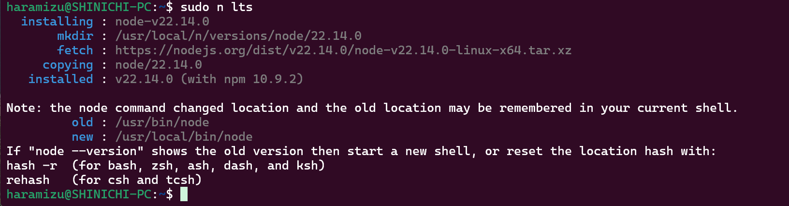
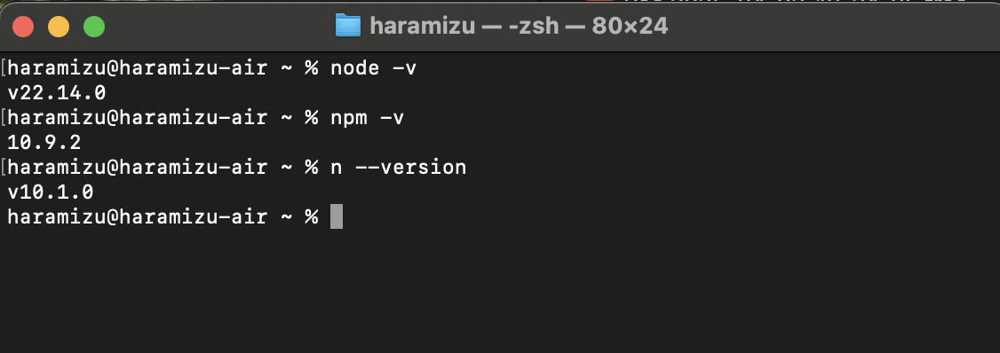

ここでは私が利用している環境の構築手順を紹介しています。

## Windows マシン

### 前提条件

- OS: Windows 11 Pro (24H2)
- CPU: Intel(R) Core(TM) i7-11700F @ 2.50GHz
- メモリ: 32GB
- SSD: 1TB
- nVidia GeForce RTX 4070

### 各種ツールのインストール

下記のツールをインストールしています。

1. PowerShell https://learn.microsoft.com/ja-jp/powershell/scripting/install/installing-powershell-on-windows
2. Visual Studio Code https://azure.microsoft.com/ja-jp/products/visual-studio-code
3. Git for Windows https://git-scm.com/downloads/win
4. Windows Subsystem for Linux https://learn.microsoft.com/ja-jp/windows/wsl/install
5. Ubuntu LTS ( Microsoft Store からインストール )
6. Google Chrome https://www.google.com/intl/ja/chrome/
7. Microsoft Office

上記以外には、画面の動画を録画するツールとして Camtasia をインストールしています。

### Ubuntu - WSL のセットアップ

#### Git の環境を設定する

ユーザーに関する情報を設定します

```bash
git config --global user.name "Shinichi Haramizu"
git config --global user.email haramizu@example.com
```

#### Node.js のインストール

まず最初に、Node.js および関連パッケージをインストールしていきます。まず最初に環境をアップデートします

```bash
sudo apt update
```

続いて Node.js と npm をインストール。

```bash
sudo apt install nodejs npm
```

n をインストール

```bash
sudo npm install n -g
```

それぞれインストールが完了したところでバージョンを確認します。

```bash
$ node -v
v18.19.1
$ npm -v
9.2.0
$ n --version
v10.1.0
```

Node の最新 LTS に切り替えます

```bash
sudo n lts
```



バージョンの確認

```bash
$ node -v
v18.19.1
```

最初にインストールした Node を削除します。

```bash
sudo apt purge nodejs
```

続いて npm のバージョンを最新版にします。

#### Vercel CLI のインストール

Vercel との連携を利用することが多いので、Vercel CLI をインストールします。

```bash
sudo npm i -g vercel
```

インストール後、バージョンの確認をします。

```bash
$ vercel -v
Vercel CLI 41.4.1
41.4.1
```

#### Visual Studio Code の起動確認

WSL の上にある Ubuntu を利用して Visual Studio Code を起動するために、以下のコマンドで Visual Studio Code が起動することを確認します。

```bash
code
```

これで Windows の環境にインストールをした Visual Studio Code が起動して、Ubuntu の環境で開発することができました。

## macOS マシン

### 前提条件

- MacBook Air M4
- OS: macOS 15.3.2
- CPU: Apple M4
- メモリ: 32GB
- SSD: 1TB

### 各種ツールのインストール

下記のツールをインストールしています。

1. Google Chrome https://www.google.com/intl/ja/chrome/
2. Microsoft Edge https://www.microsoft.com/ja-jp/edge/
3. Visual Studio Code https://azure.microsoft.com/ja-jp/products/visual-studio-code
4. xcode (App Store)
5. Microsoft Office
6. Microsoft Teams

xcode をインストールしているため、Git に関してはインストールする必要はありません。

### Node.js

Node.js をインストールする際にはパッケージを利用する、brew を利用するなどの手順がありますが、今回は https://github.com/tj/n に記載されている以下のインストールスクリプトを利用します。

```bash
curl -L https://bit.ly/n-install | bash
```


インストールが完了すると、n のコマンドが利用できるようになります。バージョンを確認すると以下のようになります。



#### Vercel CLI のインストール

Vercel との連携を利用することが多いので、Vercel CLI をインストールします。

```bash
npm i -g vercel
```

インストール後、バージョンの確認をします。

```bash
% vercel -v
Vercel CLI 41.4.1
41.4.1
```
