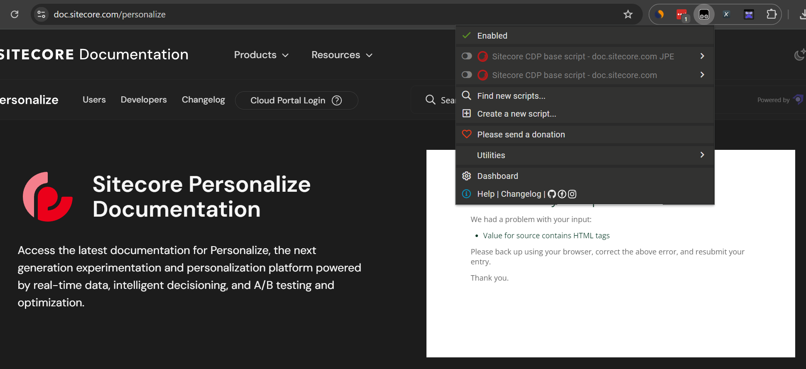
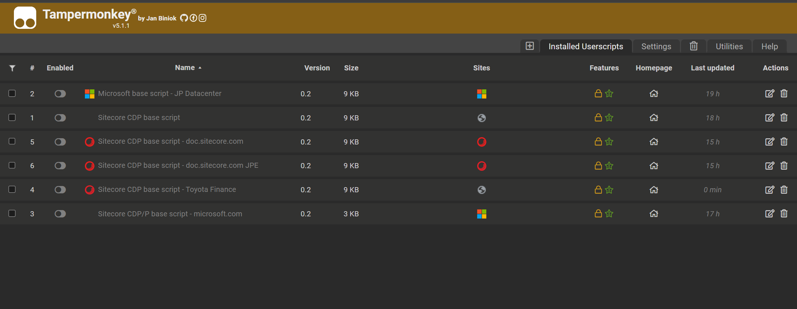
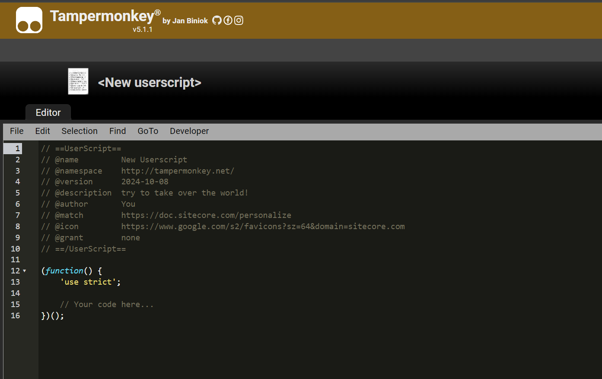
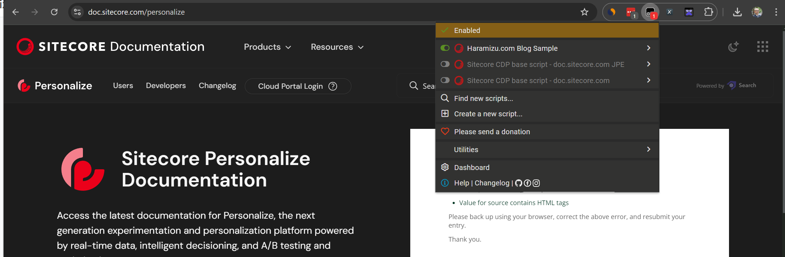

本ドキュメントでは、まだ Sitecore Personalize のタグを埋め込んでいないウェブサイトに対して、ブラウザの拡張機能を利用して実装する JavaScript のコードに関するテストを行う方法を紹介します。この方法を使用することで、開発中のサイトや非本番環境でのパーソナライズの動作確認が容易になります。

## Tampermonkey について

Tampermonkey は、ユーザースクリプトを管理および実行するためのブラウザ拡張機能です。これにより、ユーザーはウェブページの動作をカスタマイズしたり、自動化したりすることができます。以下に、Tampermonkey の主な特徴を紹介します。

### 対応ブラウザ

Tampermonkey は、以下の主要なブラウザで利用できます。

- Google Chrome
- Microsoft Edge
- Firefox
- Safari
- Opera

### インストール方法

Tampermonkey のインストールは非常に簡単です。以下のリンクから、使用しているブラウザに対応するバージョンをダウンロードしてインストールしてください。

- [Tampermonkey 公式サイト](https://www.tampermonkey.net/)

本ドキュメントでは、Google Chrome もしくは Microsoft Edge に対して機能拡張をインストール、動作検証を進めていきます。

## シンプルなスクリプトの実行

まず最初に、シンプルなスクリプトを実行したいと思います。今回は対象として、Sitecore のドキュメントサイトでテストを実行します。

- https://doc.sitecore.com/personalize

すでに機能拡張をインストールしている状態で上記のサイトにアクセスをして、Tampermonky のアイコンをクリックすると、以下のようなメニューが表示されます。まずは Dashboard をクリックしてください。



画面ではすでにいくつかサンプルを入れていますが、全て無効の状態にしてあります。



一番左側にある + のボタンをクリックして新しいスクリプトを作成します。



デフォルトで生成されるスクリプトの項目を今回は以下のように書き換えました。

```js
// ==UserScript==
// @name         Haramizu.com Sample
// @namespace    http://tampermonkey.net/
// @version      0.1
// @description  try to take over the world!
// @author       Shinichi Haramizu
// @match        https://doc.sitecore.com/*
// @icon         https://www.google.com/s2/favicons?sz=64&domain=www.sitecore.com
// @grant        none
// ==/UserScript==

(function() {
    'use strict';

    // Your code here...
})();
```

それぞれの役割は以下の通りです。

| Name | Description |
|------|-------------|
| name | スクリプトの名前 |
| match | スクリプトが有効になる条件、* を利用可能 |
| icon | 一覧で利用するアイコン |

上記の設定で保存をしたあとにサイトに改めて訪問をすると、以下の画面のように有効になっているのが分かります。



###  特定サイトでパーソナライズを表示する

今回は tampermonkey のサンプルのサンプルとして、今回は以下のコードを用意しました。

```js
// ==UserScript==
// @name         Haramizu.com Sample
// @namespace    http://tampermonkey.net/
// @version      0.1
// @description  try to take over the world!
// @author       Shinichi Haramizu
// @match        https://doc.sitecore.com/*
// @icon         https://www.google.com/s2/favicons?sz=64&domain=www.sitecore.com
// @grant        none
// ==/UserScript==

(function() {
    'use strict';

    //Sitecore CDP settings
    const SITECORECDP_CLIENT_KEY = "YOUR-CLIENT-KEY";
    const SITECORECDP_API_TARGET = "YOUR-ENDPOINT/v1.2";
    const SITECORECDP_POINT_OF_SALE = "StandardDemo";
    const SITECORECDP_WEB_FLOW_TARGET = "https://d35vb5cccm4xzp.cloudfront.net";
    const SITECORECDP_JS_LIB_SRC = "https://d1mj578wat5n4o.cloudfront.net/boxever-1.4.1.min.js";
    const SITECORECDP_COOKIE_DOMAIN = '.sitecore.com';
    const CURRENCY = "JPY";

    //Script settings
    const SEND_VIEW_EVENT = true;

    window._boxever_settings = {
        client_key: SITECORECDP_CLIENT_KEY,
        target: SITECORECDP_API_TARGET,
        pointOfSale: SITECORECDP_POINT_OF_SALE,
        cookie_domain: SITECORECDP_COOKIE_DOMAIN,
        web_flow_target: SITECORECDP_WEB_FLOW_TARGET,
        //web_flow_config: { async: false, defer: false }
    };

    loadScCdpLib();
    if (SEND_VIEW_EVENT) {
        delayUntilBrowserIdIsAvailable(sendViewEvent);
    }

    function loadScCdpLib(callback) {
        console.log('Sitecore CDP Tampermonkey script - loadScCdpLib');
        var scriptElement = document.createElement('script');
        scriptElement.type = 'text/javascript';
        scriptElement.src = SITECORECDP_JS_LIB_SRC;
        scriptElement.async = false;
        document.head.appendChild(scriptElement);
    }

    function sendViewEvent() {
        console.log('Sitecore CDP Tampermonkey script - sendViewEvent');
        var viewEvent = {
            "browser_id": Boxever.getID(),
            "channel": "WEB",
            "type": "VIEW",
            "language": "EN",
            "currency": CURRENCY,
            "page": window.location.href + window.location.search,
            "pos": SITECORECDP_POINT_OF_SALE,
            "session_data": {
                "uri": window.location.pathname
            }
        };
        Boxever.eventCreate(viewEvent, function(data) {}, 'json');
        console.log('view event');
    }

    function delayUntilBrowserIdIsAvailable(functionToDelay) {
        if (window.Boxever == null || window.Boxever == undefined || window.Boxever === "undefined" || window.Boxever.getID() === "anonymous") {
            const timeToWaitInMilliseconds = 300;
            console.log(`Sitecore CDP browserId is not yet available. Waiting ${timeToWaitInMilliseconds}ms before retrying.`);
            window.setTimeout(delayUntilBrowserIdIsAvailable, timeToWaitInMilliseconds, functionToDelay);
        } else {
            functionToDelay();
        }
    }
})();
```

上記のコードのうち、YOUR-CLIENT-KEY および YOUR-ENDPOINT に関しては環境に合わせて準備をしてください。Endpoint の一覧は以下の通りです。

Stream API target endpoint
また pointOfSales に対しては StandardDemo を Sitecore Personalize 側で用意をしてください。

tampermonkey05.png
これで tampermonkey 側の設定が完了しました。

Sitecore Personalize でプレビュー
今回は Tampermonkey を利用して連携をしていないサイトでパーソナライズのテストをするため、ブラウザに対して機能拡張が入っているサイトでのみプレビューが可能となります。

前回の記事で作成をしたパーソナライズの設定画面の右上に Preview のボタンがあります。

personalizesample08.png
クリックをすると、どのページでプレビューをするのかを確認するダイアログが表示されます。

tampermonkey06.png
プレビューが表示されており、右下にポップアップが追加されています。Tampermonkey に設定をしたスクリプトが読み込まれて動作している形です。

tampermonkey07.png
開発者ツールを開いて、実行結果を見るとライブラリを読み込んだあと、ページイベントを実行していることが分かります。

tampermonkey08.png
QA Tool の確認
プレビューで起動した際には、QA ツールが表示されます。画面の左側に出ているアイコンが QA ツールです。

tampermonkey09.png
クリックをすると QA ツールが表示されて、このパーソナライズの動作に関しての情報が表示されています。

tampermonkey10.png
QA ツールは正しく動作しない場合の原因究明などにも利用できるので、今後改めて紹介をすることがあるかと思います。

まとめ
今回は Tampermoneky を利用して、パーソナライズを設定していないサイトに対してテストをする手順を紹介しました。実際に開発中で非本番環境のデータを利用して実行したい、などのケースに利用することがありますので、これは一度はお試しいただければと思います。