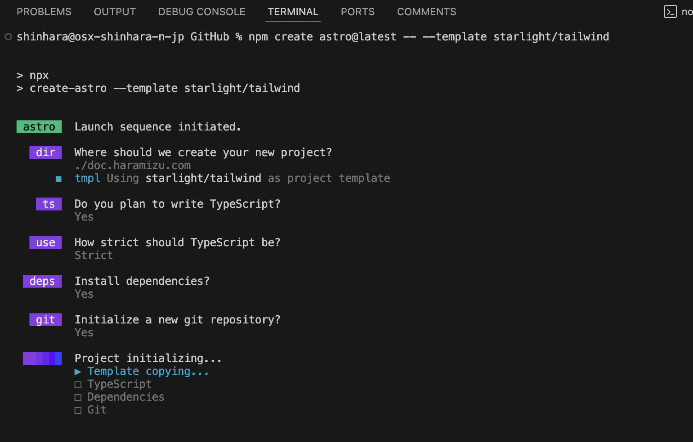
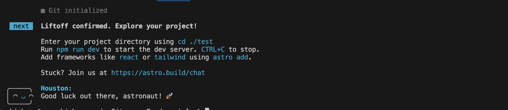
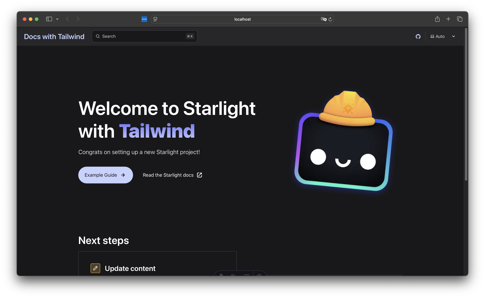
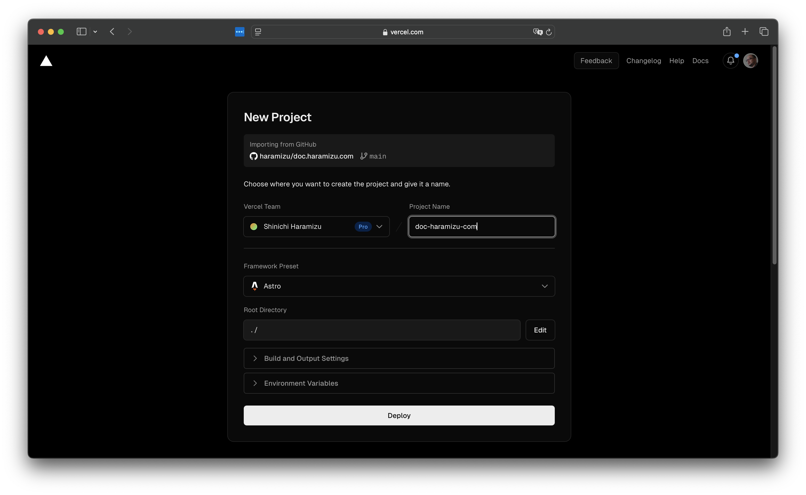
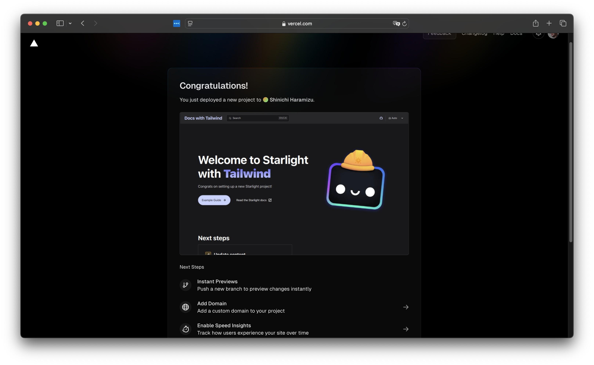
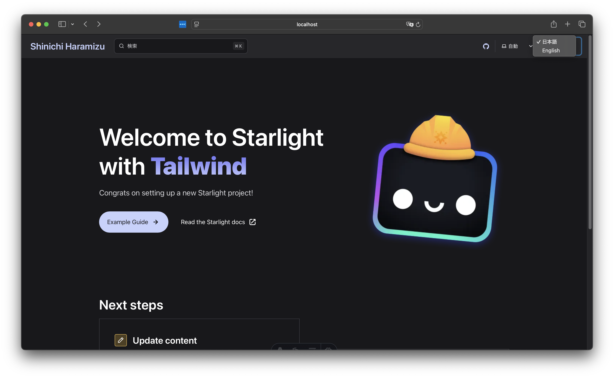

I created a blog using Next.js, but I wanted to create a documentation site that can be easily written in Markdown, fully published on GitHub, and receive feedback. Therefore, I considered several frameworks. Specifically, I thought a framework that supports SSG and is easy to customize would be good, and I considered the following candidates:

- [Gatsby](https://www.gatsbyjs.com): Gatsby is a React-based static site generator that provides a framework for building fast and scalable websites and applications. Gatsby uses GraphQL to fetch data and generates static HTML files at build time. This improves page load speed and offers excellent performance for SEO.
- [Docusaurus](https://docusaurus.io): Docusaurus is an open-source static site generator developed by Facebook, designed primarily to easily create documentation sites for projects. It is built on React and allows you to create modern and interactive documentation sites.
- [Astro](https://astro.build): Astro is a static site generator that leverages the latest web technologies to build fast and optimized static sites. Astro adopts a component-based architecture and is compatible with frameworks like React, Vue, Svelte, and Solid. There is also extensive information available in [Japanese](https://docs.astro.build/ja/).

After reconsidering various options, I decided to create this documentation site to compile tips, in addition to the Next.js blog, as I had been interested in Astro for a while.

While referring to the Astro site, I thought it would be great if I could publish in this document format. Upon checking, I found that the following documentation site is provided:

- [Starlight](https://starlight.astro.build)

As a result, I decided to create this site using Starlight.

## Launching the Starlight Site

To launch the site, configure the project you want to create and the current environment as follows:

- Astro 4.16.10
- Starlight 0.29.0
- Tailwind CSS 3.4.4
- Node.js 20.15.0
- Visual Studio Code
- macOS or Windows 11

This time, we will use Tailwind CSS, which we are familiar with.

### Creating the Project

Let's proceed with creating the project. Refer to the following page to get started.

- [CSS & Styling - Tailwind CSS](https://starlight.astro.build/guides/css-and-tailwind/#tailwind-css)

First, create the project using the following command.

```bash title="Create Project"
npm create astro@latest -- --template starlight/tailwind
```

The wizard will start and confirm the settings for the project you are creating. This time, I configured it as follows:

- dir: ./doc.haramizu.com
- ts: Yes (Typescript)
- use: Strict
- Install dependencies?: Yes
- Initialize a new git repository?: Yes

After the above settings, the project initialization will proceed automatically.



Once the configuration is complete, you will see a message like the following.



The project is now complete. As shown on the screen, when you navigate to the path and start it, you will see that it includes sample content.



### Deploy to Vercel

Let's deploy the created project to GitHub and publish the site on Vercel. Assume that the project's code has already been uploaded to GitHub. First, log in to Vercel. Click on "New Project" to create a new project and specify the GitHub repository where the code is uploaded.


You can see that the project is already specified as an Astro project. Click the Deploy button to execute the site build. After a while, the site will be up and running.


From now on, updating the main repository will automatically update this site.

### Linking the Environment with Vercel CLI

Use the Vercel CLI to link this project with the Vercel environment. If you haven't installed the Vercel CLI, run the following command (add `sudo` if necessary).

```bash title="Install Vercel CLI"
npm i -g vercel
```

If the CLI is available, log in at the top of the project with the following command. First, a confirmation screen will appear asking which account to log in with.

```bash title="Vercel CLI Login"
doc.haramizu.com % vercel login
Vercel CLI 37.14.0
? Log in to Vercel (Use arrow keys)
❯ Continue with GitHub
  Continue with GitLab
  Continue with Bitbucket
  Continue with Email
  Continue with SAML Single Sign-On
 ─────────────────────────────────
  Cancel
```

Since I am using GitHub, the browser will launch, and once the login is complete, the Vercel CLI login will be finished.

Next, link the Vercel project.

```bash title="Link Vercel Project"
doc.haramizu.com % vercel link
Vercel CLI 37.14.0
? Set up “~/GitHub/doc.haramizu.com”? yes
? Which scope should contain your project? Shinichi Haramizu
? Found project “haramizu/doc-haramizu-com”. Link to it? yes
  Linked to haramizu/doc-haramizu-com (created .vercel and added it to .gitignore)
```

By adding `.vercel` to the `.gitignore` file, you can now use `vercel env pull` to retrieve development environment variables.

## Multilingual Support for the Site

For providing information on this site, we plan to offer content in both Japanese and English (using machine translation). Since Starlight includes built-in multilingual support, we will proceed with configuring the language settings.

- [Internationalization (i18n)](https://starlight.astro.build/guides/i18n/)

This configuration involves adding settings to the `astro.config.mjs` file. In this case, the root will be in Japanese, and English will be displayed under the `/en` path.

```ts {5-16}
// astro.config.mjs
export default defineConfig({
  integrations: [
    starlight({
      title: "Shinichi Haramizu",
      defaultLocale: "root",
      locales: {
        root: {
          label: "日本語",
          lang: "ja",
        },
        en: {
          label: "English",
          lang: "en",
        },
      },
```

After completing the above settings, copy the existing files to `/content/docs/en`. At this time, you need to adjust the paths of images and links in `/en/index.mdx`.

Once the file deployment is complete, a dropdown menu will be displayed, allowing you to switch languages.



## Creating Sitemap / robots.txt

To make the sitemap of the created site available, enable the Sitemap feature. This setting is introduced on the following page.

- [Customizing Starlight - Enable sitemap](https://starlight.astro.build/guides/customization/#enable-sitemap)

The setting involves adding the URL to the `site` property in the `astro.config.mjs` file.

```ts {2}
export default defineConfig({
  site: "https://doc.haramizu.com",
  integrations: [
    starlight({
```

After making this configuration, please run the site build once.

```bash title="Build website"
npm run build
```

When you actually run the build, the following two files are created:

- dist/sitemap-index.xml
- dist/sitemap-0.xml

The `sitemap-index.xml` file needs to be configured in the `robots.txt`. This time, I created a `public/robots.txt` file and described it as follows.

```txt
User-agent: *
Allow: /

Sitemap: https://doc.haramizu.com/sitemap-index.xml
```

This completes the sitemap and robots.txt configuration.

## Implementing Google Tag Manager

Here, we will guide you through the implementation of Google Tag Manager. Since this is a setting to be used across the entire site, it will be described using the `head` in `astro.config.mjs`. First, create a `.env.local` file to manage the Google Tag Manager value as an environment variable and add the following definition:

```ts
// .env.local
GTM_ID=Your GTM ID
```

Next, update the configuration file. It reads the environment variables and assigns them to the tags.

```ts {2,7-25}
// astro.config.mjs
const GTM_ID = process.env.GTM_ID;

export default defineConfig({
  integrations: [
    starlight({
      head: [
        {
          tag: 'script',
          attrs: {
            async: true,
            src: `https://www.googletagmanager.com/gtm.js?id=${GTM_ID}`,
          },
        },
        {
          tag: 'script',
          content: `
                        (function(w,d,s,l,i){w[l]=w[l]||[];w[l].push({'gtm.start':
                        new Date().getTime(),event:'gtm.js'});var f=d.getElementsByTagName(s)[0],
                        j=d.createElement(s),dl=l!='dataLayer'?'&l='+l:'';j.async=true;j.src=
                        'https://www.googletagmanager.com/gtm.js?id='+i+dl;f.parentNode.insertBefore(j,f);
                        })(window,document,'script','dataLayer','${GTM_ID}');
                    `,
        },
      ],
    }),
  ],
});
```

## Installing Various Tools

To maintain the project effectively, it is essential to install some important tools.

### Prettier

Prettier is a tool that automatically formats your code. This helps maintain code consistency and improves readability. Install Prettier using the following command.

```bash
npm install --save-dev prettier prettier-plugin-astro
```

Let's also add the Tailwind CSS configuration.

```bash
npm install --save-dev prettier-plugin-tailwindcss
```

After installing the above packages, create a `.prettierrc.json` file in the root directory of the project and add the configuration.

```json
// .prettierrc.json
{
  "endOfLine": "crlf",
  "semi": true,
  "singleQuote": true,
  "tabWidth": 2,
  "trailingComma": "es5",
  "printWidth": 100,
  "plugins": ["prettier-plugin-astro", "prettier-plugin-tailwindcss"],
  "overrides": [
    {
      "files": "*.astro",
      "options": {
        "parser": "astro"
      }
    }
  ]
}
```

This completes the setup to use Prettier for consistent code formatting.

## Summary

This time, we introduced the procedure for setting up a website using Astro / Starlight. Basically, we just followed the guidance on the official website.

You can refer to the code up to this point from the following link.

- https://github.com/haramizu/doc.haramizu.com/tree/starlight

## References

- [Astro](https://astro.build/)
- [Starlight](https://starlight.astro.build/)
- [Starlight on GitHub](https://github.com/withastro/starlight)