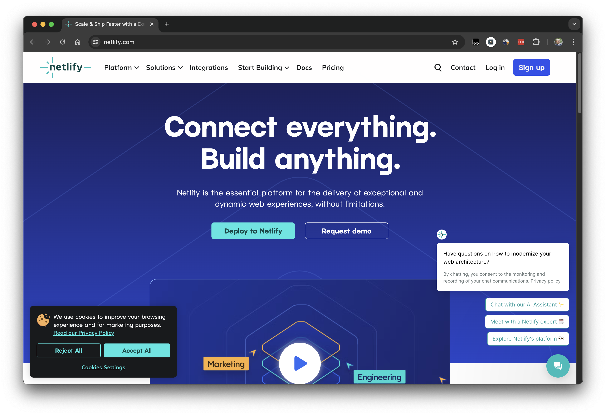
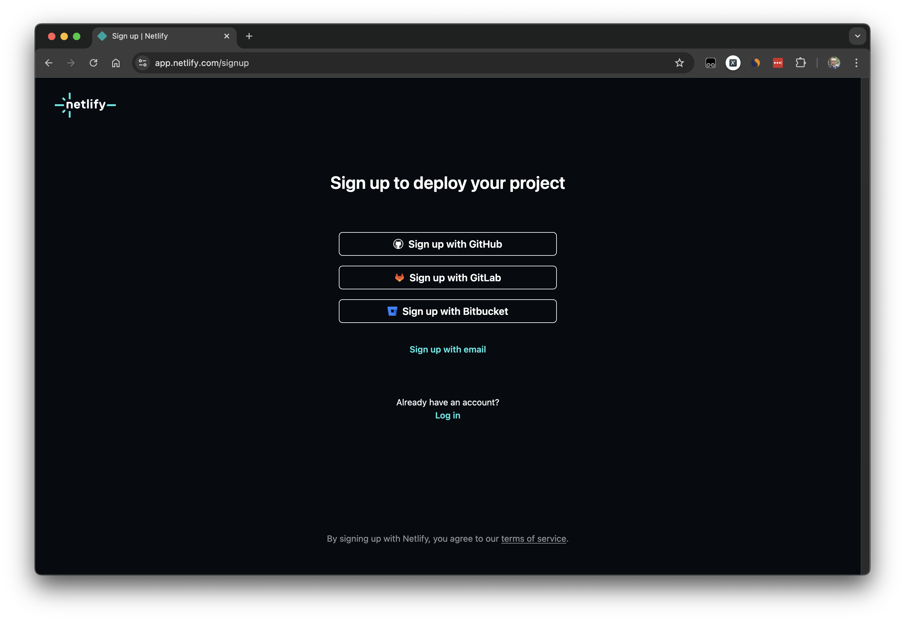
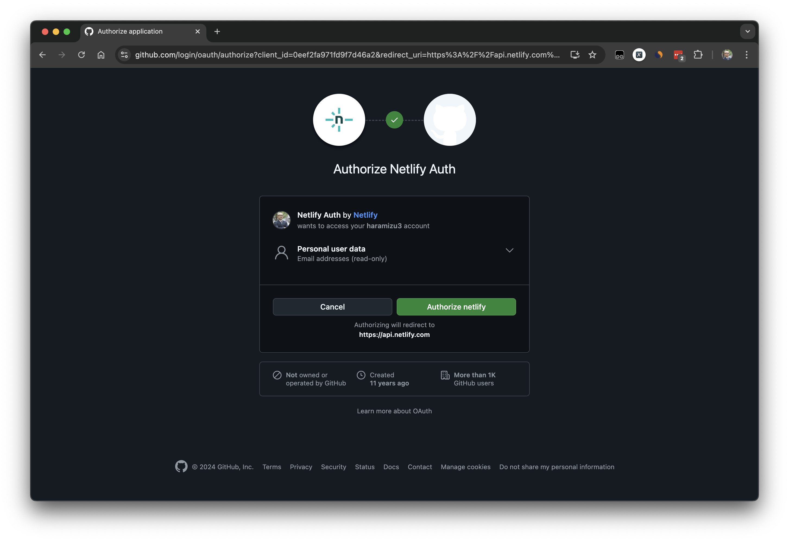
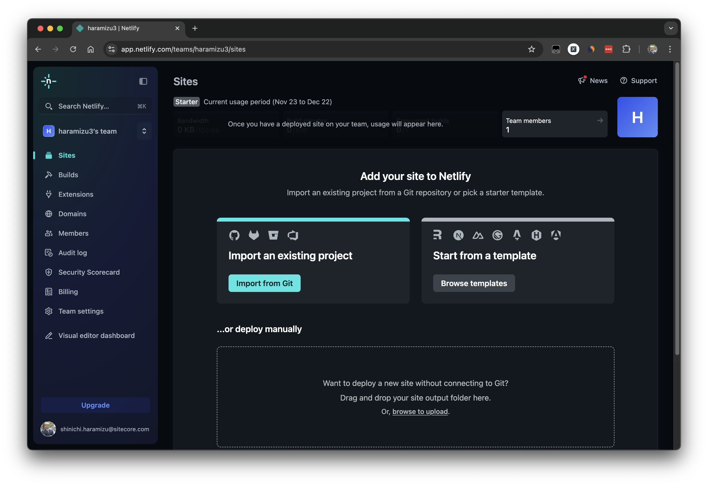
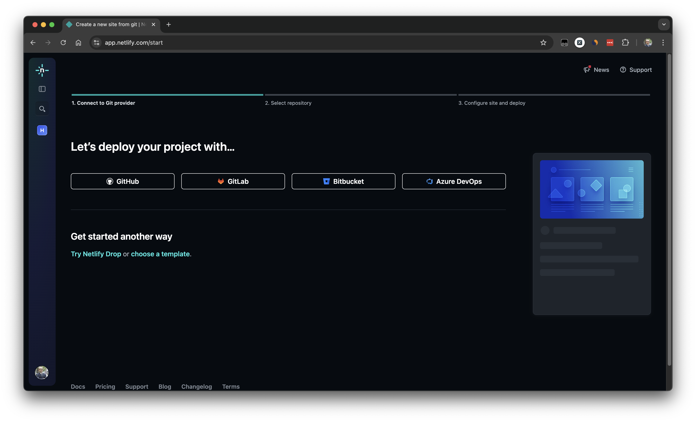
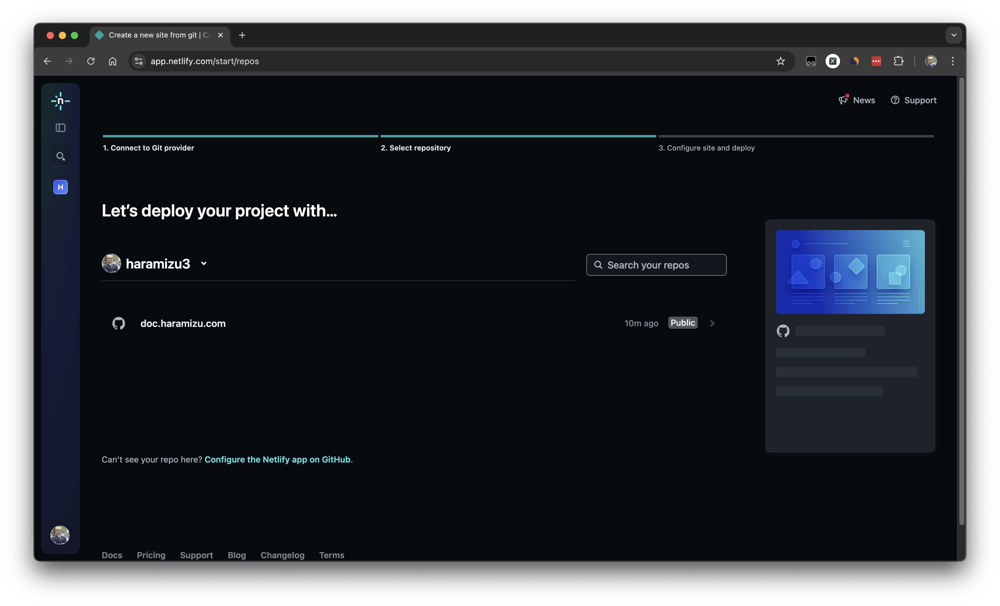
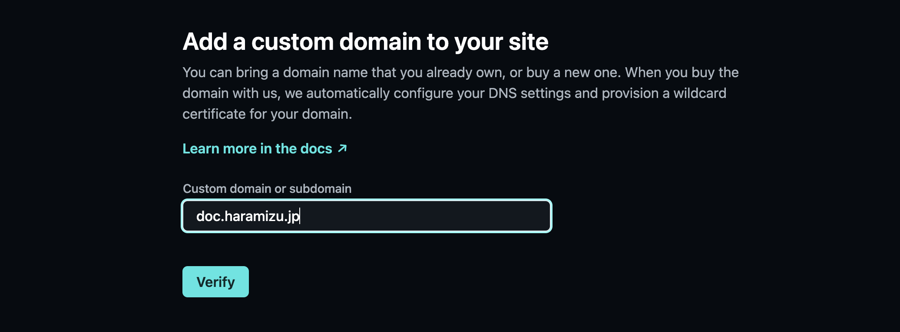
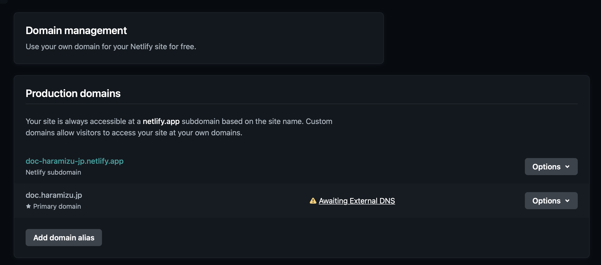

import { Steps, LinkCard } from '@astrojs/starlight/components';

Netlify is a hosting service that makes it easy to deploy static and dynamic sites. It integrates with repositories like GitHub, GitLab, and Bitbucket, automatically building and deploying whenever code changes are pushed. Netlify's powerful features include custom domain settings, automatic SSL certificate generation, form handling, and support for serverless functions. Additionally, by using the preview feature, you can check the deployed site for each pull request, making team collaboration easier. By using Netlify, developers can quickly publish websites without being bothered by infrastructure management.

## About Plans

There are three plans available. You can check the details on the official website.

<LinkCard title="Pricing" href="https://www.netlify.com/pricing/" target="_blank" />

To summarize, they are as follows:

- Free & Starter
  - Free plan
  - For one person only (Pro is required for teams)
  - Basic hosting features
  - Up to 500 sites
- Pro
  - Password-protected sites
  - More bandwidth and build time than Free
  - Support via Slack and email
- Enterprise
  - SSO
  - Custom number of sites

Netlify acquired the static site generator tool Gatsby in 2023. They are promoting it as a good combination with static hosting services. Of course, it is possible to deploy other frameworks, but some cases may require plugins.

## Creating an Account

To create an account, click the `Sign up` button displayed at the top right of the official website.

<Steps>

1. Click the `Sign up` button

   

2. You can choose the service to link when using the account.

   

   This time, select GitHub

3. A confirmation screen will appear to link with your GitHub account.

   

4. The account is created, and you log in to the management screen

   

</Steps>

## Adding a Site

Let's add a new site right away.

<Steps>

1. Click `Import from Git` on the above screen.

2. A list of services to link the source code will be displayed. Select GitHub here.

   

3. The screen will move to the GitHub management screen, and a confirmation regarding access rights will be displayed. Click `Authorize Netlify` to proceed.

   

4. If the target account includes organizations that can be linked, you can select them here. This time, link with the usual account.

   

5. Regarding the repository to be linked, this time, specify only the designated repository. After selecting, move to the bottom of the screen and click the `Install` button.

   

6. Specify the repository designated on the previous screen.

   

7. Proceed with the project settings

   

   Set the following items here:

   - `Site name`: The name of the site, used as a subdomain of netlify.app
   - `Branch to deploy`: You can select the branch name of the specified repository
   - `Base directory`: Not necessary if running at the root
   - `Build command`: The command to execute when building. Example: `npm run build`
   - `Publish directory`: The deployment destination of the built data. Example: `dist`
   - `Functions directory`: Specify the directory if using functions
   - `Environment variables`: Apply any environment variables needed when building

   Click the Deploy button at the bottom of the screen. The build will be executed for a while.

   

8. When the deployment is complete, a Success screen will appear.

   

</Steps>

When the site is launched, a settings screen for this project will be provided as shown below.

## Add Subdomain

If you want to assign a custom domain to the launched site, you can proceed with the following steps.

<Steps>

1. Click `Domain management` in the project menu.

2. Click the `Add a domain` button to start the domain addition process.

   

3. Set the domain you want to add.

   

4. Once the domain is verified, the screen will switch to add the domain.

   

5. The screen will switch to confirm the work on the external DNS.

   

   Click Awaiting External DNS to display the information to be set in the DNS.

   

6. After a while, the DNS settings will be reflected, and you will be able to access the site.

   

</Steps>

This time, we were able to apply a subdomain.

## Summary

This time, we confirmed the steps to deploy this documentation site to Netlify. Since this site itself is a static site based on Astro, there were no particular sticking points, but if server-side rendering or other processing is required, separate steps will be needed.

