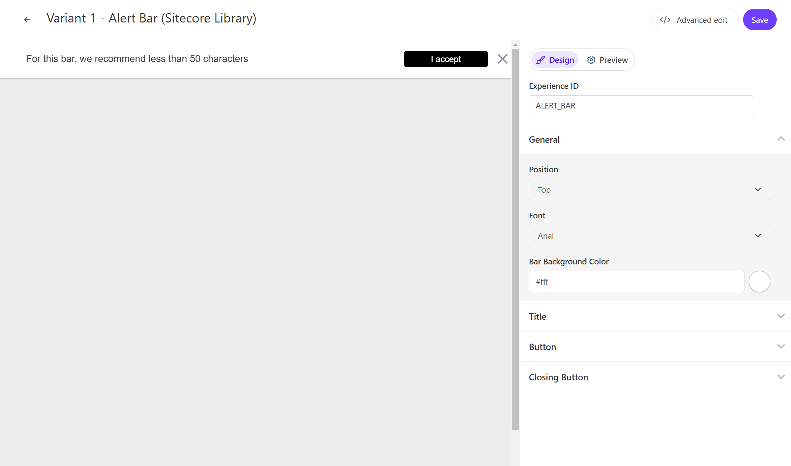
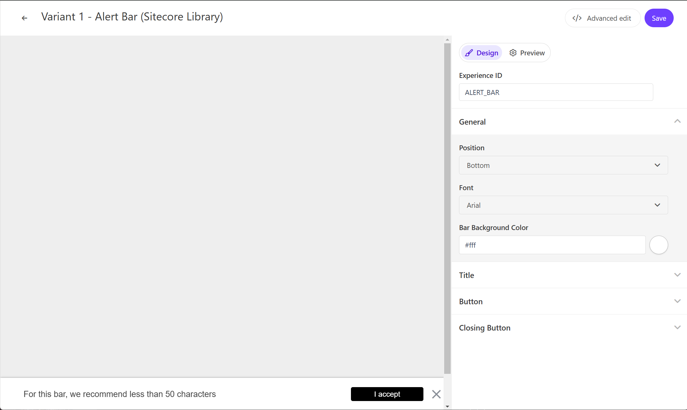

## Alert Bar

On this page, you can check out a demo of the standard Alert Bar template provided by Sitecore Personalize.

### Display Position

The Alert Bar can be displayed at the top or bottom of the page. The setting item is `General` - `Position`.

### Text

You can change the text used in the Alert Bar. The setting item is `Title` - `Title Text`.

### Button

You can change the button used in the Alert Bar. The setting item is `Button` - `Button Text` for the display text, and `Button Link` for the link destination.

## References

- [Back to Sample List](/en/cdp-personalize/sample/)