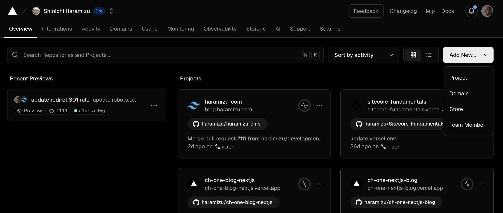
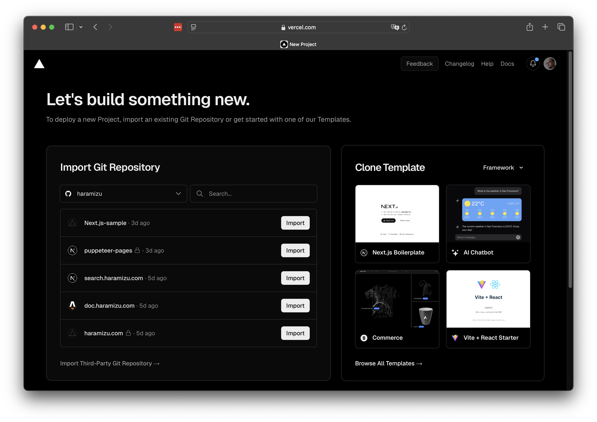
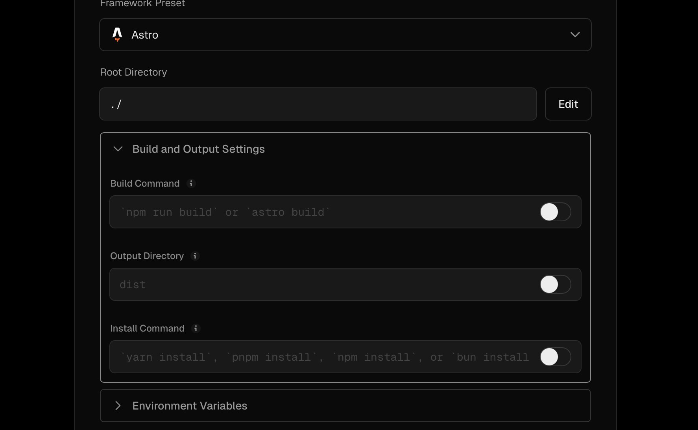
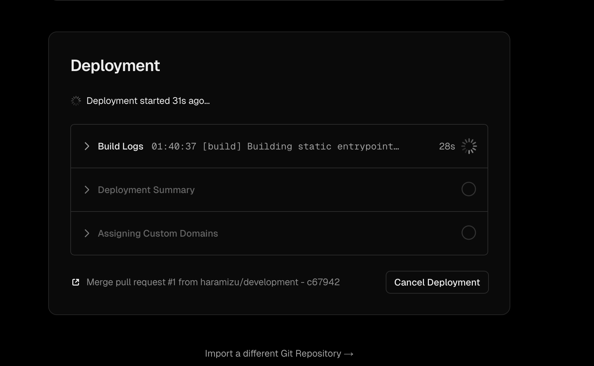
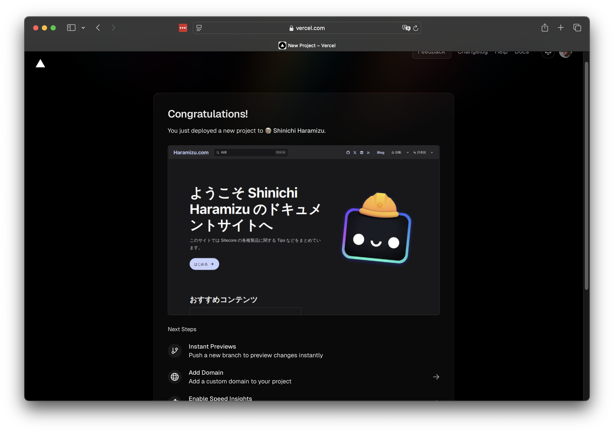
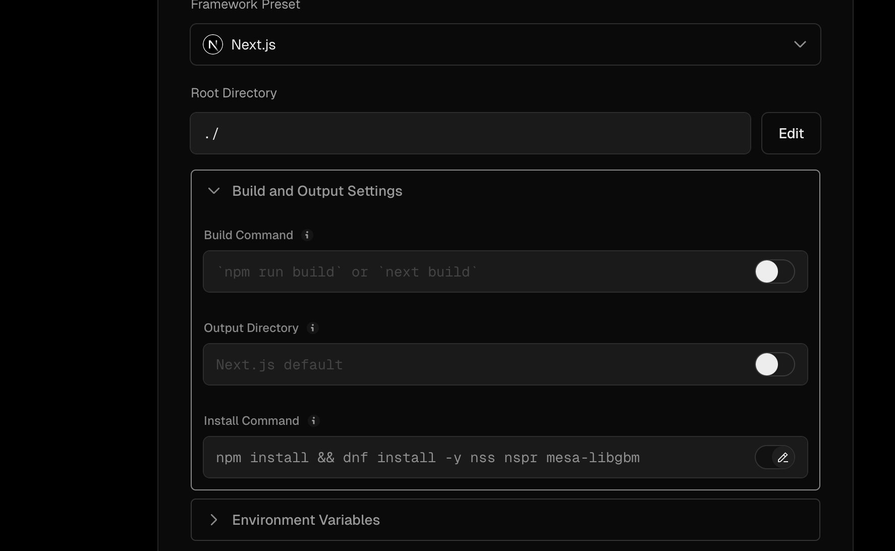
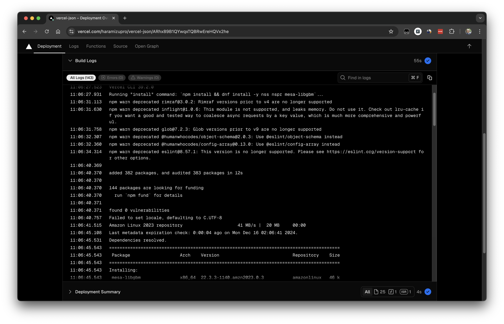
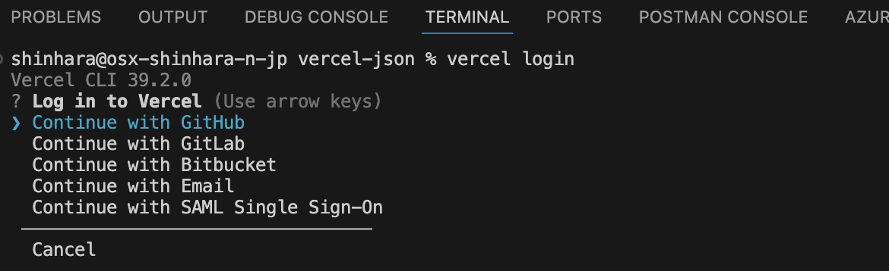
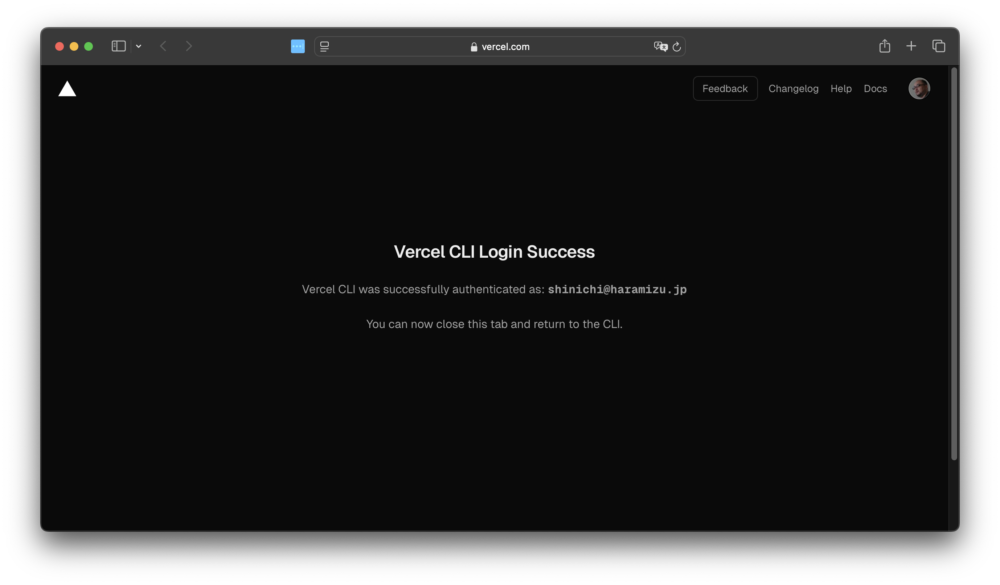
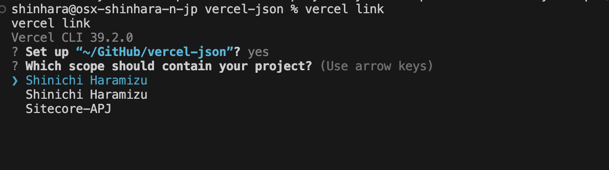

import { Steps, LinkCard } from '@astrojs/starlight/components';

Vercel is both a company name and a service name. As you can see when you visit their website, they offer several products and solutions. The content covered on this site includes the following:

- **Vercel**: Serverless hosting service with CI/CD support
- **Next.js**: Web framework using React
- **v0.dev**: Service that generates web components using AI for prototyping
- **AI SDK**: SDK for efficiently developing AI applications using React, Next.js, etc.

Among the above, this section summarizes tips for hosting and deploying with Vercel. For Next.js, see the following:

- [Next.js](/nextjs/overview/)

## What is Vercel?

Vercel is a cloud platform for frontend developers that makes it easy to deploy static sites and serverless functions. Vercel is also known as the creator of Next.js, providing a seamless development experience. Key features include the following:

- **Easy Deployment**: Automatically deploys by pushing to repositories like GitHub, GitLab, and Bitbucket.
- **High Performance**: Delivers fast content distribution via a global CDN, providing excellent performance to users.
- **Serverless Functions**: Easily implement APIs and backend logic as serverless functions.
- **Custom Domains**: Easily set up custom domains with automatic SSL certificate management.

Using Vercel simplifies the development-to-deployment process, enabling efficient development.

For example, this site is built as a static site based on Astro. When deploying this article written in Markdown as a web page, a build is executed. By deploying the code to GitHub, the build is automatically executed, and if there are no issues, it is applied to the production environment and published.

### Pricing

When using Vercel, there are plans for individual use (Hobby), team use or more serious use (Pro), and enterprise use (Enterprise). Check the official site for differences.

<LinkCard title="Pricing" href="https://vercel.com/pricing" target="_blank" />

Note that the Hobby plan is not allowed for commercial use, so ads with advertisements are not permitted. This condition can be avoided by switching to the Pro plan.

Here is a summary:

- Hobby
  - Easily host websites using GitHub, etc.
  - Custom domains and DNS features available
  - Plan for individual use (use Pro for teams)
  - Suitable for publishing samples
- Pro
  - Available for team use
  - More resources than allocated in Hobby
  - Commercial use allowed
  - Email support available
- Enterprise
  - SSO available
  - Audit Log available
  - SLA 99.99%

Most features are available in Hobby, making it accessible, and Pro starts at $20 per account, making it relatively inexpensive. Enterprise covers SSO and SLA required by companies.

## Deploying a Site

Here, we introduce the steps required to deploy with Vercel. Assuming you are using an account already linked with GitHub, deploy to Vercel.

<Steps>

1. Create a new project. Click the Add New button in the top right. Several creation menus will appear, select Project here.

   

2. A list of linked GitHub repositories will appear.

   

3. The new project settings screen will appear.

   

   You can see that it is already recognized as an Astro project, and the default deployment command is set accordingly.

   

4. After setting values such as environment variables, click the Deploy button to execute the build.

   

5. After a while, the deployment will be completed.

   

</Steps>

### Customizing Deployment Steps

In the above steps, the default build process was used, so the `Build and Output Settings` part was deployed as default. However, there are cases where you want to customize this part depending on the project. As a mechanism to manage this part with code, you can include a vercel.json file in the project to control this setting.

The official page for this setting procedure is as follows.

<LinkCard
  title="Configuring projects with vercel.json"
  href="https://vercel.com/docs/projects/project-configuration"
  target="_blank"
  description="Learn how to use vercel.json to configure and override the default behavior of Vercel from within your project."
/>

For example, if you need to add some libraries to the environment for the project. For projects targeting Node 20 or later, Vercel uses Amazon Linux 2023 for the build image.

<LinkCard
  title="Build image overview"
  href="https://vercel.com/docs/deployments/build-image"
  target="_blank"
  description="Learn about the container image used for Vercel builds."
/>

<LinkCard
  title="Introducing the Amazon Linux 2023 runtime for AWS Lambda"
  href="https://aws.amazon.com/blogs/compute/introducing-the-amazon-linux-2023-runtime-for-aws-lambda/"
  target="_blank"
  description="AWS Lambda now supports Amazon Linux 2023 (AL2023) as a managed runtime and container base image. Named provided.al2023, this runtime provides an OS-only environment to run your Lambda functions."
/>

For example, if you want to use Playwright with Next.js, some libraries are missing in the above Amazon Linux 2023 when deploying to Vercel. In such cases, place a vercel.json file as follows.

```json
// vercel.json
{
  "$schema": "https://openapi.vercel.sh/vercel.json",
  "installCommand": "npm install && dnf install -y nss nspr mesa-libgbm"
}
```

You can see that the Install Command part is reflected in the project that reads this file.



After actually deploying, you can see that the installation is executed by referring to the build log.



This time, we introduced the part of installing libraries, but understanding this part increases the possibility of using various tools with Vercel.

## Vercel CLI

For environment variables, if they are fixed for deployment, they can be used with Vercel.json. However, if you want to use different values for production and non-production environments, it is recommended to use Vercel CLI.

The official page for Vercel CLI is as follows.

<LinkCard
  title="Vercel CLI Overview"
  href="https://vercel.com/docs/cli"
  target="_blank"
  description="Learn how to use the Vercel command-line interface (CLI) to manage and configure your Vercel Projects from the command line."
/>

Vercel CLI is literally a tool for executing Vercel-related procedures from the command line, allowing you to link your local project with the Vercel project.

Installation is very simple, just run the following command.

```bash
npm i -g vercel
```

### Usage Example

Here, we introduce the steps to link environment variables between your local project and the Vercel project.

<Steps>

1. Execute the following command as a command line command in the root of the local project you want to link.

   ```bash
   vercel login
   ```

   The account selection screen will appear.

   

2. Click GitHub to launch the browser. Log in to GitHub.

3. After logging in with the browser, the Vercel CLI login is complete.

   

4. Execute the following command again.

   ```bash
   vercel link
   ```

5. It will check which project to link with locally. Since you are already working in that path, proceed with Yes.

6. If you belong to multiple teams, a team selection will appear to know which team's project it is.

   

7. A confirmation will appear to link with an existing project. Since we are linking with an already deployed project, select Y.

8. A `.env.local` file will be created.

</Steps>

In general, you can set multiple environment variable files, such as .env and .env.local. It is convenient to set them as follows:

- .env - Set default values for the environment
- .env.local - Manage secret codes related to the project

In fact, in projects like Next.js, .env.local files are often created by default without sharing, so it is important to manage secret codes in .env.local.

```
// .gitignore
.env.local
.env.\*.local
```

You can also use a file like .env.development.local to load it as a development environment.

## Summary

We introduced an overview of Vercel services, deployment customization, and Vercel CLI. While much more is possible, this introduction covers the basics you need to understand initially.

## References

<LinkCard
  title="AI SDK by Vercel"
  href="https://sdk.vercel.ai/docs/introduction"
  target="_blank"
  description="The AI SDK is the TypeScript toolkit designed to help developers build AI-powered applications with React, Next.js, Vue, Svelte, Node.js, and more."
/>

<LinkCard
  title="Configuring projects with vercel.json"
  href="https://vercel.com/docs/projects/project-configuration"
  target="_blank"
  description="Learn how to use vercel.json to configure and override the default behavior of Vercel from within your project."
/>

<LinkCard
  title="Build image overview"
  href="https://vercel.com/docs/deployments/build-image"
  target="_blank"
  description="Learn about the container image used for Vercel builds."
/>

<LinkCard
  title="Introducing the Amazon Linux 2023 runtime for AWS Lambda"
  href="https://aws.amazon.com/blogs/compute/introducing-the-amazon-linux-2023-runtime-for-aws-lambda/"
  target="_blank"
  description="AWS Lambda now supports Amazon Linux 2023 (AL2023) as a managed runtime and container base image. Named provided.al2023, this runtime provides an OS-only environment to run your Lambda functions."
/>

<LinkCard
  title="Vercel CLI Overview"
  href="https://vercel.com/docs/cli"
  target="_blank"
  description="Learn how to use the Vercel command-line interface (CLI) to manage and configure your Vercel Projects from the command line."
/>

