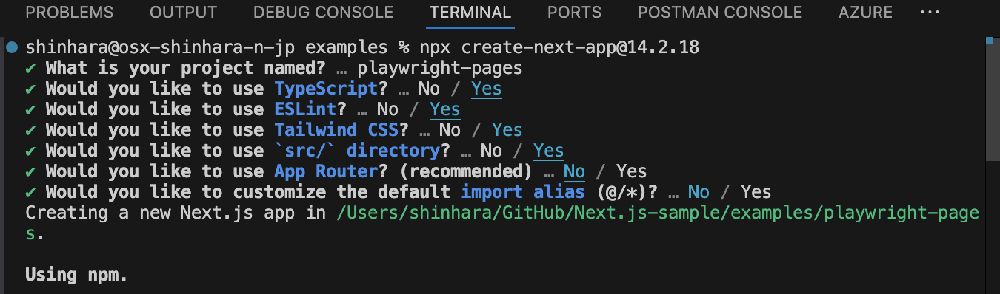
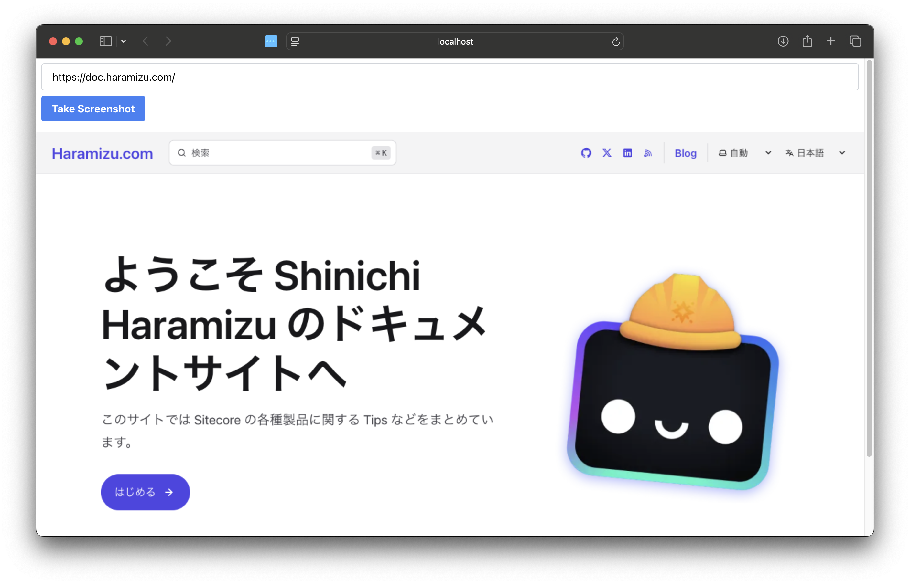
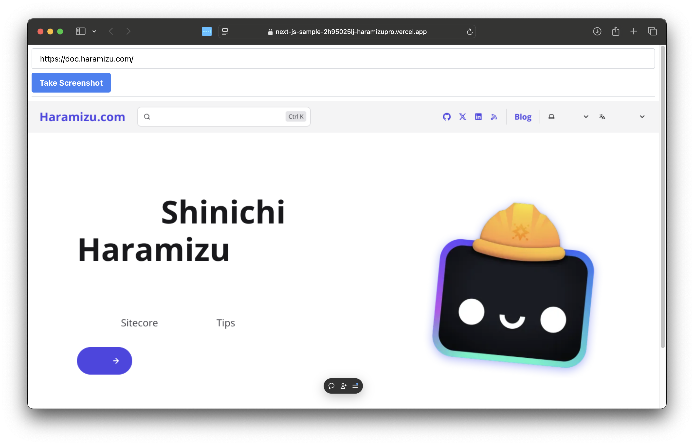
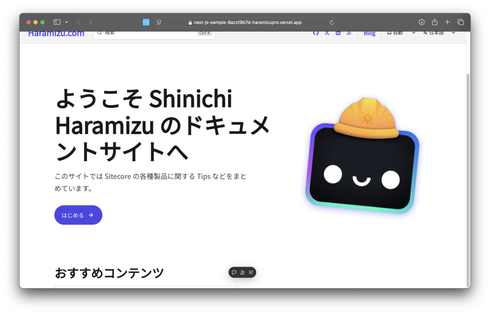

import { Steps, LinkCard } from '@astrojs/starlight/components';

Playwright is an open-source end-to-end test automation framework developed by Microsoft. It supports multiple browsers (Chromium, Firefox, WebKit) and can execute fast and reliable tests. Playwright offers many features, including cross-browser testing, screenshots, and PDF generation.

The official Playwright website is as follows:

<LinkCard
  title="Playwright"
  href="https://playwright.dev"
  target="_blank"
  description="Playwright enables reliable end-to-end testing for modern web apps."
/>

This document introduces the steps to deploy a Next.js sample using Playwright to Vercel and take screenshots.

## Create a Project

First, create a sample using Playwright with Next.js. The prerequisites for this document are as follows:

- Next.js 14.2.18
- Pages Router
- Node.js v20
- macOS
- Google Chrome

When running locally, it is assumed that Google Chrome is installed, and screenshots will be taken by running Google Chrome in Headless mode.

<Steps>

1. Create a new Next.js project.

   ```bash
   npx create-next-app@14.2.18
   ```

   The selections were made as follows:

   

2. Add the playwright package.

   ```bash
   npm install playwright-core
   ```

3. Use playwright as an API to capture images by specifying a URL. Create the file `src/pages/api/screenshot.ts` and add the following code.

   ```tsx
   // /src/pages/api/screenshot.ts
   import type { NextApiRequest, NextApiResponse } from 'next';
   import playwright from 'playwright-core';

   export default async function handler(req: NextApiRequest, res: NextApiResponse) {
     const url = req.query.url as string;
     const width = parseInt(req.query.width as string) || 1280;
     const height = parseInt(req.query.height as string) || 768;

     if (!url) {
       res.status(400).json({ error: 'URL is required' });
       return;
     }

     try {
       const browser = await playwright.chromium.launch({
         channel: 'chrome',
         headless: true,
       });

       const page = await browser.newPage();

       await page.setViewportSize({ width, height });
       await page.goto(url, { waitUntil: 'networkidle' });

       const screenshotBuffer = await page.screenshot();
       const screenshot = screenshotBuffer.toString('base64');
       await page.close();
       await browser.close();

       res.status(200).json({ screenshot });
     } catch (error) {
       console.error(error);
       res.status(500).json({ error: 'Failed to take screenshot' });
     }
   }
   ```

4. Modify the code of the Next.js top page as follows.

   ```tsx
   // /src/pages/index.tsx
   import Image from 'next/image';
   import { useState } from 'react';

   export default function Home() {
     const [screenshot, setScreenshot] = useState<string | null>(null);

     const handleTakeScreenshot = async () => {
       const urlInput = (document.getElementById('urlInput') as HTMLInputElement).value;
       const response = await fetch(
         `/api/screenshot?url=${encodeURIComponent(urlInput)}&width=1280&height=768`
       );
       const data = await response.json();
       setScreenshot(data.screenshot);
     };

     return (
       <div>
         <div className="m-2 border-b border-gray-300 pb-2">
           <input
             type="text"
             id="urlInput"
             placeholder="Enter URL"
             defaultValue="https://doc.haramizu.com/"
             className="mb-2 w-full rounded border border-gray-300 px-4 py-2"
           />
           <button
             onClick={handleTakeScreenshot}
             className="rounded bg-blue-500 px-4 py-2 font-bold text-white hover:bg-blue-700"
           >
             Take Screenshot
           </button>
         </div>
         <div>
           {screenshot && (
             <Image
               src={`data:image/png;base64,${screenshot}`}
               alt="Screenshot"
               width={1280}
               height={768}
             />
           )}
         </div>
       </div>
     );
   }
   ```

5. Remove all sample styles listed in the stylesheet `/src/styles/globals.css`.

   ```css
   @tailwind base;
   @tailwind components;
   @tailwind utilities;
   ```

</Steps>

Run the following command to execute.

```bash
npm run dev
```

Enter the URL, press the button, and take a screenshot. It was displayed as an image as follows.



## Deploy to Vercel

In the above, Google Chrome installed locally was used, but Chrome is not installed in the Vercel environment, so it does not work as is.

Therefore, this time, we will use a package called `@sparticuz/chromium`. This is a package of Chromium that can be used in a Serverless environment.

<LinkCard
  title="@sparticuz/chromium"
  href="https://github.com/Sparticuz/chromium"
  target="_blank"
  description="Chromium (x86-64) for Serverless Platforms"
/>

The steps are as follows.

<Steps>

1. Install `@sparticuz/chromium`.

   ```bash
   npm install @sparticuz/chromium
   ```

2. Modify the API in `/src/pages/api/screenshot.ts` to use the above chromium in the Vercel environment as follows.

   ```ts {4,20-32}
   // /src/pages/api/screenshot.ts
   import type { NextApiRequest, NextApiResponse } from "next";
   import playwright from "playwright-core";
   import chromium from "@sparticuz/chromium";

   export default async function handler(
     req: NextApiRequest,
     res: NextApiResponse,
   ) {
     const url = req.query.url as string;
     const width = parseInt(req.query.width as string) || 1280;
     const height = parseInt(req.query.height as string) || 768;

     if (!url) {
       res.status(400).json({ error: "URL is required" });
       return;
     }

     try {
       let browser;
       if (process.env.VERCEL_ENV) {
         browser = await playwright.chromium.launch({
           args: chromium.args,
           executablePath: await chromium.executablePath(),
           headless: true,
         });
       } else {
         browser = await playwright.chromium.launch({
           channel: 'chrome',
           headless: true,
         });
       }
       const page = await browser.newPage();
   ```

</Steps>

After the above changes, deploy to Vercel and check the operation. Enter the URL and execute it, and it will be as follows.



Actually, `@sparticuz/chromium` does not include Japanese fonts by default, so when referring to a Japanese page, the content is not displayed correctly on the page.

This time, to display Japanese, add processing to display Japanese in `/src/pages/api/screenshot.ts`. Specifically, add definitions regarding styles and wait for 1 second before taking a screenshot to apply them.

```ts {7-16}
// /src/pages/api/screenshot.ts
const page = await browser.newPage();

await page.setViewport({ width, height });
await page.goto(url, { waitUntil: 'networkidle' });

await page.addStyleTag({
  content: `
        @import url('https://fonts.googleapis.com/css2?family=Noto+Sans+JP&display=swap');
        * {
          font-family: 'Noto Sans JP', sans-serif !important;
        }
      `,
});

await new Promise((resolve) => setTimeout(resolve, 1000));

const screenshot = await page.screenshot({ encoding: 'base64' });
```

After the above code changes, redeploy to Vercel and run the test. Successfully took a screenshot.



## Summary

This time, we deployed a simple Next.js app using Playwright to Vercel. Regarding the part where Japanese could not be displayed, we were able to apply Japanese fonts to the screenshot by using the package's functions. It will probably work similarly for other languages as well.

This sample code is available at the following URL. We also share the code for App Router.

<LinkCard
  title="GitHub - haramizu / Next.js-sample: playwright-pages"
  href="https://github.com/haramizu/Next.js-sample/tree/main/examples/playwright-pages"
  description="Playwright - Next.js Pages Router version"
  target="_blank"
/>

<LinkCard
  title="GitHub - haramizu / Next.js-sample: playwright-pages"
  href="https://github.com/haramizu/Next.js-sample/tree/main/examples/playwright-app"
  description="Playwright - Next.js App Router version"
  target="_blank"
/>

