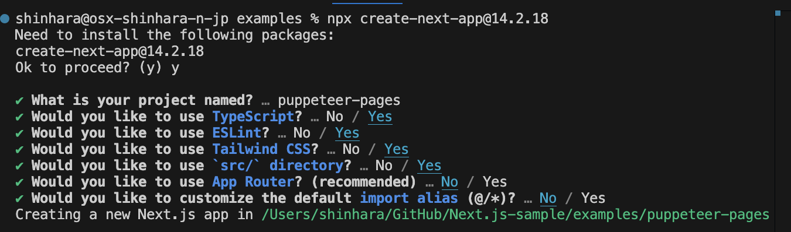
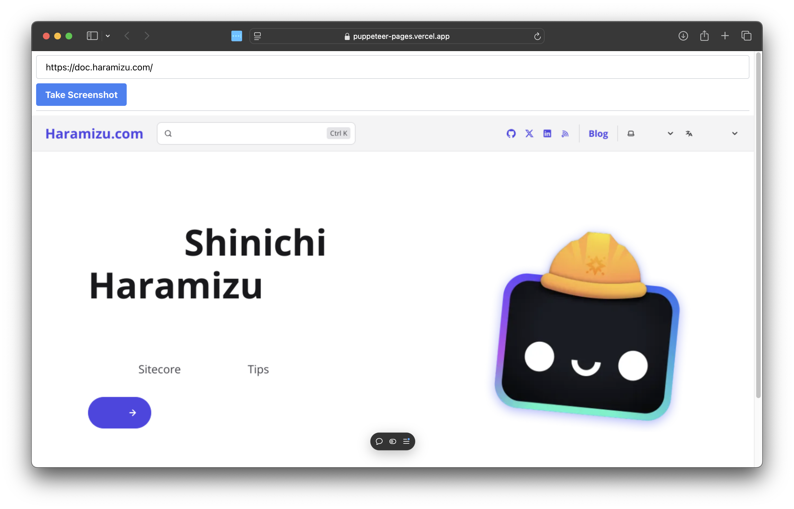
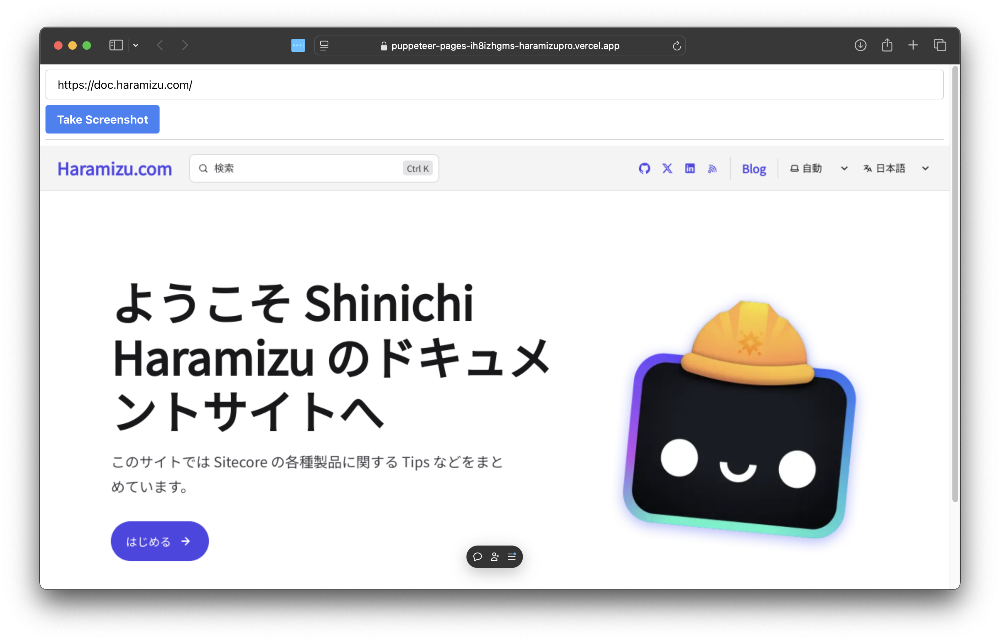

import { Steps, LinkCard } from '@astrojs/starlight/components';

Puppeteer is a library developed for Node.js that provides an API to control Chrome or Chromium. It is specialized for operating Headless Chrome and is often used for test automation. The official website is as follows.

<LinkCard
  title="Puppeteer"
  href="https://pptr.dev"
  description="Puppeteer is a JavaScript library which provides a high-level API to control Chrome or Firefox over the DevTools Protocol or WebDriver BiDi. Puppeteer runs in the headless (no visible UI) by default"
  target="_blank"
/>

Here, we will introduce the steps to deploy a Next.js sample using Puppeteer to Vercel.

## Create a Project

First, we will create a sample of Puppeteer that can be used with Next.js. The prerequisites for this document are as follows:

- Next.js 14.2.18
- Pages Router
- Node.js v20
- macOS
- Google Chrome

When running locally, it is assumed that Google Chrome is installed, and it will operate in Headless mode to take screenshots.

<Steps>

1. Create a new Next.js project.

   ```bash
   npx create-next-app@14.2.18
   ```

   This time, we selected as follows.

   

2. Add the puppeteer package.

   ```bash
   npm install puppeteer-core
   ```

3. This time, we will use puppeteer as an API to get images by specifying a URL. Therefore, create a file `src/pages/api/screenshot.ts` and add the following code.

   ```tsx
   // /src/pages/api/screenshot.ts
   // Next.js API route support: https://nextjs.org/docs/api-routes/introduction
   import type { NextApiRequest, NextApiResponse } from 'next';
   import puppeteer from 'puppeteer-core';

   export default async function handler(req: NextApiRequest, res: NextApiResponse) {
     const url = req.query.url as string;
     const width = parseInt(req.query.width as string) || 1280;
     const height = parseInt(req.query.height as string) || 768;

     if (!url) {
       res.status(400).json({ error: 'URL is required' });
       return;
     }

     try {
       const browser = await puppeteer.launch({
         channel: 'chrome',
         headless: true,
       });

       const page = await browser.newPage();

       await page.setViewport({ width, height });
       await page.goto(url, { waitUntil: 'networkidle0' });

       const screenshot = await page.screenshot({ encoding: 'base64' });
       await page.close();
       await browser.close();

       res.status(200).json({ screenshot });
     } catch (error) {
       console.error(error);
       res.status(500).json({ error: 'Failed to take screenshot' });
     }
   }
   ```

4. Change the code of the Next.js top page as follows.

   ```tsx
   // /src/pages/index.tsx
   import Image from 'next/image';
   import { useState } from 'react';

   export default function Home() {
     const [screenshot, setScreenshot] = useState<string | null>(null);

     const handleTakeScreenshot = async () => {
       const urlInput = (document.getElementById('urlInput') as HTMLInputElement).value;
       const response = await fetch(
         `/api/screenshot?url=${encodeURIComponent(urlInput)}&width=1280&height=768`
       );
       const data = await response.json();
       setScreenshot(data.screenshot);
     };

     return (
       <div>
         <div className="m-2 border-b border-gray-300 pb-2">
           <input
             type="text"
             id="urlInput"
             placeholder="Enter URL"
             defaultValue="https://doc.haramizu.com/"
             className="mb-2 w-full rounded border border-gray-300 px-4 py-2"
           />
           <button
             onClick={handleTakeScreenshot}
             className="rounded bg-blue-500 px-4 py-2 font-bold text-white hover:bg-blue-700"
           >
             Take Screenshot
           </button>
         </div>
         <div>
           {screenshot && (
             <Image
               src={`data:image/png;base64,${screenshot}`}
               alt="Screenshot"
               width={1280}
               height={768}
             />
           )}
         </div>
       </div>
     );
   }
   ```

5. Delete all sample styles listed in the stylesheet `/src/styles/globals.css`.

   ```css
   @tailwind base;
   @tailwind components;
   @tailwind utilities;
   ```

</Steps>

Run the above state.

```bash
npm run dev
```

Enter the URL and press the button to take a screenshot. It was displayed as an image as follows.


## Deploy to Vercel

In the above, we used Google Chrome installed locally, but Chrome is not installed in the Vercel environment, so it does not work as it is.

Therefore, this time, we will use a package called `@sparticuz/chromium`. This is a package of Chromium that can be used in a Serverless environment.

<LinkCard
  title="@sparticuz/chromium"
  href="https://github.com/Sparticuz/chromium"
  target="_blank"
  description="Chromium (x86-64) for Serverless Platforms"
/>

The steps are as follows.

<Steps>

1. Install `@sparticuz/chromium`

   ```bash
   npm install @sparticuz/chromium
   ```

2. Change the API in `/src/pages/api/screenshot.ts` to use the above chromium in the Vercel environment as follows.

   ```ts {4,20-32}
   // /src/pages/api/screenshot.ts
   import type { NextApiRequest, NextApiResponse } from "next";
   import puppeteer from "puppeteer-core";
   import chromium from "@sparticuz/chromium";

   export default async function handler(
     req: NextApiRequest,
     res: NextApiResponse,
   ) {
     const url = req.query.url as string;
     const width = parseInt(req.query.width as string) || 1280;
     const height = parseInt(req.query.height as string) || 768;

     if (!url) {
       res.status(400).json({ error: "URL is required" });
       return;
     }

     try {
       let browser;
       if (process.env.VERCEL_ENV) {
         browser = await puppeteer.launch({
           args: chromium.args,
           executablePath: await chromium.executablePath(),
           headless: true,
         });
       } else {
         browser = await puppeteer.launch({
           channel: 'chrome',
           headless: true,
         });
       }

       const page = await browser.newPage();
   ```

</Steps>

After the above changes, deploy to Vercel and check the operation. When you enter the URL and execute it, it will be as follows.



Actually, `@sparticuz/chromium` does not include Japanese fonts by default, so when you refer to a Japanese page, the content is not displayed correctly on the page.

This time, we want to display Japanese as well, so we will add processing to display Japanese in `/src/pages/api/screenshot.ts`. Specifically, add a definition for the style and wait for 1 second before taking the screenshot to apply it.

```ts {7-16}
// /src/pages/api/screenshot.ts
const page = await browser.newPage();

await page.setViewport({ width, height });
await page.goto(url, { waitUntil: 'networkidle0' });

await page.addStyleTag({
  content: `
        @import url('https://fonts.googleapis.com/css2?family=Noto+Sans+JP&display=swap');
        * {
          font-family: 'Noto Sans JP', sans-serif !important;
        }
      `,
});

await new Promise((resolve) => setTimeout(resolve, 1000));

const screenshot = await page.screenshot({ encoding: 'base64' });
```

After the above code changes, deploy to Vercel again and run the test. Successfully took a screenshot.



## Summary

This time, we deployed a simple Next.js app using Puppeteer to Vercel. Regarding the part where Japanese cannot be displayed, we were able to apply Japanese fonts to the screenshot by using the package function. It will probably work similarly for other languages as well.

This sample code is available at the following URL. We also share the code for App Router.

<LinkCard
  title="GitHub - haramizu / Next.js-sample: puppeteer-pages"
  href="https://github.com/haramizu/Next.js-sample/tree/main/examples/puppeteer-pages"
  description="Puppeteer - Next.js Pages Router version"
  target="_blank"
/>

<LinkCard
  title="GitHub - haramizu / Next.js-sample: puppeteer-app"
  href="https://github.com/haramizu/Next.js-sample/tree/main/examples/puppeteer-app"
  description="Puppeteer - Next.js App Router version"
  target="_blank"
/>

