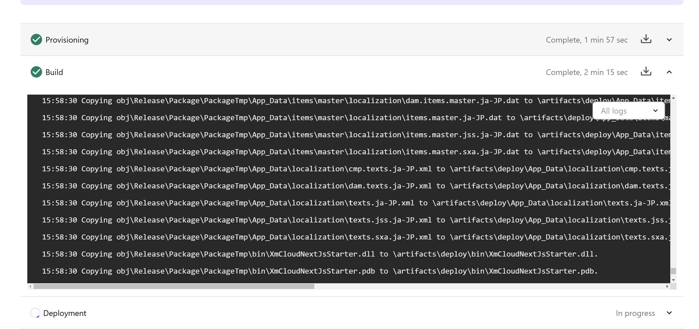
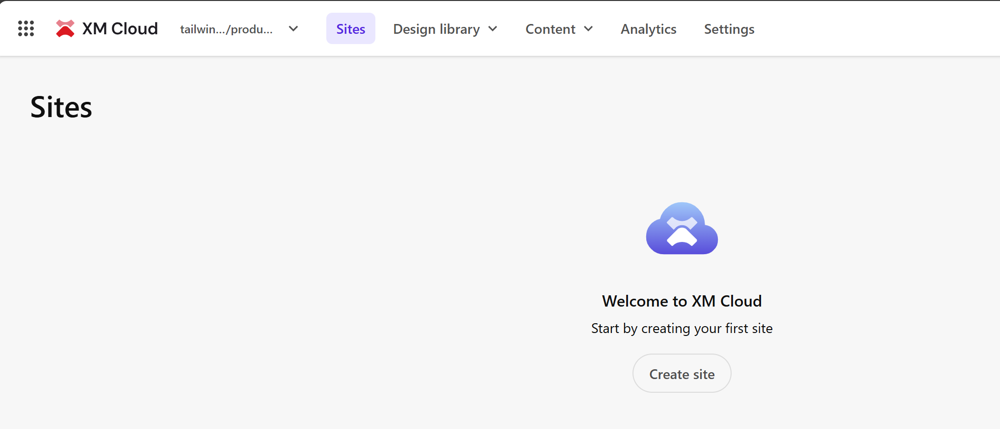

import { Steps, LinkCard, Aside, FileTree } from '@astrojs/starlight/components';
import { YouTube } from 'astro-embed';

We provide a template site called tailwind-starter that includes the information introduced on this site. This project applies some changes in addition to the standard template, so we will introduce those contents here.

## Prerequisites

The prerequisites for the contents introduced in this document are as follows.

First, the base image was created using the following repository.

<LinkCard
  title="XM Cloud Next.js Starter Kit"
  href="https://github.com/sitecorelabs/xmcloud-foundation-head"
  target="_blank"
/>

The following environment has been confirmed to work.

- Windows 11 Pro
- Node.js 20.18.1
- Docker Desktop 4.36.0

Using the above template, we provide a new sample in the following repository.

<LinkCard
  title="XM Cloud Next.js Tailwind CSS Starter Kit"
  href="https://github.com/haramizu/tailwind-starter"
  target="_blank"
/>

## About Docker Environment

The .env file that runs in the Docker environment will contain environment-specific information. If you use this file as it is, it will be shared along with that information when published on GitHub, etc. Therefore, we will change the settings here so that the .env file is not shared.

The following YouTube video is helpful for this procedure.

<YouTube id="https://youtu.be/uNkQQSC6n8o" title="XM Cloud Tutorials - Rename app #4" />

The actual procedure is as follows.

<Steps>

1. Rename the `.env` file to `.env.template`

2. Remove environment-specific keys from `env.template`

   - SITECORE_ADMIN_PASSWORD
   - SQL_SA_PASSWORD
   - REPORTING_API_KEY
   - TELERIK_ENCRYPTION_KEY
   - MEDIA_REQUEST_PROTECTION_SHARED_SECRET
   - JSS_DEPLOYMENT_SECRET_xmcloudpreview
   - SITECORE_API_KEY_xmcloudpreview
   - JSS_EDITING_SECRET

3. Commit the changes to .env and .env.template to delete the .env file

   

4. Update .gitignore

   ```
   // .gitignore

   # Environment file .env
   .env
   ```

   This change ensures that the `.env` file will not be published on GitHub

5. Modify the script to create `.env` from `.env.template` when running `init.ps1`.

   ```ps1 {4-9}
   // local-containers\scripts\init.ps1
   $envFileLocation = "$RepoRoot/local-containers/.env"

   ################################
   # Create .env file
   ################################

   Write-Host "Create .env file." -ForegroundColor Green
   Copy-Item ".\.env.template" ".\.env" -Force

   ################################
   # Add Windows hosts file entries
   ################################
   ```

</Steps>

With the above changes, the `.env` file is protected, and the local Docker environment is ready.

Launch a Terminal with administrator privileges and start the local environment as follows.

```ps1
cd local-containers
./scripts/init.ps1 -InitEnv -LicenseXmlPath "C:\license\license.xml" -AdminPassword "DesiredAdminPassword"
```

The .env file will be created, and the environment will be set up as shown below.


To start the container, run the following command in a Terminal with administrator privileges.

```ps1
./scripts/up.ps1
```

This will start the local Docker environment.

## Changes to up.ps1

The `local-containers\scripts\up.ps1` file provided by default requires administrator privileges. The code that requires these privileges is as follows.

```ps1
// local-containers\scripts\up.ps1
#set nuget version
$xmCloudBuild = Get-Content "$RepoRoot/xmcloud.build.json" | ConvertFrom-Json
$nodeVersion = $xmCloudBuild.renderingHosts.nextjsstarter.nodeVersion
if (![string]::IsNullOrWhitespace($nodeVersion)) {
    Set-EnvFileVariable "NODEJS_VERSION" -Value $xmCloudBuild.renderingHosts.nextjsstarter.nodeVersion -Path $envFileLocation
}
```

This code is used to retrieve the Node.js version information from the JSON file `xmcloud.build.json` that defines the environment variables for XM Cloud and set it as an environment variable. By commenting out this part, you can run `./scripts/up.ps1` without administrator privileges.

## Adding Japanese Resources

You can add Sitecore Experience Manager resources to the Sitecore XM Cloud environment and the local Docker environment. This allows you to import Japanese resources for common items.

<Aside type="caution">This procedure is not officially supported.</Aside>

### Preparing Resource Files

This time, we will download and use the resource files of Sitecore Experience Manager from the official site. Download the following files.

<LinkCard
  title="Sitecore Experience Platform 10.4 - Client translations"
  href="https://developers.sitecore.com/downloads/Sitecore_Experience_Platform/104/Sitecore_Experience_Platform_104#client-translations"
  target="_blank"
/>

<LinkCard
  title="Sitecore Experience Accelerator 10.4.0 - Client translations"
  href="https://developers.sitecore.com/downloads/Sitecore_Experience_Accelerator/10x/Sitecore_Experience_Accelerator_1040#client-translations"
  target="_blank"
/>

<LinkCard
  title="Sitecore Headless Rendering 22.0.0 - Client translations"
  href="https://developers.sitecore.com/downloads/Sitecore_Headless_Rendering/22x/Sitecore_Headless_Rendering_2200#client-translations"
  target="_blank"
/>

<LinkCard
  title="Sitecore Connect™ for Content Hub 5.2.0 - Client translations"
  href="https://developers.sitecore.com/downloads/Sitecore_Connect_for_Content_Hub/5x/Sitecore_Connect_for_Content_Hub_520#client-translations"
  target="_blank"
/>

Create a folder `local-containers\docker\build\cm\App_Data` and extract the downloaded files there. Note that web-related resources are not needed for XM Cloud, so they are omitted.

<FileTree>

- local-containers
  - docker
    - build
      - cm
        - **App_Data**
          - items
            - core
              - localization
                - cmp.items.core.ja-JP.dat
                - dam.items.core.ja-JP.dat
                - items.core.ja-JP.dat
                - items.core.jss.ja-JP.dat
                - items.core.sxa.ja-JP.dat
            - master
              - localization
                - cmp.items.master.ja-JP.dat
                - dam.items.master.ja-JP.dat
                - items.master.ja-JP.dat
                - items.master.jss.ja-JP.dat
                - items.master.sxa.ja-JP.dat
          - localization
            - cmp.texts.ja-JP.xml
            - dam.texts.ja-JP.xml
            - texts.ja-JP.xml
            - texts.sxa.ja-JP.xml

</FileTree>

The resource files are ready.

### Applying to Docker Environment

This time, we can apply the resource files by copying them to the cm instance, so add a copy command to the following file.

```dockerfile title="local-containers/docker/build/cm/Dockerfile" {15}
# escape=`

ARG PARENT_IMAGE
ARG SOLUTION_IMAGE
ARG TOOLS_IMAGE

FROM ${TOOLS_IMAGE} as tools
FROM ${PARENT_IMAGE}

SHELL ["powershell", "-Command", "$ErrorActionPreference = 'Stop'; $ProgressPreference = 'SilentlyContinue';"]

WORKDIR C:\inetpub\wwwroot

# resource copy
COPY .\App_Data\ .\App_Data

# Copy developer tools and entrypoint
COPY --from=tools C:\tools C:\tools
```

After changing the settings, apply and start the local environment.

<Steps>

1. Launch Desktop

2. Click the icon in the lower right corner and switch to Core

   

3. From the Control Panel, select Localization - `Add a new language`.

4. Add Japanese - Japan

   

5. After adding the language, launch Desktop and switch the database back to master.

</Steps>

With the above steps, you can select Japanese resources. When you set the display language to Japanese in the user profile, the local environment will display data in Japanese.


### Applying to XM Cloud Environment

To apply the resource files to the XM Cloud environment, you need to adjust the XM Cloud Deploy to include the resource files through the authoring project. The steps are as follows.

<Steps>

1. Create a folder `authoring\platform\App_Data` and copy the files with the same structure as `local-containers\docker\build\cm\App_Data`.

   <FileTree>

   - authoring
     - platform
       - **App_Data**
         - items
           - core
             - localization
               - cmp.items.core.ja-JP.dat
               - dam.items.core.ja-JP.dat
               - items.core.ja-JP.dat
               - items.core.jss.ja-JP.dat
               - items.core.sxa.ja-JP.dat
           - master
             - localization
               - cmp.items.master.ja-JP.dat
               - dam.items.master.ja-JP.dat
               - items.master.ja-JP.dat
               - items.master.jss.ja-JP.dat
               - items.master.sxa.ja-JP.dat
         - localization
           - cmp.texts.ja-JP.xml
           - dam.texts.ja-JP.xml
           - texts.ja-JP.xml
           - texts.sxa.ja-JP.xml

   </FileTree>

2. Add the following lines to include the above files in the project file `authoring\platform\Platform.csproj`.

   ```xml title="authoring\platform\Platform.csproj" {2-16}
     <ItemGroup>
       <Content Include="App_Data\items\core\localization\cmp.items.core.ja-JP.dat" />
       <Content Include="App_Data\items\core\localization\dam.items.core.ja-JP.dat" />
       <Content Include="App_Data\items\core\localization\items.core.ja-JP.dat" />
       <Content Include="App_Data\items\core\localization\items.core.jss.ja-JP.dat" />
       <Content Include="App_Data\items\core\localization\items.core.sxa.ja-JP.dat" />
       <Content Include="App_Data\items\master\localization\cmp.items.master.ja-JP.dat" />
       <Content Include="App_Data\items\master\localization\dam.items.master.ja-JP.dat" />
       <Content Include="App_Data\items\master\localization\items.master.ja-JP.dat" />
       <Content Include="App_Data\items\master\localization\items.master.jss.ja-JP.dat" />
       <Content Include="App_Data\items\master\localization\items.master.sxa.ja-JP.dat" />
       <Content Include="App_Data\localization\cmp.texts.ja-JP.xml" />
       <Content Include="App_Data\localization\dam.texts.ja-JP.xml" />
       <Content Include="App_Data\localization\texts.ja-JP.xml" />
       <Content Include="App_Data\localization\texts.jss.ja-JP.xml" />
       <Content Include="App_Data\localization\texts.sxa.ja-JP.xml" />
       <None Include="Platform.wpp.targets" />
   ```

</Steps>

This allows you to start the XM Cloud instance with the resource files included.

When you build the project with the above settings and deploy it with XM Cloud Deploy, you can confirm that it is deployed with the resource files included.



After the new environment is started, follow these steps to add Japanese resources.

<Steps>

1. From the Sites menu that displays the list of sites, select Settings.

   

2. Open Desktop from the left menu

   

3. Click the icon in the lower right corner and switch to Core

   

4. From the Control Panel, select Localization - `Add a new language`.

5. Add Japanese - Japan

   

6. After adding the language, launch Desktop and switch the database back to master.

</Steps>

With the above steps, you can select Japanese resources.

Although it does not apply to all resources in Sitecore XM Cloud, you can confirm that Japanese data is displayed in the Content Editor, which is a common tool. First, open Content Editor under Content in the Sites menu.


This time, to verify that the language is imported correctly, we will switch the language in the URL instead of switching the user's language. Change the last language in the URL accessing the CMS to `&sc_lang=ja-JP`. Then, it was displayed in Japanese resources as shown below.


## Adding new Project

In addition to the existing Next.js Starter Kit and Angular SAP Starter Kit, we will add a new project this time. Ultimately, we will proceed with the steps to make it work with the following structure.

<FileTree>

- headapps
  - nextjs-starter/ Nest.js starter kit
  - spa-starters/ angular starter kit
  - **tailwind-starter/** new project
- local-containers
  - docker
    - build/ docker build image
    - data/ docker data folder
    - deploy
      - platform/
    - traefik/ traefik data and certification
    - clean.ps1 docker image clean up script
  - scripts
    - down.ps1 docker script
    - init.ps1 init script for local instance
    - up.ps1 start xm cloud instance
  - docker-compose.override.yml
  - docker-compose.yml
- sitecore.json Sitecore CLI configuration file
- xmcloud.build.json XM Cloud Deploy configuration file

</FileTree>

### Prerequisites

We will proceed with creating the project in the following environment.

- Windows 11 Pro 24H2
- Node 22.12.0
- Docker Desktop 4.36.0 (175267)
- Visual Studio Code + Docker 機能拡張

### add Project

First, add a new Next.js project. In the headapps folder, run the following command to add a new project:

```bash
npx create-sitecore-jss
```

This will add a project in the `tailwind-starter` directory, similar to the `nextjs-starter` project.


### Docker Environment

Next, modify the local Docker environment configuration to run the `tailwind-starter` Node.js container.

<Steps>

1. Add two environment variables to the `.env.template` and `.env` files.

   ```
   // .env.template
   RENDERING_HOST_TAILWIND=tailwind.xmc-starter-js.localhost
   RENDERING_HOST_INTERNAL_TAILWIND_URI=http://rendering-tailwind:3000
   ```

2. Add the `tailwind.xmc-starter-js.localhost` entry to the localhost.

3. Prepare a Node instance for the `tailwind-starter`. Copy the `nextjs-starter` image and create a Dockerfile.

   ```dockerfile title="local-containers\docker\build\rendering-tailwind\Dockerfile"
   # escape=`

   ARG PARENT_IMAGE
   FROM ${PARENT_IMAGE} as debug

   USER ContainerAdministrator

   WORKDIR /app

   EXPOSE 3000
   ENTRYPOINT "npm install && npm run start:connected"
   ```

4. Add the following lines to the `local-containers\docker-compose.override.yml` file to build and start the container.

   ```yml
   // local-containers\docker-compose.override.yml
     rendering-tailwind:
      image: ${REGISTRY}${COMPOSE_PROJECT_NAME}-rendering-tailwind:${VERSION:-latest}
      build:
       context: ./docker/build/rendering-tailwind
       target: ${BUILD_CONFIGURATION}
       args:
         PARENT_IMAGE: ${REGISTRY}${COMPOSE_PROJECT_NAME}-nodejs:${VERSION:-latest}
      volumes:
       - ../headapps/tailwind-starter:C:\app
      environment:
       SITECORE_API_HOST: "http://cm"
       NEXTJS_DIST_DIR: ".next-container"
       PUBLIC_URL: "https://${RENDERING_HOST_TAILWIND}"
       JSS_EDITING_SECRET: ${JSS_EDITING_SECRET}
       SITECORE_API_KEY: "${SITECORE_API_KEY_APP_STARTER}"
       DISABLE_SSG_FETCH: ${DISABLE_SSG_FETCH}
      depends_on:
       - cm
       - nodejs
      labels:
       - "traefik.enable=true"
       - "traefik.http.routers.rendering-secure-tailwind.entrypoints=websecure"
       - "traefik.http.routers.rendering-secure-tailwind.rule=Host(`${RENDERING_HOST_TAILWIND}`)"
       - "traefik.http.routers.rendering-secure-tailwind.tls=true"
   ```

5. Add the following line to the `local-containers\docker-compose.yml` file to recognize the container.

   ```yml {14}
   // local-containers\docker-compose.yml

     cm:
     isolation: ${ISOLATION}
     image: ${SITECORE_DOCKER_REGISTRY}sitecore-xmcloud-cm:${SITECORE_VERSION}
     depends_on:
       mssql:
         condition: service_healthy
       solr-init:
         condition: service_started
     environment:
       host: ${CM_HOST}
       RENDERING_HOST_INTERNAL_URI: ${RENDERING_HOST_INTERNAL_URI}
       RENDERING_HOST_INTERNAL_TAILWIND_URI: ${RENDERING_HOST_INTERNAL_TAILWIND_URI}
   ```

6. Add the following line to the `local-containers\docker-compose.override.yml` file to ensure `rendering-tailwind` starts correctly.

   ```yml {7}
   // local-containers\docker-compose.override.yml
     traefik:
     volumes:
       - ./docker/traefik:C:/etc/traefik
     depends_on:
       - rendering-nextjs
       - rendering-tailwind
   ```

</Steps>

Now, the `tailwind-starter` will run in a new container. However, Sitecore's Rendering Host is set to Default, so manual configuration in the Content Editor is required.

<Steps>

1. Open Content Editor, select `/sitecore/system/Settings/Services/Rendering Hosts/Default`, right-click and duplicate the item.

   

2. Name the new item `tailwindstarter`.

3. Change the field values as follows:

   | Field Name                                     | Value                                            |
   | ---------------------------------------------- | ------------------------------------------------ |
   | Server side rendering engine endpoint URL      | `http://tailwind-nextjs:3000/api/editing/render` |
   | Server side rendering engine application URL   | `http://tailwind-nextjs:3000`                    |
   | Server side rendering engine configuration URL | `http://tailwind-nextjs:3000/api/editing/config` |

</Steps>

The Docker environment is now ready. Start the container-based XM Cloud and verify the environment.

<Steps>

1. Add a Basic site and verify it works in Experience Editor.

   

2. Change the Rendering Host of the created site.

   

3. Open the page in Experience Editor and verify it displays correctly.

4. Check the logs of the `rendering-tailwind` container in Visual Studio Code.

   

5. Confirm the logs show access from the CMS.

   

</Steps>

This setup allows you to use a separate Node.js container for additional projects and ensures the Experience Editor works with the new Node instance.

### XM Cloud Environment

Assuming the above Docker environment setup is complete, here are the specific changes for the XM Cloud environment. Modify the `xmcloud.build.json` file for the build process.

<Steps>

1. Add the following lines to the `xmcloud.build.json` file.

   ```json {9-17}
   // xmcloud.build.json
   {
     "renderingHosts": {
     "nextjsstarter": {

     ...

     },
     "tailwindstarter": {
       "path": "./headapps/tailwind-starter",
       "nodeVersion": "22.11.0",
       "jssDeploymentSecret": "110F1C44A496B45478640DD36F80C18C9",
       "enabled": true,
       "type": "sxa",
       "buildCommand": "build",
       "runCommand": "next:start"
     }
   ```

2. Reflect the changes in the target repository branch and wait for the XM Cloud Deploy to complete.

3. Verify that the new CM instance has two Rendering Hosts configured.

   

4. Change the Rendering Host of the sample site.

   

5. Verify the pages render correctly.

   

</Steps>

The `tailwind-starter` project provides the same rendering as the Next.js Starter, so switching the Rendering Host displays the page correctly.

## Update History

- **2024-12-18** Updated XM Cloud Front End Application Starter Kits and added the [Creating a Project](#adding-new-project) section to run `tailwind-starter` alongside `nextjs-starter` and `spa-starter`.

