import { Steps, LinkCard, Aside, FileTree } from '@astrojs/starlight/components';

This guide introduces the steps to add custom components to the Next.js Starter Kit provided by Sitecore.

## Elements of the Image Component

First, let's proceed by checking the items used by existing components. This time, we will focus on the Image component. The Image component consists of the following items:

<FileTree>

- sitecore
  - layout
    - Renderings
      - Feature
        - _JSS Experience Accelerator_
          - Media
            - **Image** rendering item
  - templates
    - Feature
      - JSS Experience Accelerator
        - Media
          - **Image** image template
          - **Image Folder** image folder template
          - Rendering Parameters
            - **Image** parameter template

</FileTree>

We will proceed by referring to the contents specified above.

### Rendering Items

Rendering items are items that define the actual behavior of the component. The important point is that they are set in conjunction with the items in the above tree. For reference, the following settings are required.

| Group                  | Item                    | Value to Set                  |
| ---------------------- | ----------------------- | ----------------------------- |
| Experience Accelerator | Other properties        | Settings related to behavior  |
| Editor Options         | Parameters Template     | Parameter template            |
|                        | Datasource Location     | Definition related to storage |
|                        | Datasource Template     | Template item                 |
| GraphQL                | Component GraphQL Query | Used when utilizing GraphQL   |

### Image Template

This template defines the fields used when creating an Image item.

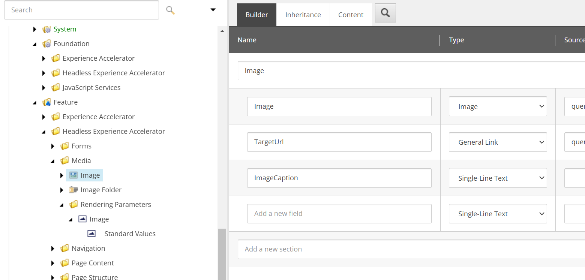

The component provides the following fields:

- Image: Specifies an image from the media library, with query:$siteMedia to select only the site's media
- TargetUrl: Allows setting the link destination
- ImageCaption: Defines the caption for the image as a string

When an item is created, the above fields will be included.

### Parameter Template

This element allows specifying a template that the Image component inherits. By using this mechanism, it is possible to manage inheritance with a separate item rather than directly in the Image template.

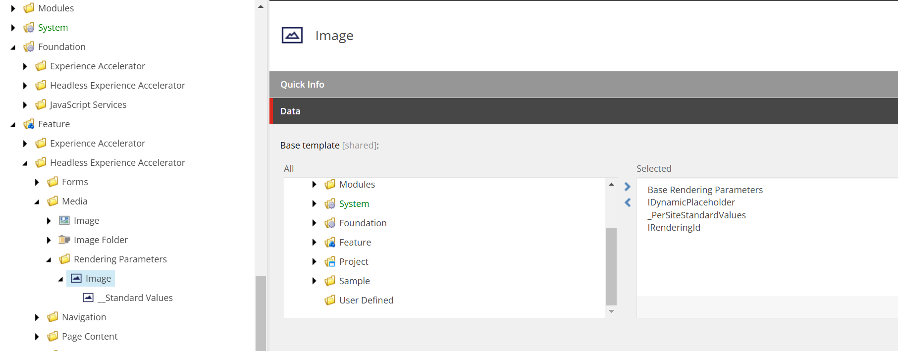

When creating an Image item, you can restrict the folder to contain only Image items by using a template that limits the folder to only Image items.

## Component Wizard

The component wizard allows you to create the necessary items for a component from the content editor. This time, we will create a simple component using the wizard.

### Preparation Before Running the Wizard

You need to prepare the location where the component wizard will save the items it creates. This time, we will create a folder called Tailwind.

<FileTree>

- sitecore
  - layout
    - Renderings
      - Feature
        - **Tailwind**
  - system
    - Settings
      - Feature
        - **Tailwind**
  - templates
    - Branches
      - Feature
        - **Tailwind**
    - Feature
      - **Tailwind**

</FileTree>

Now we are ready to run the wizard.

### Running the Wizard

After creating the above folders, right-click on the folder created in Renderings, and you will see an executable item with an icon labeled Component at the top of Insert. This is the component wizard.


First, specify the name of the component in the General tab. This time, we will set it to ContentBlock.


Next, switch to the Datasource tab. In this screen, change the **Rendering template** item to **Templates/Foundation/JavaScript Services/Json Rendering**.


After making the above two changes and executing, the wizard will create the items. Perform the following tasks on the created items.

### Modifying the Component

You need to define the fields used by the component. In fact, the ContentBlock component is already included in the Next.js Starter Kit as a sample component that is not enabled. The file is already created in **src\components\ContentBlock.tsx**, and its content is as follows.

```ts
// src\components\ContentBlock.tsx
import { Text, RichText, Field, withDatasourceCheck } from '@sitecore-jss/sitecore-jss-nextjs';
import { ComponentProps } from 'lib/component-props';

type ContentBlockProps = ComponentProps & {
  fields: {
    heading: Field<string>;
    content: Field<string>;
  };
};

/**
 * A simple Content Block component, with a heading and rich text block.
 * This is the most basic building block of a content site, and the most basic
 * JSS component that's useful.
 */
const ContentBlock = ({ fields }: ContentBlockProps): JSX.Element => (
  <div className="contentBlock">
    <Text tag="h2" className="contentTitle" field={fields.heading} />

    <RichText className="contentDescription" field={fields.content} />
  </div>
);

export default withDatasourceCheck()<ContentBlockProps>(ContentBlock);
```

The datasource for this component is the item **/sitecore/templates/Feature/Tailwind/Data Source/ContentBlock**. Add the following two items to match the code.


Now the component is ready.

### Registering the Component

To use the component on the site, you need to register it in **Presentation** - **Available Renderings** of the site you want to use it on. This time, we will register it in the Page Content group.


After registration, you can see that the component is displayed in the Page Builder.


Although we registered it in Page Content, you can see that it is displayed in the Tailwind group. To display it in the desired group, create a folder with the same name and move the rendering item to change the display position.

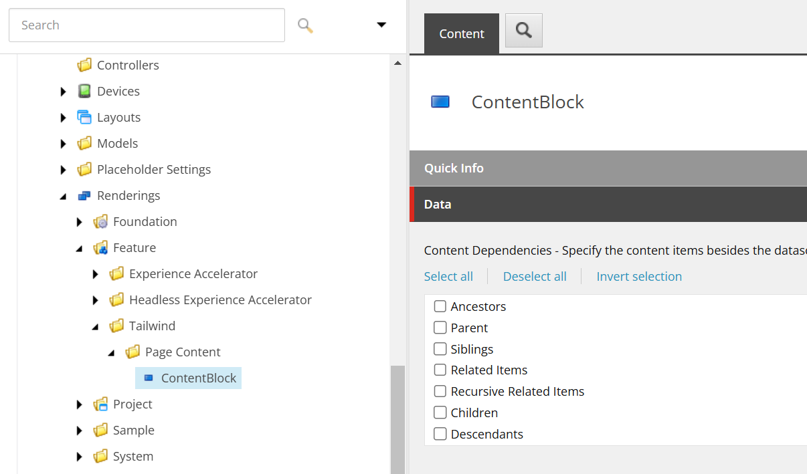

After the change, it is displayed in the same group as shown below.

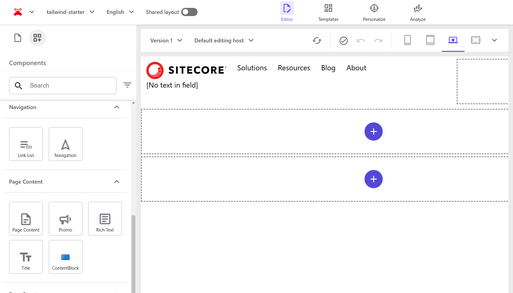

### Creating a Save Folder

When creating an item, we want to create it in the Data folder under the page item or in the shared Data folder of the site. The information about the save location for the Image component is under Editor Options - Datasource Location. For reference, it is as follows.

```txt title="Editor Options - Datasouce Location"
query:$site/*[@@name='Data']/*[@@templatename='Image Folder']|query:$sharedSites/*[@@name='Data']/*[@@templatename='Image Folder']
```

Here, it specifies that items or folders can be created in the specified location using the **Image Folder** template. This time, we will create a `ContentBlock Folder`.

<Steps>

1. Move to the hierarchy where the ContentBlock item template is located **/sitecore/templates/Feature/Tailwind/Data Source** and click the New Template button displayed on the screen.

   

2. Specify **ContentBlock Folder** as the template name and create the template.

   

3. Select the created item and click Standard values from Builder Options in the menu.

   

4. Select the created **\_\_Standard Values** item, click **Configure** - **Assign** to open the item assignment settings screen.

   

5. In the Insert Options screen, add the ContentBlock item created this time and itself.

   

6. After completing the above settings, finally add the ContentBlock folder created this time under the site's Data folder.

   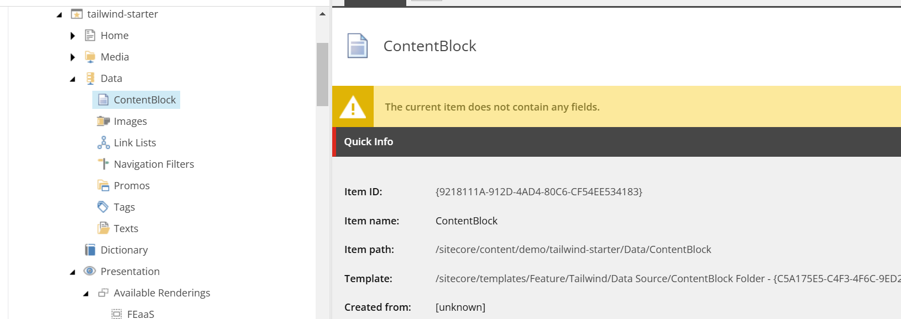

</Steps>

After completing the above steps, set the following content in the Editor Options - Datasouce Location of the ContentBlock rendering item.

```txt title="Editor Options - Datasouce Location"
query:$site/*[@@name='Data']/*[@@templatename='ContentBlock Folder']|query:$sharedSites/*[@@name='Data']/*[@@templatename='ContentBlock Folder']
```

Now, when placing the component, the item will be created in the optimal location. The following shows that the save location is working as set above.


## About Each Item of the Wizard

This time, we proceeded with the minimum settings to create a standard component using the component wizard. Several items are provided, so let's check each one.

### Datasource Settings

In the Datasource tab, besides specifying the Rendering template, there is an item called Datasource at the top. By default, it is set to `Ask user for data source`.

- Ask user for data source ( Default )
- User current page
- Automatically create data source under page

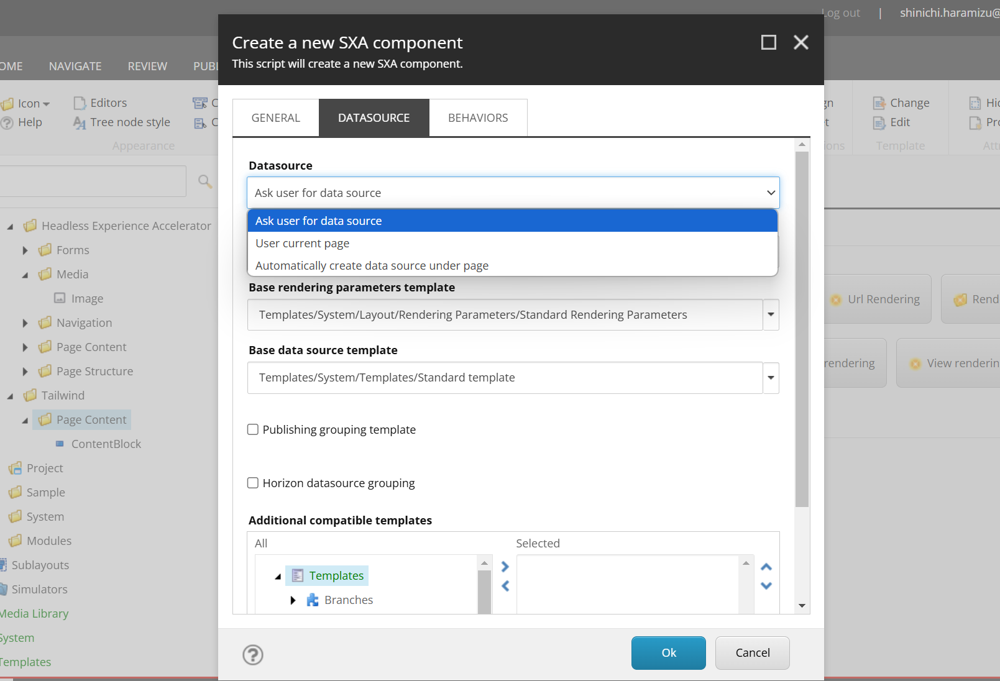

#### User current page

When this item is selected, the items displayed in **Datasource** are reduced.

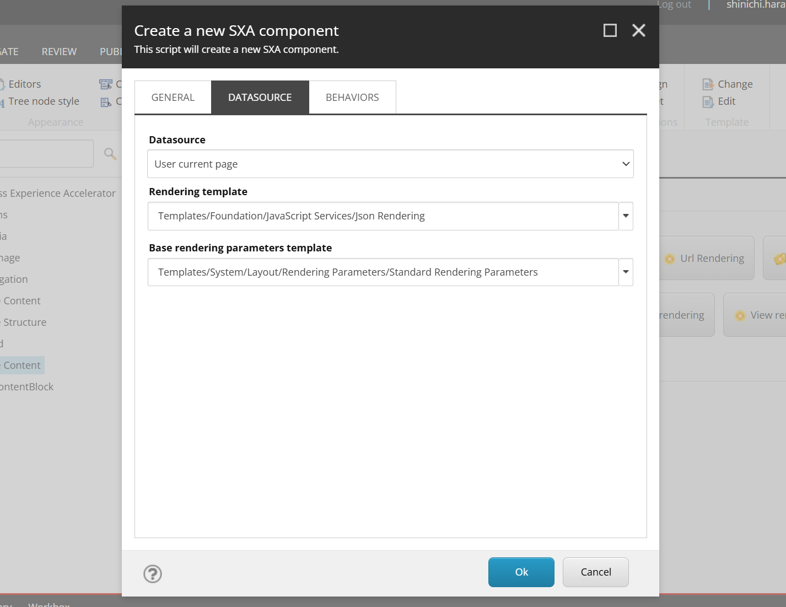

The items in the **Behaviors** tab are also reduced.

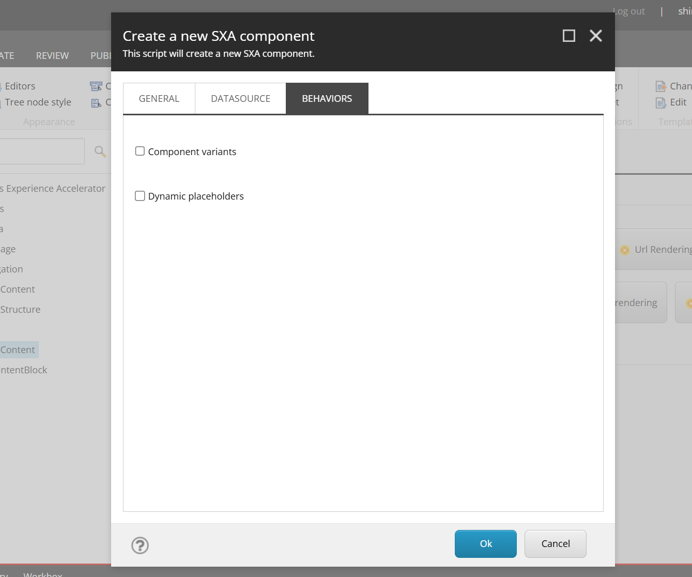

When actually created, the Rendering item is created with an empty Editor Options - Datasource Template, and no associated template is created.

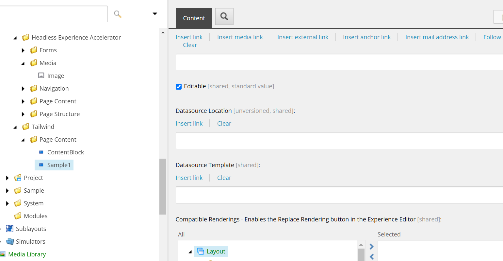

The standard components with this item blank are as follows.

- Navigation
- Page Content
- Title
- Column Splitter
- Container
- Row Splitter

These components do not have a datasource item and use the data of the item where the component is placed (e.g., Title displays the title of that page). When creating a component that does not need a datasource item, specifying User current page will prevent unnecessary templates from being created.

#### Automatically create data source under page

When this setting is turned on, the Experience Accelerator - Other properties item is set to IsAutoDatasourceRendering with a default value of true.


In this case, when the component is placed by drag & drop, an item is automatically created in the Data folder under that page. This is enabled for the Image component, where an item is first created when the component is placed, and then that item is specified.

If you want to create a component that always completes within that page, you can control the behavior by specifying it in the wizard or later setting **IsAutoDatasourceRendering**.

### Behaviors Settings

The wizard provides the following five items.

- Select Page as a data source
- Background image
- Select data source behavior
- Component variants
- Dynamic placeholders


#### Select Page as a data source

When this item is checked and the component is created, the **Experience Accelerator** - **Can select page as a data source** of the rendering item is checked. The standard component with this item checked is only Title.


What is the difference in behavior between using the page's datasource and the Page Content component? In fact, this is different in terms of coding. The GraphQL item of the Title component's Rendering item implements the following query.

```graphql
query TitleQuery($datasource: String!, $contextItem: String!, $language: String!) {
  datasource: item(path: $datasource, language: $language) {
    url {
      path
      siteName
    }
    field(name: "Title") {
      jsonValue
    }
  }
  contextItem: item(path: $contextItem, language: $language) {
    url {
      path
      siteName
    }
    field(name: "Title") {
      jsonValue
    }
  }
}
```

The screen shows the following.


In this way, the rendering component processes it, and the component receives the result as Json data and displays it on the page.

If you want to process it on the rendering item side rather than just the component side, this implementation is possible.

#### Background image

When this item is checked and executed, the **\_Background Image** is added as an inheritance target of the template.


This template is provided at **/sitecore/templates/Foundation/Experience Accelerator/Presentation/\_Background Image**. When an item is created without adding fields, the following image-related settings are displayed.

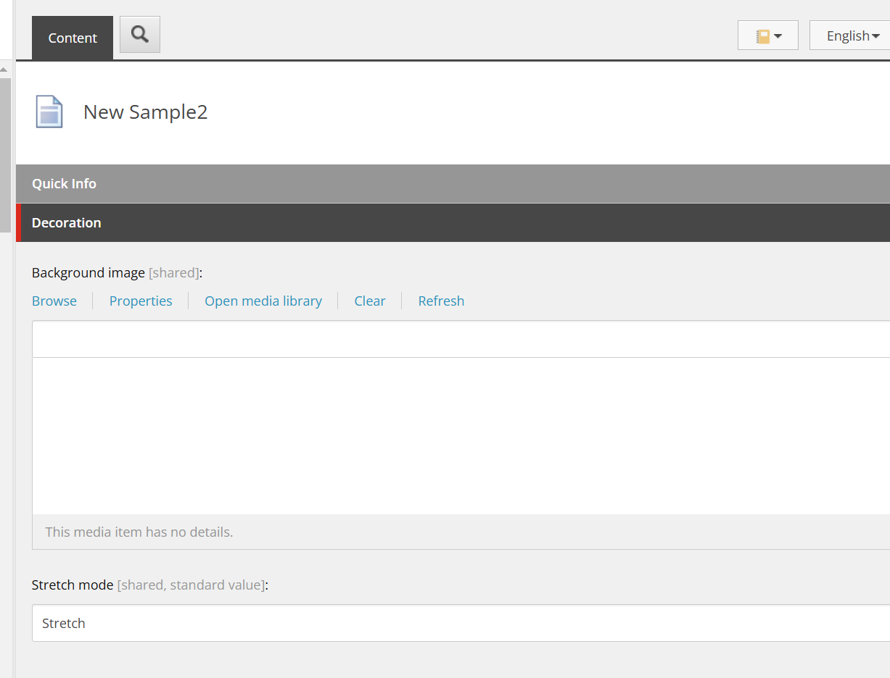

If you want to provide a background image field for the component, checking this item will automatically add it.

On the other hand, does the standard component with a background image, such as Container, use this? In fact, it is implemented differently. To reproduce the implementation, select the **/sitecore/templates/Feature/Tailwind/Rendering Parameters/ContentBlock** of the ContentBlock component and add a field.

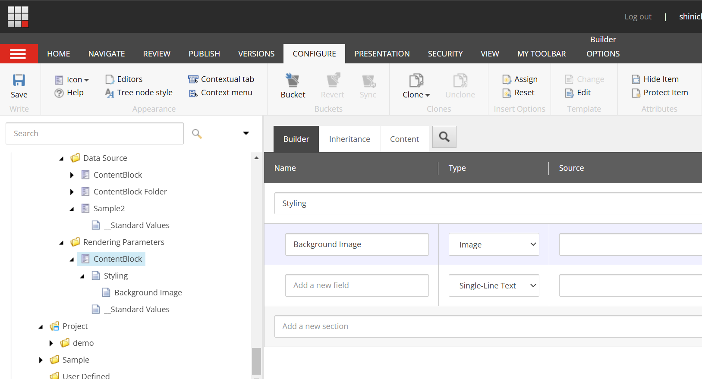

After adding this field, open the Page Builder and open the Advanced styling item to see that you can set the image.

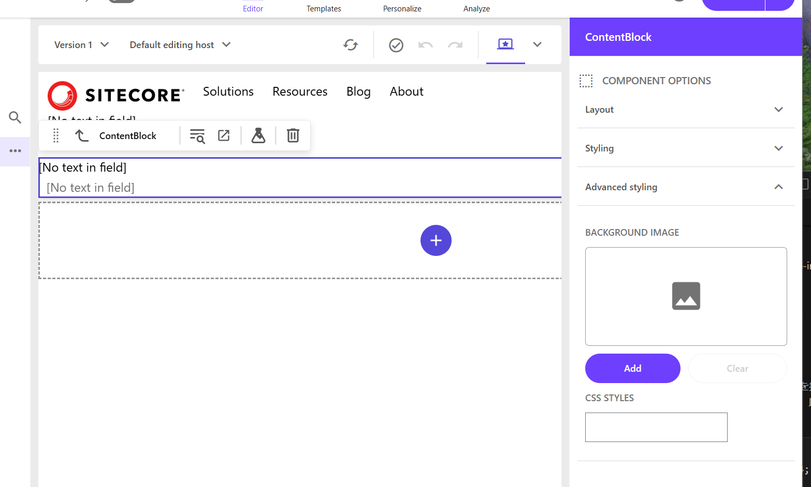

This implementation is easier to change in the Page Builder, so the latter implementation is better for future use.

#### Select data source behavior

When this item is checked, the **Global Datasource Behavior** item is added to the template.

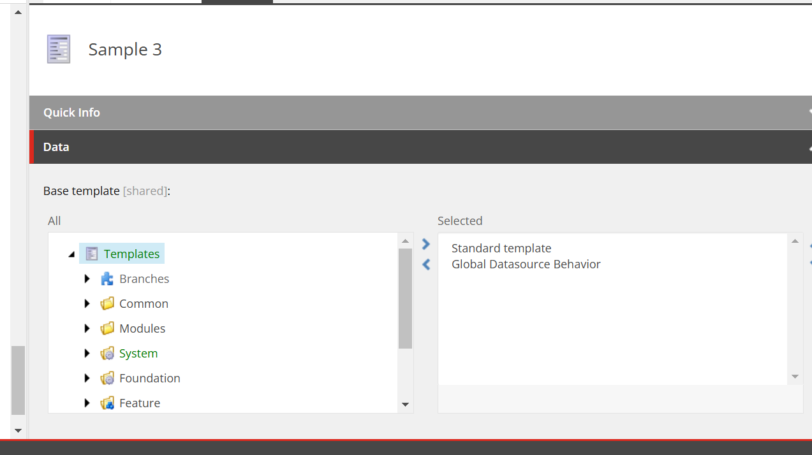

This template is provided at **/sitecore/templates/Foundation/Experience Accelerator/Local Datasources/Global Datasource Behavior**.

I will introduce how to use this later when I understand it.

#### Component variants

When this item is checked, **IDynamicPlaceholder** and **IComponentVariant** are added to the Rendering Parameters template.


The paths of each item are as follows.

- /sitecore/templates/Foundation/Experience Accelerator/Dynamic Placeholders/Rendering Parameters/IDynamicPlaceholder
- /sitecore/templates/Foundation/Experience Accelerator/Variants/Rendering Parameters/IComponentVariant

This allows the Variant item to be specified in the Page Builder screen.


If you want to have multiple display patterns for the component, checking this item will allow you to select it in the Variants item.

#### Dynamic placeholders

By checking this item, you can use dynamic placeholders in the component. When created, the difference in rendering is that IsRenderingsWithDynamicPlaceholders is set to true.

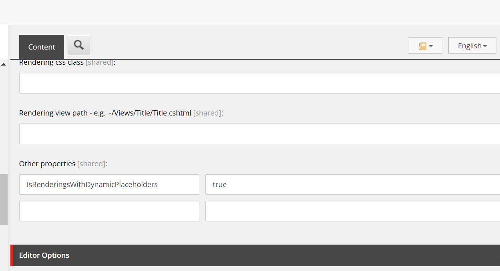

This is used when the component contains multiple placeholders or when the placeholder name is dynamically generated. Normally, placeholders use a fixed name, but using dynamic placeholders assigns a unique placeholder number dynamically.

In other words, when placing the same component multiple times on a page, it assigns a unique ID to make them behave differently. You can see that unique IDs are assigned when multiple components are placed.


In fact, the following standard components have this setting.

- Media
- Link List
- Promo
- Title
- Rich Text
- Column Splitter
- Container
- Row Splitter

Except for the Navigation component and Page Content component, all other components use it.

## Summary

This time, we introduced the settings and use of the wizard when creating a new component. Creating custom components involves referring to the components included in the Next.js Starter Kit as the next step.

