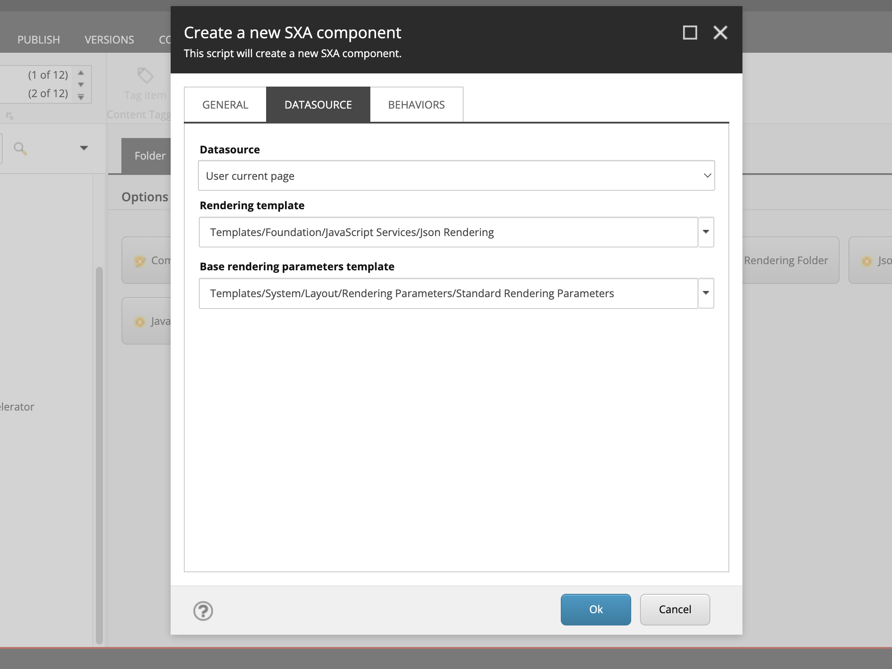
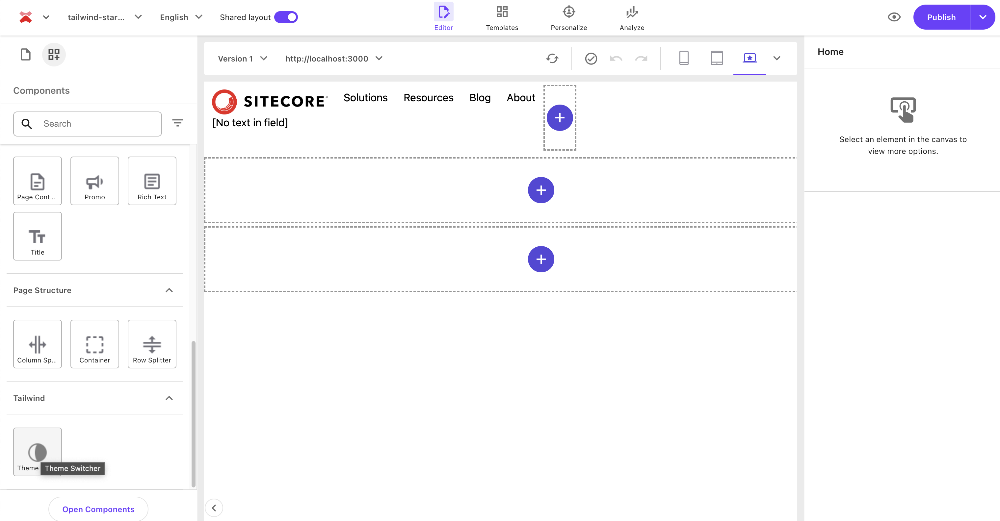
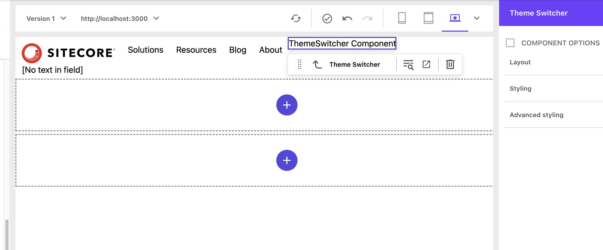

import { Steps, LinkCard, FileTree } from '@astrojs/starlight/components';

This document introduces the steps to implement dark mode functionality in the Next.js Starter Kit.

## Prerequisites

The following environment is assumed for this implementation.

- Next.js - Page Router 14.2.18
- Sitecore JSS 22.3.1
- Tailwind CSS 4.0.0

## Enabling Dark Mode

<Steps>

1. Install the `next-themes` package

   ```bash
   npm install next-themes
   ```

2. Add `ThemeProvider` to `src/pages/_app.tsx`. The code below is partially excerpted.

   ```ts {4,14,16}
   // src/pages/_app.tsx
   import { GoogleTagManager } from '@next/third-parties/google';
   import Bootstrap from 'src/Bootstrap';
   import { ThemeProvider } from 'next-themes';

   function App({ Component, pageProps }: AppProps<SitecorePageProps>): JSX.Element {
   const { dictionary, ...rest } = pageProps;

    return (
        <>
        <Bootstrap {...pageProps} />
        <GoogleTagManager gtmId={process.env.NEXT_PUBLIC_GOOGLE_TAG_MANAGER || ''} />
        <I18nProvider lngDict={dictionary} locale={pageProps.locale}>
          <ThemeProvider>
            <Component {...rest} />
          </ThemeProvider>
        </I18nProvider>
        </>
    );
   }
   ```

3. Add dark mode settings to `tailwind.config.js`.

   ```js {4}
   // tailwind.config.js
   /** @type {import('tailwindcss').Config} */
   module.exports = {
     darkMode: ['class'],
     content: [],
   ```

</Steps>

Once the above settings are complete, you can see that the display changes depending on the mode of the PC when you refer to the page. For example, on a PC screen using light mode, it is displayed in light mode as shown below, and the mode is described in `data-theme` in HTML.

```html
<html lang="en" data-theme="light" style="color-scheme: light;">
  ...
</html>
```


In dark mode, it switches to the following code.

```html
<html lang="en" data-theme="dark" style="color-scheme: dark;">
  ...
</html>
```


## Implementing the Toggle Button

Dark mode is now enabled according to the PC mode, but to add a toggle button to switch modes according to user preference, you need to add a mode switch component and implement it on the page.

### Adding the ThemeSwitcher Rendering Item

The component to be created this time will only switch the display of the screen, so it will be created as a component that does not require a data source. The creation of the component is introduced in another article, so if you have not referred to it yet, please take a look.

<LinkCard
  title="Creating Custom Components"
  href="/en/xmcdeveloper/cretea-component/"
  target="_blank"
  description="This guide introduces the steps to add custom components to the Next.js Starter Kit provided by Sitecore."
/>

Proceed with the preparation to add the component according to the following steps.

<Steps>

1. This time, create the following path and create the component.

   <FileTree>

   - sitecore
     - layout
       - Renderings
         - Feature
           - **Tailwind/**

    </FileTree>

2. Right-click to launch the Component Wizard

   

3. Set the name of the Component to ThemeSwitcher.

   

4. Open the Datasource tab and set the following two items.

   - **Datasource**: User current page
   - **Rendering template**: Templates/Foundation/JavaScript Services/Json Rendering

   

5. Change the icon of the created rendering item. Select Configure - Icon and specify `office/32x32/moon_half.png` as the icon.

6. Select Home - Display name and change the display name to `Theme Switcher`.

</Steps>

Now the component is ready.

### Creating the Component File

You need to add the code used by the created component to the project. Here, execute the JSS command to create the file.

```bash
jss scaffold ThemeSwitcher
```

When you run the above command, the `src/components/ThemeSwitcher.tsx` file is created, and the code is as follows.

```ts
import React from 'react';
import { ComponentParams, ComponentRendering } from '@sitecore-jss/sitecore-jss-nextjs';

interface ThemeSwitcherProps {
  rendering: ComponentRendering & { params: ComponentParams };
  params: ComponentParams;
}

export const Default = (props: ThemeSwitcherProps): JSX.Element => {
  const id = props.params.RenderingIdentifier;

  return (
    <div className={`component ${props.params.styles}`} id={id ? id : undefined}>
      <div className="component-content">
        <p>ThemeSwitcher Component</p>
      </div>
    </div>
  );
};
```

### Placing the Component

The rendering item and code of the component are ready. First, add it to the Rendering available for use on the target site so that it can be used on Pages. This time, it was added to Navigation.


Launch Page Builder and confirm that it is displayed in the list of components.



When actually placed, you can see that the component name prepared in the sample code is displayed.



### Rewriting the Component Code

Change the current component code to code for switching modes. This component will work without using data from Sitecore, so change it to the standard dark mode code as follows.

```ts
// src/components/ThemeSwitcher.tsx
import { useTheme } from 'next-themes';
import React, { useEffect } from 'react';

export const Default = (): JSX.Element => {
  const { theme, setTheme } = useTheme();

  useEffect(() => {}, [theme]);

  return (
    <div>
      <button onClick={() => setTheme('light')} disabled={theme === 'light'}>
        Light
      </button>
      <span> - </span>
      <button onClick={() => setTheme('dark')} disabled={theme === 'dark'}>
        Dark
      </button>
      <span> - </span>
      <button onClick={() => setTheme('system')} disabled={theme === 'system'}>
        System
      </button>
    </div>
  );
};
```

After rewriting the code, when you check the display on the new page, you can see that the mode switches as shown below.


You can now switch between dark mode and light mode.

## Adding Styles

In the above code, the styles are fixed, so you cannot use the editing options on the Page Builder screen to adjust the position, etc. Therefore, rewrite the code as follows to make the style data available. The changed parts of the code are as follows.

```ts {2,5-8,10-11,16-17,29-30}
// src\components\ThemeSwitcher.tsx
import { ComponentParams, ComponentRendering } from '@sitecore-jss/sitecore-jss-nextjs';
import { useTheme } from 'next-themes';

interface ComponentProps {
  rendering: ComponentRendering & { params: ComponentParams };
  params: ComponentParams;
}

export const Default = (props: ComponentProps): JSX.Element => {
  const styles = `${props.params.GridParameters ?? ''} ${props.params.Styles ?? ''}`.trimEnd();

  const { theme, setTheme } = useTheme();

  return (
    <div className={`component theme-switcher ${styles}`}>
      <div className="component-content">
        <button onClick={() => setTheme('light')} disabled={theme === 'light'}>
          Light
        </button>
        <span> - </span>
        <button onClick={() => setTheme('dark')} disabled={theme === 'dark'}>
          Dark
        </button>
        <span> - </span>
        <button onClick={() => setTheme('system')} disabled={theme === 'system'}>
          System
        </button>
      </div>
    </div>
  );
};
```

The actual output is as follows, and you can see that the styles are applied.

```html
<div class="component theme-switcher indent-top indent basis-full">
  <div class="component-content">
    <button>Light</button>
    <span> - </span>
    <button>Dark</button>
    <span> - </span>
    <button>System</button>
  </div>
</div>
```

## Summary

This time, we introduced the implementation of standard dark mode. As for how to create this component, it is a simple component that does not use Sitecore's data source, so it was confirmed that it can be set in the same way as general Next.js implementation.

