import { FileTree, Steps, LinkCard } from '@astrojs/starlight/components';

This document introduces the environment for developing websites targeting XM Cloud. It covers setting up the environment for local Docker and connecting to an XM Cloud instance for development.

## Starter Kit Configuration

The Starter Kit for Sitecore XM Cloud projects is available on GitHub.

<LinkCard
  title="XM Cloud Front End Application Starter Kits"
  href="https://github.com/sitecorelabs/xmcloud-foundation-head"
  target="_blank"
  description="This repository contains the Next.js Starter Kit, and the SPA Starters monorepo (which includes a Node Proxy Application and SPA starter apps) for Sitecore XM Cloud Development. It is intended to get developers up and running quickly with a new front end project that is integrated with Sitecore XM Cloud."
/>

The above repository can be selected when creating an XM Cloud project. You can also create and deploy a new repository using the `Use this template` option.

This project includes the following files:

<FileTree>

- headapps
  - nextjs-starter/ Nest.js starter kit
  - spa-starters/ angular starter kit
- local-containers
  - docker
    - build/ docker build image
    - data/ docker data folder
    - deploy
      - platform/
    - traefik/ traefik data and certification
    - clean.ps1 docker image clean up script
  - scripts
    - down.ps1 docker script
    - init.ps1 init script for local instance
    - up.ps1 start xm cloud instance
  - docker-compose.override.yml
  - docker-compose.yml
- sitecore.json Sitecore CLI configuration file
- xmcloud.build.json XM Cloud Deploy configuration file

</FileTree>

The template introduced on this documentation site is as follows:

<LinkCard
  title="Tailwind CSS Starter Kit"
  href="https://github.com/haramizu/tailwind-starter"
  target="_blank"
/>

This project includes the `headapps/tailwind-starter` project, customized to use Next.js + Tailwind CSS.

Both projects can create a development environment using Docker and XM Cloud. This document introduces how to prepare each environment.

## Using Docker

You can use Docker to set up a Sitecore XM Cloud development environment on your local PC. This section introduces the steps.

### Prerequisites

This article is executed in the following environment:

- Windows 11 Pro 23H2
- Docker 4.37.0
- Visual Studio Code(../../../assets/
- Modern browsers like Google Chrome, Microsoft Edge

### Starting with Docker

Assuming the project is already created, refer to [Creating a Template](/xmcdeveloper/create-template/) for project creation. All Docker-related environments are prepared under the local-containers directory.

Follow these steps to start:

<Steps>

1. Ensure Docker Desktop is running.

2. Open a terminal with administrator privileges.

3. Navigate to the target folder and run the initialization script, specifying the license file.

   ```bash
   cd local-containers
   ./scripts/init.ps1 -InitEnv -LicenseXmlPath "C:\license\license.xml" -AdminPassword "DesiredAdminPassword"
   ```

   ![init.ps1]xmcdeveloper/developerenvironment01.png)

4. To initialize and start the Sitecore CMS locally, run the following command:

   ```bash
   .\scripts\up.ps1
   ```

   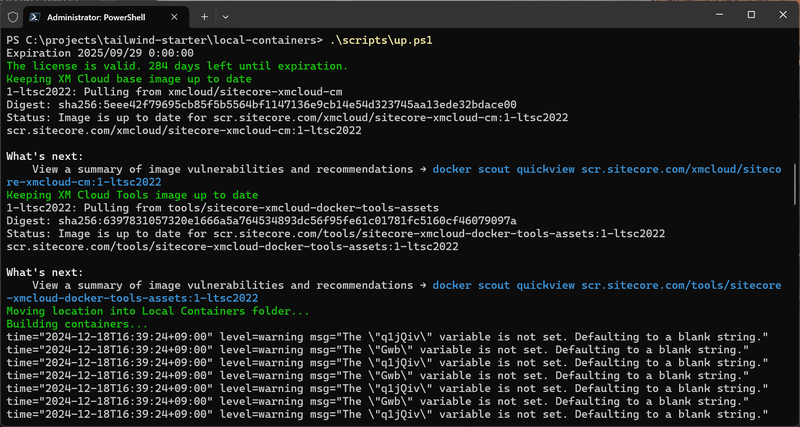

   The first startup will download container images.

5. During the process, a login screen for XM Cloud will appear. Click Confirm to complete the login.

   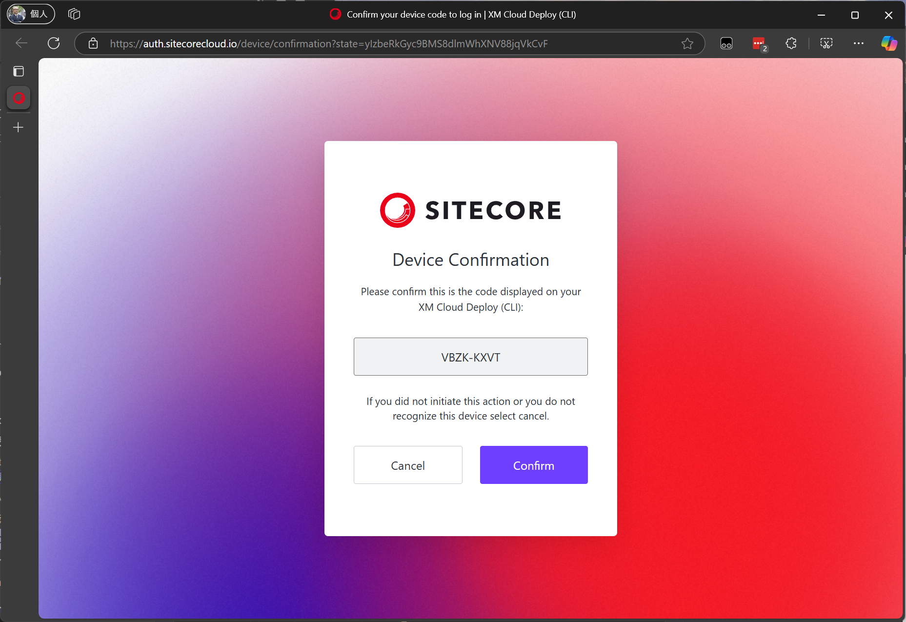

6. After a while, the XM Cloud Docker management screen will appear.

   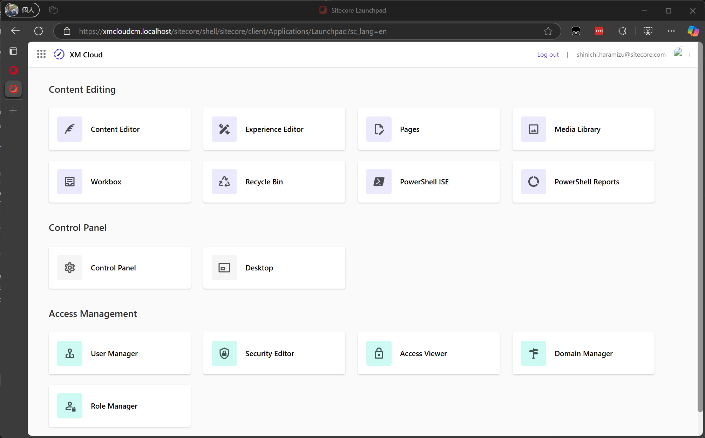

</Steps>

Now, you can use the Next.js project in `headapps\nextjs-starter` for development, utilizing it as a rendering in the Experience Editor, thus preparing the development environment locally.

### Docker Environment and Pages

Pages is a very convenient WYSIWYG tool provided by Sitecore XM Cloud, also usable for creating partial designs. While similar tasks can be done with the Experience Editor, integration with Components provided by XM Cloud is not possible with the Experience Editor, making Pages the ideal tool.

The Docker version also displays the Pages icon.


You can connect Pages to the local Docker environment. The official information is available on the following page:

<LinkCard
  title="Connect XM Cloud Pages to your local XM instance"
  href="https://doc.sitecore.com/xmc/en/developers/xm-cloud/connect-xm-cloud-pages-to-your-local-xm-instance.html"
  target="_blank"
  description="When you use Docker for full-stack development in XM Cloud, and after you set up your local XM Cloud development environment, XM Cloud Pages is not connected to your locally running XM instance."
/>

Following the steps on the above page will connect them, but a browser extension is available for easier connection.

<LinkCard
  title="Sitecore XM Cloud Extensions"
  href="https://chromewebstore.google.com/detail/sitecore-xm-cloud-extensi/pkonhbljhhbhbdjkacgmafheaebijmjh?pli=1"
  target="_blank"
  description="Browser extension that improves Sitecore XM Cloud user experience."
/>

After installing this extension, you can easily connect Pages to the local instance. The following steps are for after installing the extension.

<Steps>

1. Use the Pages icon on the local management screen to start.

2. Launch the extension and enter the URL of the local instance.

   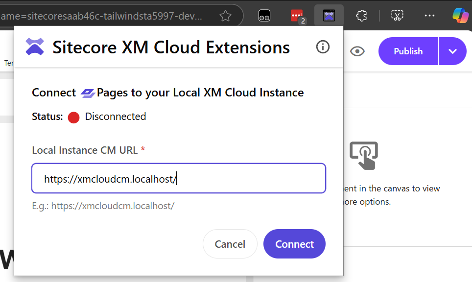

3. After setting the URL, it will connect to the local instance as shown below.

   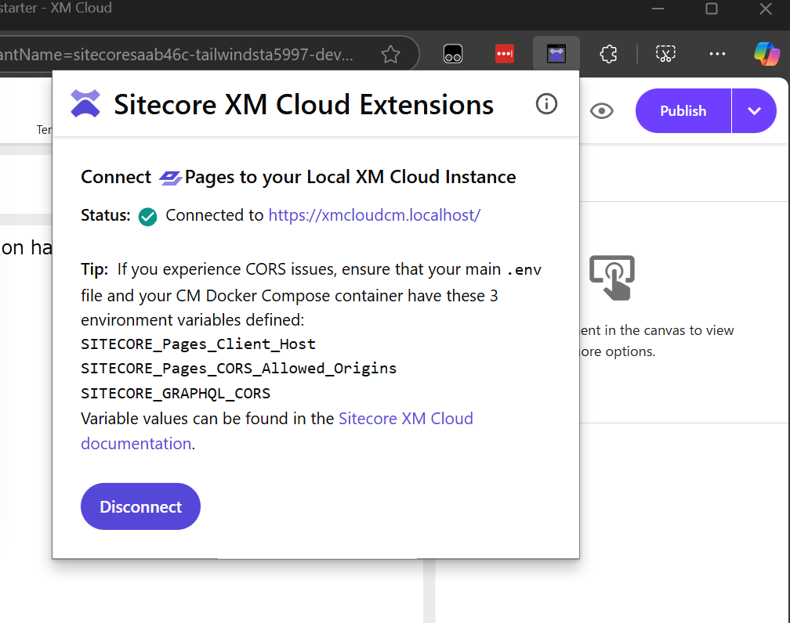

4. To verify the local environment is reflected, change an item as shown below.

   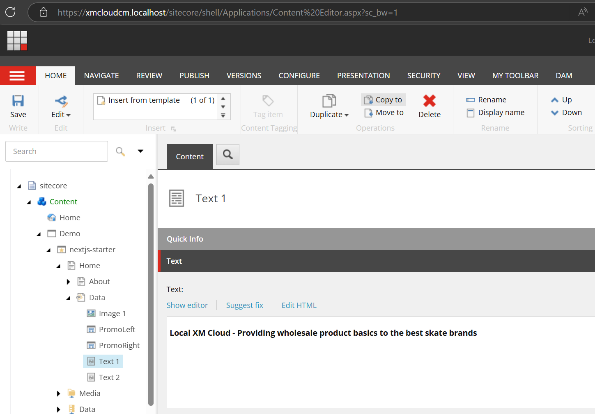

5. Refresh Pages to confirm it is loading and displaying local content.

   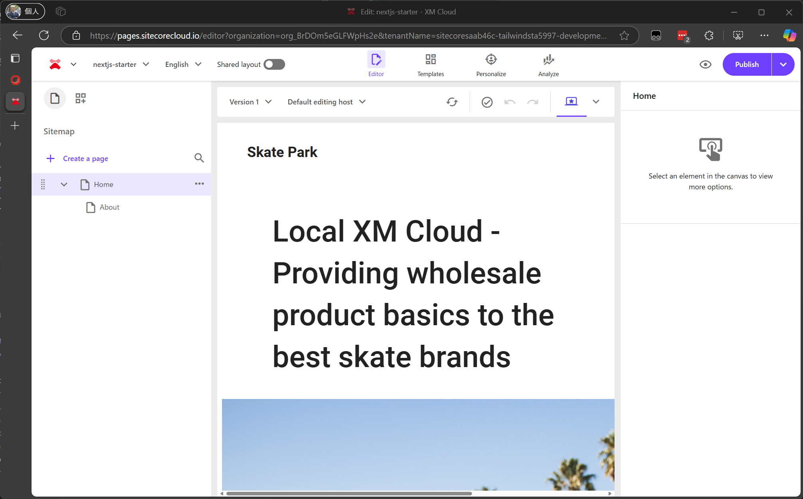

</Steps>

This completes the setup of the development environment using Docker. The Docker environment is powerful as it allows using the local development environment without affecting anyone else.

## XM Cloud Instance

Unlike Docker, you can also use the SaaS environment provided by XM Cloud as a development server. This section introduces how to connect the local development environment to an already deployed XM Cloud environment.

### Prerequisites

While using the cloud instance as the CMS server, you can connect it to a locally running Next.js project. The prerequisites are as follows:

- Sitecore XM Cloud development instance
- Sitecore JSS 21.6 or later
- Node 22.x or later
- Visual Studio Code
- Modern browsers like Google Chrome, Microsoft Edge

This example uses a macOS environment to start a Next.js project and connect it to an online development server.

### Setting Up the Environment

First, prepare the local environment to run Next.js. Follow these steps:

<Steps>

1. Access the Developer Settings of the target instance in XM Cloud Deploy.

2. Select the target Site and check the Environment variables.

   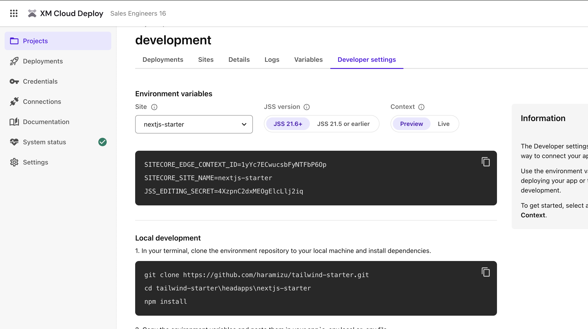

3. Create a .env.local file in the folder where Next.js runs locally.

   ```
   // .env.local
   SITECORE_EDGE_CONTEXT_ID=contect-id-preview
   SITECORE_SITE_NAME=nextjs-starter
   JSS_EDITING_SECRET=editing-secret
   ```

4. Start locally using start:connected.

   ```bash
   npm install
   npm run start:connected
   ```

</Steps>

Now, the local Next.js project is connected to Sitecore and displayed locally.

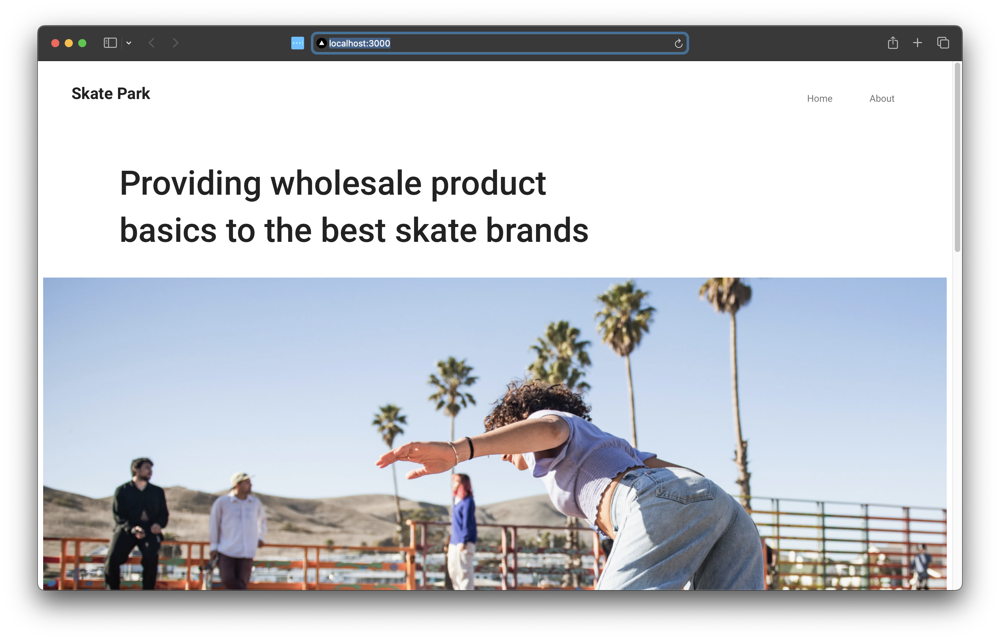

Next, connect Pages to the locally launched project.

<Steps>

1. Open Pages in XM Cloud.

   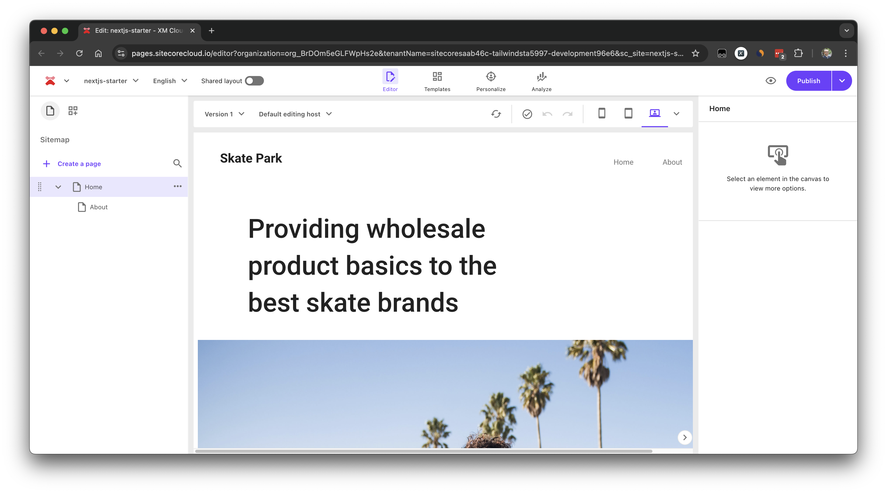

2. Click the Default editing host item in the WYSIWYG editing screen, select Localhost, and set `http://localhost:3000`.

   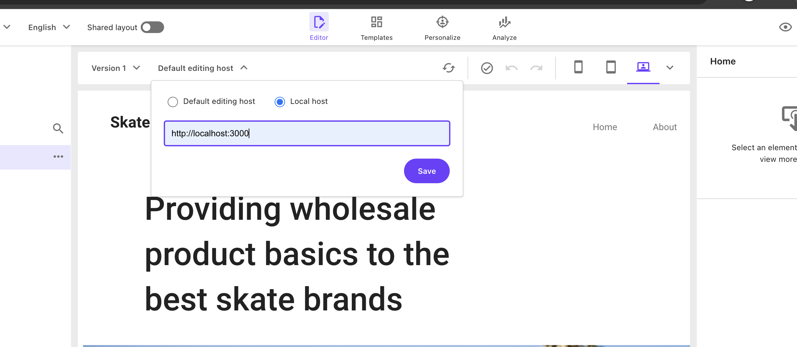

3. After setting, you can see the message **You are working with a local host.** confirming the connection to the local Next.js instance.

   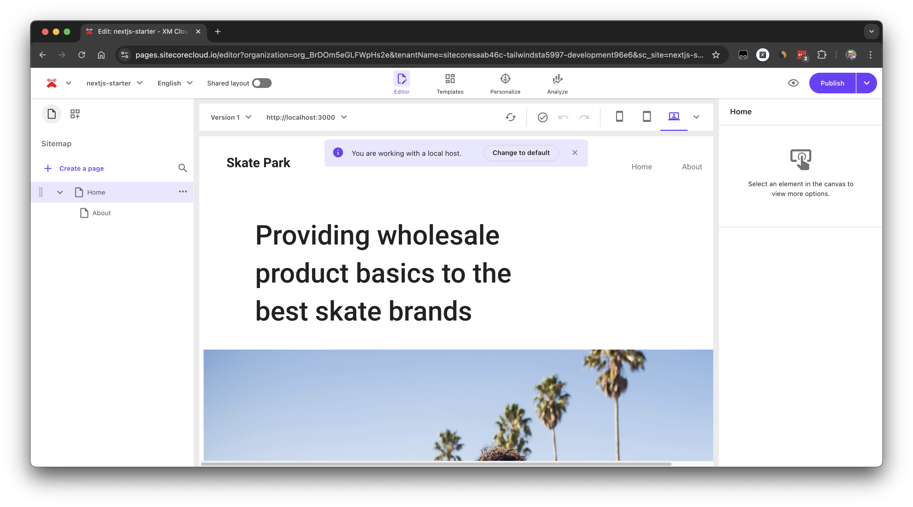

4. Check the logs of the locally running Next.js to confirm Pages is using the local instance.

   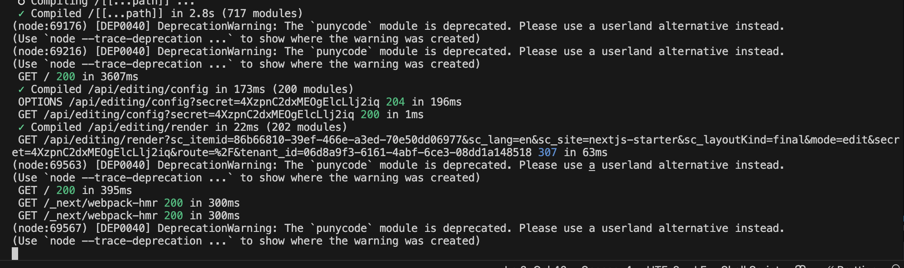

</Steps>

This way, you can develop local projects like Next.js while using the XM Cloud server instance.

## Summary

This time, we introduced the steps to use Pages when utilizing XM Cloud running locally with Docker. Additionally, we connected a locally running Next.js project to the XM Cloud deployed as SaaS and linked Pages to the local Next.js instance.

Since it is challenging to prepare an XM Cloud server for each developer, make good use of both patterns by leveraging the Docker environment.

