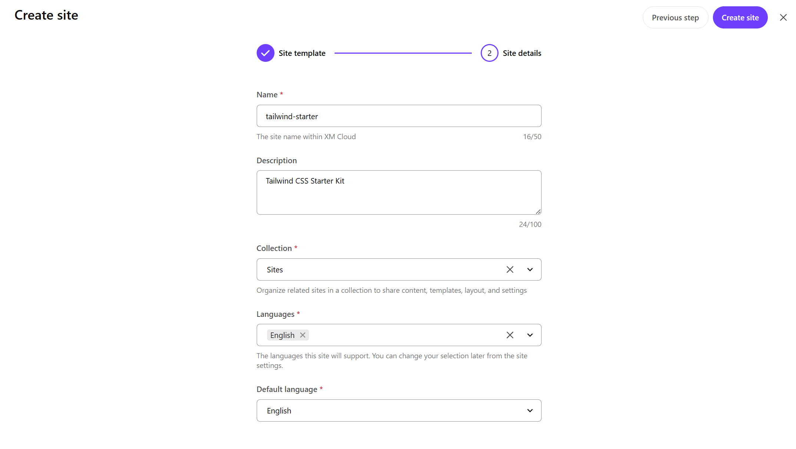
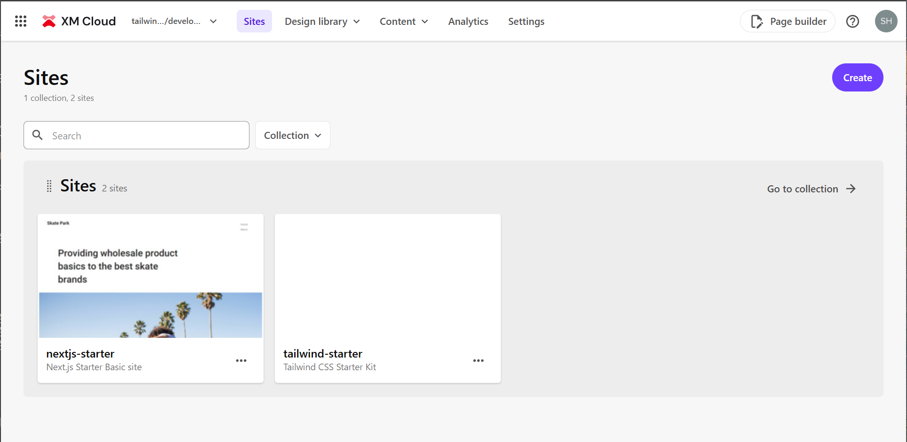
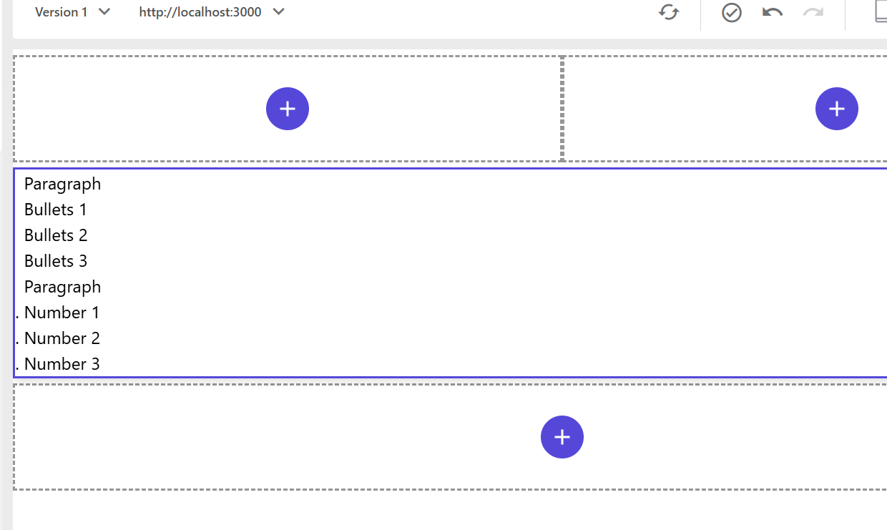
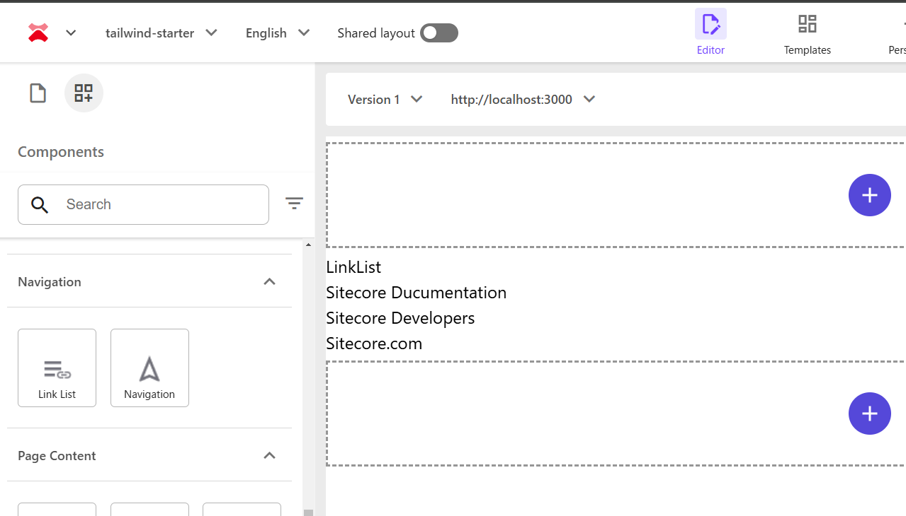

import { Steps, LinkCard, Aside, FileTree } from '@astrojs/starlight/components';

The Tailwind Starter, which serves as the base for the sample created on this document site, applies Tailwind CSS as the stylesheet framework based on the Next.js Starter. This document introduces the work done on the base Next.js Starter.

<linkCard
  title="GitHub Haramizu / tailwind-starter"
  href="https://github.com/haramizu/tailwind-starter"
  target="_blank"
/>

The base of the template was created as follows:

- [Creating the Template](/xmcdeveloper/create-template/)

## Creating the Site

First, launch XM Cloud in a SaaS environment based on the above template.

<Steps>

1. Select Empty as the template for the site to be created.

   

2. Create the site as shown below and prepare the site to be worked on in the XM Cloud development environment.

   

3. Work will proceed with the Next.js Starter Kit's Basic site and the site created above side by side.

   

4. In Pages, link with the local Next.js instance to check the page display using the development code.

   

   Since Empty is selected this time, nothing is displayed as shown below.

5. Open the Content Editor, select the item `/sitecore/content/sites/tailwind-starter/Settings` as the JSS setting, and change the Grid setting to Tailwind.

   

6. Next, open the site setting `/sitecore/content/sites/tailwind-starter/Settings/Site Grouping/tailwind-starter` and change the Predefined application editing host to tailwindstarter.

   

</Steps>

The environment for development is now ready.

## Applying Tailwind CSS

Since the Next.js Starter Kit uses Bootstrap as the CSS framework, Tailwind CSS will be applied while removing unnecessary bootstrap packages.

### Installing Tailwind CSS

First, rewrite to enable the use of Tailwind CSS.

<Steps>

1. First, install Tailwind CSS.

   ```bash
   npm install -D tailwindcss postcss autoprefixer
   ```

2. Copy the `src/assets/app.css` file and create `src/styles/app.css`.

3. Create the `src/styles/globals.css` file and set the following styles.

   ```css
   @tailwind base;
   @tailwind components;
   @tailwind utilities;

   @import './app.css';
   ```

4. Modify the code in `src/pages/_app.tsx` to load the stylesheet as follows.

   ```diff lang="tsx"
   // src/pages/_app.tsx
   import type { AppProps } from 'next/app';
   import { I18nProvider } from 'next-localization';
   import { SitecorePageProps } from 'lib/page-props';
   import Bootstrap from 'src/Bootstrap';

   -import 'assets/main.scss';
   +import '@/styles/globals.css';
   ```

5. Create the `postcss.config.mjs` file and add the following code.

   ```js {4}
   // postcss.config.js
   module.exports = {
     plugins: {
       tailwindcss: {},
       autoprefixer: {},
     },
   };
   ```

6. To enable the use of `@/` when loading the stylesheet, add the following lines to the Typescript configuration `tsconfig.json`.

   ```json {12}
   // tsconfig.json
   {
     "compilerOptions": {
       "baseUrl": ".",
       "paths": {
         "components/*": ["src/components/*"],
         "lib/*": ["src/lib/*"],
         "temp/*": ["src/temp/*"],
         "assets/*": ["src/assets/*"],
         "graphql-types": ["node_modules/@types/graphql-let/__generated__/__types__"],
         "react": ["node_modules/react"],
         "@/*": ["./src/*"]
       },
   ```

7. Update the `tailwind.config.js` file as follows for the Sitecore environment.

   ```js
   // tailwind.config.js
   /** @type {import('tailwindcss').Config} */
   module.exports = {
     darkMode: ['class'],
     content: ['./src/**/*.{js,ts,jsx,tsx}'],
     safelist: [
       {
         pattern: /basis-/,
       },
       {
         pattern: /self-/,
       },
       {
         pattern: /hidden/,
         variants: ['sm', 'md', 'lg', 'xl', '2xl'],
       },
       {
         pattern: /block/,
         variants: ['sm', 'md', 'lg', 'xl', '2xl'],
       },
     ],
     theme: {
       extend: {},
     },
     plugins: [],
   };
   ```

8. Rewrite the following code in the file `src\Layout.tsx` to make it responsive.

   ```ts {7}
   // src\Layout.tsx
     return (
       <>
         <Scripts />
         <Head>
           <title>{fields?.Title?.value?.toString() || 'Page'}</title>
           <meta name="viewport" content="width=device-width, initial-scale=1.0" />
           <link rel="icon" href={`${publicUrl}/favicon.ico`} />
   ```

</Steps>

Now Tailwind CSS is applied. You can confirm that the stylesheet is applied by accessing it with npm run start:connected and checking with developer tools since there is no content yet.


### Removing Bootstrap

Next, remove the Bootstrap-related files that will no longer be used.

<Steps>

1. Delete the folder `src/assets` where the stylesheet-related files are located.

2. Uninstall the bootstrap and font-awesome packages.

   ```bash
   npm uninstall bootstrap font-awesome
   ```

</Steps>

This removes the bootstrap-related files.

## Adjusting Stylesheets

The above work only switches the stylesheet framework, and no styles are defined for each component. Therefore, add styles for some components.

### Grid

Two frequently used components are **Column Splitter** and **Row Splitter**. When placing the `Column Splitter`, it looks like this.


The expected result is to be arranged horizontally, but it is arranged vertically. The HTML output is as follows.

```html
<div class="row component column-splitter basis-full">
  <div class="basis-1/2"><div class="row"></div></div>
  <div class="basis-1/2"><div class="row"></div></div>
</div>
```

To arrange them horizontally, add the flex class. Create a file `src/styles/components/ColumnSplitter.css` and apply the following code.

```css
// src/styles/components/ColumnSplitter.css
.column-splitter {
  @apply flex;
}
```

As a result, the display changes as follows.


They are arranged horizontally, but the width specified by `basis-1/2` is not applied. Tailwind CSS disables styles not specified in the code to keep the stylesheet simple, so the styles output by the component are not applied.

Therefore, add the following code to the configuration file tailwind.config.js to enable the use of salelist.

```js {5-10}
// tailwind.config.js
/** @type {import('tailwindcss').Config} */
module.exports = {
  content: [],
  safelist: [
    {
      pattern: /basis-/,
      variants: ['sm', 'md', 'lg', 'xl', '2xl'],
    },
  ],
  theme: {
    extend: {},
  },
  plugins: [],
};
```

Successfully, they are arranged horizontally with the 1/2 width applied.


### Display Options

This time, use the RichText editor to add styles for the component's display position and text position. First, place the RichText component using Pages.


When placed, the component options display Spacing / Add Highlight / Content Alignment / Rich Text settings. Rich Text will be covered separately, but for example, set the items as follows.


When set, the HTML code changes as follows.

```html
<div id="content">
  <!--$-->
  <div class="component rich-text indent-bottom highlighted-left position-center basis-full">
    <div class="component-content">
      <div>
        <div class="ck-content"><p>Text</p></div>
      </div>
    </div>
  </div>
  <!--/$-->
</div>
```

These definitions are defined as items within the site being built. Refer to the site's tree as follows. The values listed on the right side of the items are the values output to the CSS.

<FileTree>

- Presentation
  - Styles
    - _Spacing_
      - _Indent top_ indent-top
      - _Indent bottom_ indent-bottom
      - _Indent side_ indent
    - _Add highlight_
      - _Highlighted left_ highlighted-left
      - _Highlighted right_ highlighted-right
      - _Highlighted top_ highlighted-top
      - _Highlighted bottom_ highlighted-bottom
    - _Content alignment_
      - _Align content left_ position-left
      - _Align content center_ position-center
      - _Align content right_ position-right

</FileTree>

Spacing and Content alignment are general display options that can also be used for images. Create two files for common styles.

```css
// src\styles\common\alignment.css
.position-left {
  @apply flex;
  @apply justify-start;
}

.position-right {
  @apply flex;
  @apply justify-end;
}

.position-center {
  @apply flex;
  @apply justify-center;
}
```

```css
// src\styles\common\highlight.css
.highlighted-left {
  @apply border-l-4;
  @apply border-blue-500;
}

.highlighted-right {
  @apply border-r-4;
  @apply border-blue-500;
}

.highlighted-top {
  @apply border-t-4;
  @apply border-blue-500;
}

.highlighted-bottom {
  @apply border-b-4;
  @apply border-blue-500;
}
```

```css
// src\styles\common\spacing.css
.indent {
  @apply mx-3;
}

.indent-top {
  @apply mt-3;
}

.indent-bottom {
  @apply mb-3;
}
```

Add the above three files to the globals.css file.

```css {8-11}
// src\styles\globals.css
@import './app.css';

@tailwind base;
@tailwind components;
@tailwind utilities;

/* Pages Style - Common */
@import './common/alignment.css';
@import './common/highlight.css';
@import './common/spacing.css';

/* Components */
@import './components/ColumnSplitter.css';
```

This reflects the display position as follows.


### Rich Text

For the HTML inside the RichText component, let's start by setting up paragraphs as follows:

```html
<p>Paragraph</p>
<ul>
  <li>Bullets 1</li>
  <li>Bullets 2</li>
  <li>Bullets 3</li>
</ul>
<p>Paragraph</p>
<ol>
  <li>Number 1</li>
  <li>Number 2</li>
  <li>Number 3</li>
</ol>
```

When using Tailwind CSS, if nothing is defined, it will be displayed flat as shown below.



We need to add definitions for the display in RichText. This also needs to be applied to tags like h1, so let's create a file to define the styles for RichText as follows:

```css
// src/styles/components/RichText.css
.component.rich-text {
  h1 {
    @apply text-4xl;
  }

  h2 {
    @apply text-3xl;
  }

  h3 {
    @apply text-2xl;
  }

  ul {
    @apply list-disc pb-2 pl-3 pt-2;
  }

  ol {
    @apply list-decimal pb-2 pl-3 pt-2;
  }

  li {
    @apply ml-4;
  }
}
```

After importing the above styles in the `src/styles/globals.css` file, you can preview the changes and see that the display has been updated.


There are also sample values prepared to display styles for Rich Text.

<FileTree>

- Presentation
  - Styles
    - Rich-text
      - Custom-bullet-points rich-text-lists

</FileTree>

To enable this and change the list display, add the following code to `src/styles/components/RichText.css`:

```css
.component.rich-text.rich-text-lists {
  ul {
    @apply list-disc px-2 pl-9 text-2xl;
  }
}
```

After setting this, checking the display options for the RichText component will enlarge the list text.


### Container Background Color

Containers can hold various components and can be very useful for controlling display and responsiveness at the container level. The styles prepared specifically for containers are as follows:

<FileTree>

- Presentation
  - Styles
    - _Background color_
      - _Clean background_ container-clean-background
      - _Color background_ container-color-background
      - _Dark background_ container-dark-background
      - _Gray background_ container-gray-background
    - _Background layout_
      - _Cover background_ cover-background
      - _Fix background_ fix-background
      - _Parallax background_ parallax-background
    - _Container_
      - _Centered_ container
      - _Bordered_ sxa-bordered

</FileTree>

To define only the background color part, add the following stylesheet:

```css
// src/styles/components/Container.css
.container-dark-background {
  @apply bg-gray-800 text-white;
}

.container-color-background {
  @apply bg-blue-400 text-gray-800;
}

.container-gray-background {
  @apply bg-gray-300 text-gray-800;
}

.container-clean-background {
  @apply bg-white text-gray-800;
}
```

Add the above file to `src/styles/globals.css` to enable the container background colors. Below is the result of placing a container and specifying the background color.


### LinkList

To check the display of the standard list component, first create sample items and place them in Pages, which will be displayed as follows:



The actual HTML output is as follows:

```html
<div class="component link-list basis-full">
  <div class="component-content">
    <h3>LinkList</h3>
    <ul>
      <li class="item0 odd first">
        <div class="field-link">
          <a href="https://doc.sitecore.com/" target="">Sitecore Documentation</a>
        </div>
      </li>
      <li class="item1 even">
        <div class="field-link">
          <a href="https://developers.sitecore.com/" target="">Sitecore Developers</a>
        </div>
      </li>
      <li class="item2 odd last">
        <div class="field-link"><a href="https://www.sitecore.com/" target="">Sitecore.com</a></div>
      </li>
    </ul>
  </div>
</div>
```

For the above HTML, you can use the list styles from RichText. Therefore, add the following file:

```css
// src/styles/components/LinkList.css
.component.link-list {
  ul {
    @apply list-disc pb-2 pl-3 pt-2;
  }

  ol {
    @apply list-decimal pb-2 pl-3 pt-2;
  }

  li {
    @apply ml-4;
  }
}
```

Add the above file to `src/styles/globals.css` to display the link list as shown below.


### Navigation

The Navigation component has several styles prepared, and explaining all of them would be lengthy, so let's adjust one navigation style for now. First, create sample items and arrange them hierarchically in the site pages as follows:

<FileTree>

- home
  - products
    - sitecore-language-switcher/
    - tailwindcss/
  - resources
    - components/
    - nextjs/
  - blog/

</FileTree>

Using the above content tree, place the Navigation component, which will be displayed as follows. When using Tailwind CSS, it is initially displayed flat.


The actual HTML output is as follows:

```html
<div class="component navigation basis-full">
  <label class="menu-mobile-navigate-wrapper"
    ><input type="checkbox" class="menu-mobile-navigate" />
    <div class="menu-humburger"></div>
    <div class="component-content">
      <nav>
        <ul class="clearfix">
          <li class="level1 submenu item0 odd first rel-level1" tabindex="0">
            <div class="navigation-title child">
              <a title="Products" href="/products?sc_site=tailwind-starter"
                ><span>Products</span></a
              >
            </div>
            <ul class="clearfix">
              <li class="level2 item0 odd first rel-level2" tabindex="0">
                <div class="navigation-title">
                  <a
                    title="Sitecore Language Switcher"
                    href="/products/sitecore-language-switcher?sc_site=tailwind-starter"
                    ><span>Sitecore Language Switcher</span></a
                  >
                </div>
              </li>
              <li class="level2 item1 even last rel-level2" tabindex="0">
                <div class="navigation-title">
                  <a
                    title="Tailwind CSS Starter Kit"
                    href="/products/tailwindcss?sc_site=tailwind-starter"
                    ><span>Tailwind CSS Starter Kit</span></a
                  >
                </div>
              </li>
            </ul>
          </li>
          <li class="level1 submenu item1 even rel-level1" tabindex="0">
            <div class="navigation-title child">
              <a title="Resources" href="/resources?sc_site=tailwind-starter"
                ><span>Resources</span></a
              >
            </div>
            <ul class="clearfix">
              <li class="level2 item0 odd first rel-level2" tabindex="0">
                <div class="navigation-title">
                  <a title="Components" href="/resources/components?sc_site=tailwind-starter"
                    ><span>Components</span></a
                  >
                </div>
              </li>
              <li class="level2 item1 even last rel-level2" tabindex="0">
                <div class="navigation-title">
                  <a title="Next.js" href="/resources/nextjs?sc_site=tailwind-starter"
                    ><span>Next.js</span></a
                  >
                </div>
              </li>
            </ul>
          </li>
          <li class="level1 item2 odd last rel-level1" tabindex="0">
            <div class="navigation-title">
              <a title="Blog" href="/blog?sc_site=tailwind-starter"><span>Blog</span></a>
            </div>
          </li>
        </ul>
      </nav>
    </div></label
  >
</div>
```

The styles added to the display options for the menu are defined in the site's styles as follows. This time, let's enable **Main navigation - Drop down vertical** and **Main navigation - Drop down horizontal**, and leave the mobile implementation for later.

<FileTree>

- Presentation
  - Styles
    - Navigation
      - **Main navigation - Drop down vertical** navigation-main navigation-main-vertical
      - **Main navigation - Drop down horizontal** navigation-main navigation-main-horizontal
      - _Mobile navigation_ navigation-mobile
      - _Sidebar navigation_ navigation-sidebar
      - _Sitemap navigation_ sitemap-navigation
      - _Big/Fat navigation_ navigation-fat

</FileTree>

The actual stylesheet will adjust the top-level display with **navigation-main**, display the menu vertically with **navigation-main-vertical**, and display the submenu horizontally with **navigation-main-horizontal**. Below is the completed code:

```css
// src/styles/components/Navigation.css
.component.navigation.navigation-main {
  .rel-level1 {
    @apply relative float-left mx-3;
  }

  .rel-level2 {
    @apply mx-5 mb-3;
  }

  &.navigation-main-vertical {
    .rel-level1 {
      &:hover {
        > ul {
          @apply absolute left-0 top-full z-10 block w-max min-w-[200px] border border-gray-300 bg-white pt-3 shadow-md;
        }
      }

      > ul {
        overflow: hidden;
        display: none;
      }
    }
  }

  &.navigation-main-horizontal {
    .rel-level1 {
      &:hover {
        > ul {
          @apply absolute left-0 top-full z-10 flex w-screen border border-gray-300 bg-white pt-3 shadow-md;
        }
      }

      > ul {
        overflow: hidden;
        display: none;
      }
    }
  }
}

.menu-mobile-navigate {
  display: none;
}
```

Below is a video showing the two menus placed and their respective behaviors.


## Summary

This time, we introduced the initial steps for using Tailwind CSS stylesheets based on the Next.js Starter Kit provided by Sitecore. By following this walkthrough, you can learn how to manage stylesheets and how to call and apply site styles when holding styles on the Sitecore side.

## References

<LinkCard
  title="Install Tailwind CSS with Next.js"
  href="https://tailwindcss.com/docs/guides/nextjs"
  target="_blank"
/>

## Update Information

2025-01-31 Added Tailwind CSS responsive code
