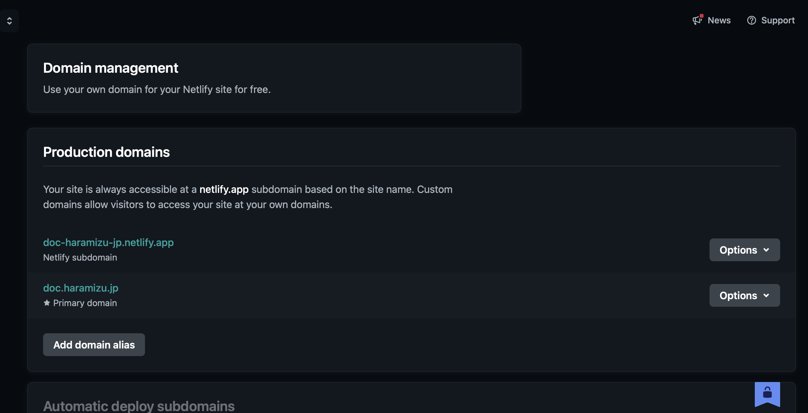

import { Steps, LinkCard } from '@astrojs/starlight/components';

Netlify は、静的サイトや動的サイトを簡単にデプロイできるホスティングサービスです。GitHub、GitLab、Bitbucket などのリポジトリと連携し、コードの変更がプッシュされるたびに自動的にビルドとデプロイが行われます。Netlify の強力な機能には、カスタムドメインの設定、SSL 証明書の自動生成、フォームハンドリング、サーバーレス関数のサポートなどがあります。また、プレビュー機能を使用することで、プルリクエストごとにデプロイされたサイトを確認することができ、チームでのコラボレーションが容易になります。Netlify を使用することで、開発者はインフラストラクチャの管理に煩わされることなく、迅速にウェブサイトを公開することができます。

## プランに関して

プランに関しては３つ用意されています。公式サイトで詳細を確認することができます。

<LinkCard title="Pricing" href="https://www.netlify.com/pricing/" target="_blank" />

抜粋すると以下のような形です。

- Free & Starter
  - 無料で利用できるプラン
  - １名専用（チームを作る場合は有償の Pro ）
  - ホスティングに必要な基本機能
  - 500 サイトまで
- Pro
  - パスワードが必要なサイト
  - Free よりも多い Bandwidth と build 時間
  - Slack やメールでのサポート
- Enterprise
  - SSO
  - サイト数は Custom

なお、Netlify は静的サイト生成ツールの Gatsby を 2023 年に買収しています。静的ホスティングサービスと相性の良いコンビとして展開しています。もちろん、それ以外のフレームワークを展開することは可能ですが、Plug-in が必要なケースもあります。

## アカウントの作成

アカウントを作成する際には、公式サイトの右上に表示されている `Sign up` のボタンをクリックすると進めていくことができます。

<Steps>

1. `Sign up` のボタンをクリックします

   

2. アカウントを利用する際に連携するサービスを選択できます。

   

   今回は GitHub を選択します

3. GitHub のアカウントと連携するかの確認画面が表示されます。

   

4. アカウントが作成されて、管理画面にログイン

   

</Steps>

## サイトの追加

早速ですが新しいサイトを追加していきます。

<Steps>

1. 上記の画面の `Import from Git` をクリックします。

2. ソースコードを連携させるサービス一覧が表示されます。ここでは GitHub を選択します。

   

3. 画面は GitHub の管理画面に移動して、アクセス権に関しての確認が表示されます。`Authorize Netlify` をクリックして次に進みます。

   

4. 対象となるアカウントが連携できる Organzation が含まれている場合は、ここで選択することが可能です。今回は通常のアカウントと紐づけます。

   

5. 連携をしたいリポジトリに関して、今回は指定のリポジトリのみとします。選択をした後画面の下に移動をして `Install` のボタンをクリックしてください。

   

6. 先ほどの画面で指定したリポジトリを今回は指定します。

   

7. プロジェクトの設定を進めます

   

   ここでは以下の項目も設定していきます。

   - `Site name`: サイトの名前で netlify.app のサブドメインで利用します
   - `Branch to deploy`: 指定したリポジトリのブランチ名を選択できます
   - `Base directory`: Root で実行している場合は特に必要ありません
   - `Build command`: Build を実行する際のコマンドです。例： `npm run build`
   - `Publish directory`: Build したデータの展開先です。例： `dist`
   - `Functions directory`: Function を利用している場合のディレクトリを指定します
   - `Environment variables`: Build を実行する際に必要な環境変数があれば適用してください

   今回はそのまま画面の下にある Deploy ボタンをクリックします。しばらく Build が実行されます。

   

8. 展開が完了すると、Success の画面になります。

   

</Steps>

サイトが立ち上がると、以下のようにこのプロジェクトのための設定画面が提供されます。

## ドメインを設定する

立ち上げたサイトに独自ドメインを割り当てたい場合は、以下の手順で進めることができます。

<Steps>

1. プロジェクトのメニュー、`Domain management` をクリックします。

2. `Add a domain` のボタンをクリックして、ドメイン追加の手順を開始します。

   

3. 追加したいドメインを設定します。

   

4. ドメインに関して確認が取れると、次はドメインを追加するための画面に切り替わります。

   

5. 外部の DNS での作業の確認画面に切り替わります。

   

   Awaiting External DNS をクリックすると、DNS に設定する情報が表示されます。

   

6. しばらくすると、DNS の設定が反映されて、サイトにアクセスできるようになります。

   

</Steps>

これで今回はサブドメインを適用することができました。

## まとめ

今回は Netlify に対してこのドキュメントサイトを展開する手順を確認しました。このサイト自体が Astro をベースにした静的サイトということで、特に引っかかるポイントはありませんでしたが、サーバーサイドレンダリングなどの処理が必要となる場合は、別途手順が必要となります。

