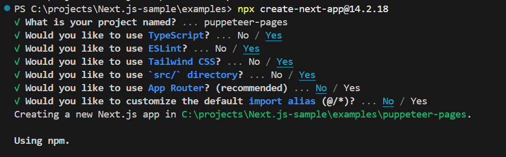

import { Steps, LinkCard } from '@astrojs/starlight/components';

Puppeteer は、Chrome または Firefox を制御するための高レベルAPIを提供するJavaScriptライブラリです。 Puppeteerはデフォルトでヘッドレス（UIが表示されない）状態で動作します。

ここでは、Puppeteer のライブラリを Next.js に実装をして、ページのサムネイルの画像を作成していきます。

## Puppeteer

Puppeteer のライブラリを利用することで、ブラウザでの動作を JavaScript を利用して再現することができます。これにより、サイトのテストの自動化などが可能となるため、多くの場合はテストツールとして利用されることが多いです。

今回は、Puppeteer が持っている機能の１つ、サムネイルを取得する仕組みを利用して、サイトの URL から画像ファイルを作成するサンプルを作成していきます。

公式サイトは以下の通りです。

<LinkCard title="Puppeteer" href="https://pptr.dev/" target="_blank" />

## サンプルの作成

今回は、前提条件として以下の環境で作成をしていきます。

- Next.js 14.2.18
- Pages Router
- Typescript
- Puppeteer は API 連携で呼び出す
- 作成した画像はストレージに保存をする

それでは最初のベースを作成していきます。

<Steps>

1. まずは Next.js のプロジェクトを作成します。

   

2. puppeteer のパッケージをインストールします。

   ```bash
   npm i puppeteer
   ```

3. `src\styles\globals.css` を以下のように書き換えます。

   ```css
   // src\styles\globals.css
   @tailwind base;
   @tailwind components;
   @tailwind utilities;
   ```

4. `src\pages\index.tsx` のファイルを以下のように書き換えます。

   ```tsx
   // src\pages\index.tsx
   export default function Home() {
     return (
       <div className="m-2 border-b border-gray-300 pb-2">
         <main>Screenshot</main>
       </div>
     );
   }
   ```

</Steps>

これでまずは、受け皿となる空っぽの Next.js のプロジェクトができました。

## Puppeteer のセットアップ

すでにパッケージをインストールしているため、API で呼び出す部分を作成していきます。

### API の作成

API として動作させるために `src\pages\api\screenshot.ts` のファイルを作成します。

```ts
// src\pages\api\screenshot.ts
import { NextApiRequest, NextApiResponse } from 'next';
import puppeteer from 'puppeteer';

export default async function handler(req: NextApiRequest, res: NextApiResponse) {
  const url = req.query.url as string;
  const width = parseInt(req.query.width as string) || 1280;
  const height = parseInt(req.query.height as string) || 768;

  if (!url) {
    res.status(400).json({ error: 'URL is required' });
    return;
  }

  try {
    const browser = await puppeteer.launch({
      args: ['--use-gl=angle', '--use-angle=swiftshader', '--single-process', '--no-sandbox'],
      headless: true,
    });

    const page = await browser.newPage();
    await page.setViewport({ width, height });
    await page.goto(url);

    const screenshot = await page.screenshot({ encoding: 'base64' });

    await page.close();
    await browser.close();

    res.status(200).json({ screenshot });
  } catch (error) {
    console.error(error);
    res.status(500).json({ error: 'Failed to take screenshot' });
  }
}
```

トップページとなる `src\pages\index.tsx` のファイルを書き換えて、上記の API を利用してスクリーンショットを撮るボタンを配置して、データを作成します。

```tsx
// src\pages\index.tsx
import { useState } from 'react';
import Image from 'next/image';

export default function Home() {
  const [screenshot, setScreenshot] = useState<string | null>(null);

  const handleTakeScreenshot = async () => {
    const response = await fetch(`/api/screenshot?url=https://doc.haramizu.com/en/`);
    const data = await response.json();
    setScreenshot(data.screenshot);
  };

  return (
    <div className="m-2 border-b border-gray-300 pb-2">
      <main>
        <div>
          <button
            onClick={handleTakeScreenshot}
            className="rounded bg-blue-500 px-4 py-2 font-bold text-white hover:bg-blue-700"
          >
            Screenshot
          </button>
        </div>
        <div>
          {screenshot ? (
            <Image
              src={`data:image/png;base64,${screenshot}`}
              alt="Screenshot"
              width={1280}
              height={768}
            />
          ) : (
            <p>Click button</p>
          )}
        </div>
      </main>
    </div>
  );
}
```

ページを表示したときは以下のようにボタンだけが表示されています。


ボタンをクリックすると、スクリーンショットの取得ができました。


### URL を変更できるようにする

上記のサンプルの場合、まだ URL はコードに埋め込まれて固定となっています。URL を入力する Input ボックスを追加して、入力されている URL を利用して生成するようにします。`src\pages\index.tsx` のファイルを変更します。以下は変更したコードをハイライトしています。

```tsx {3-4,12-18}
// src\pages\index.tsx
  const handleTakeScreenshot = async () => {
    const urlInput = (document.getElementById('urlInput') as HTMLInputElement).value;
    const response = await fetch(`/api/screenshot?url=${encodeURIComponent(urlInput)}`);
    const data = await response.json();
    setScreenshot(data.screenshot);
  };

  return (
    <div className="m-2 border-b border-gray-300 pb-2">
      <main>
        <div className="m-2 border-b border-gray-300 pb-2">
          <input
            type="text"
            id="urlInput"
            placeholder="Enter URL"
            className="border border-gray-300 rounded py-2 px-4 mb-2 w-full"
          />
          <button
            onClick={handleTakeScreenshot}
            className="bg-blue-500 hover:bg-blue-700 text-white font-bold py-2 px-4 rounded"
          >
            Screenshot
          </button>
```

入力ボックスを経由してデータを渡すこととするため、URL はエンコードして渡すように変更をしました。そこで、API 側でデコードするように変更をします。

```tsx {6}
// src\pages\api\screenshot.ts
export default async function handler(
  req: NextApiRequest,
  res: NextApiResponse
) {
  const url = decodeURIComponent(req.query.url as string);
  const width = parseInt(req.query.width as string) || 1280;
  const height = parseInt(req.query.height as string) || 768;
```

上記の実装の結果、URL を入力してスクリーンショットを取ることができるようになりました。


## 参考情報

<LinkCard
  title="Puppeteer"
  href="https://pptr.dev/"
  description="Puppeteer is a JavaScript library which provides a high-level API to control Chrome or Firefox over the DevTools Protocol or WebDriver BiDi. Puppeteer runs in the headless (no visible UI) by default"
  target="_blank"
/>

