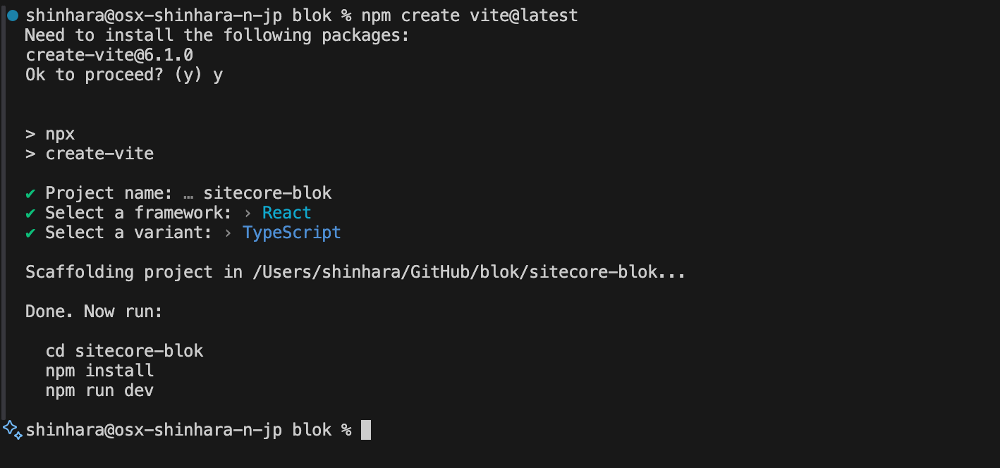

{/* https://blog.haramizu.com/ja-JP/blog/2024/06/19/sitecore-blok */}

import { FileTree, Steps, LinkCard } from '@astrojs/starlight/components';

Sitecore の製品で採用されている Web フレームワークが公開されており、このフレームワークを Sitecore Blok という形で誰でも利用できるようにパッケージを提供しています。今回はこの Sitecore Blok を Next.js で利用したいと思います。

## Sitecore Blok とは？

改めて Sitecore Blok を簡単に説明をすると、Sitecore の各製品、例えば Sitecore XM Cloud などで採用されいる UI を利用することができるように、Sitecore が提供しているフレームワークとなります。

以下のサイトが公式サイトになります。

<LinkCard
  title="Sitecore Blok"
  href="https://blok.sitecore.com/"
  target="_blank"
  description="Blok is Sitecore’s product design system: the UI framework and style guide we use to build great apps. It’s publicly available, so that anyone can easily build software in the Sitecore product design language."
/>

これを利用することで、Sitecore と連携するようなツールを作るときに、Sitecore の製品と一貫性のある UI のアプリを作ることができます。今回は、サンプルを動かすところまで進めていきます。

## 新しいプロジェクトを作成する

### 前提条件

Sitecore Blok は React および Chakra UI をベースとして作成されているため、前提条件は以下のようになります。

- React (v18)
- Chakra UI (v2) component library
- Blok theme package
- Material Design Icons

### Vite のプロジェクト作成

今回は最もシンプルな実装をするために、Vite を利用して検証を進めていきます。

<Steps>

1. プロジェクトを作成します。

   ```bash
   npm create vite@latest
   ```

   以下のように作成をしました。

   - Project name: sitecore-blok
   - framework: react
   - variant: TypeScript

   

2. 以下のコマンドを実行して、vite のプロジェクトが動作することを確認します。

   ```bash
   npm install
   npm run dev
   ```

3. Blok で利用するパッケージを追加します。最初に Chakra のコンポーネントライブラリをインストールします。

   ```bash
   npm i @chakra-ui/react @emotion/react @emotion/styled framer-motion
   ```

4. 続いて Blok のテーマパッケージを適用します。

   ```bash
   npm i @sitecore/blok-theme@1.1.9
   ```

   ここでは古いバージョンですが、1.1.9 をインストールします。

5. 最後に、Material Design Icons を利用しているので、このアイコンもインストールします。

   ```bash
   npm install @mdi/js
   ```

</Steps>

これで必要なパッケージの追加が完了しました。

## Blok のコンポーネントを利用する

まずは Chakra UI および Blok を利用できるようにするため、src\app\providers.tsx のファイルを作成して、以下のコードを設定します。

```ts
// app/providers.tsx
"use client";
import sitecoreTheme from "@sitecore/blok-theme";
import { ChakraProvider } from "@chakra-ui/react";
export function Providers({ children }: { children: React.ReactNode }) {
  return (
    <ChakraProvider
      theme={sitecoreTheme}
      toastOptions={{
        defaultOptions: {
          position: "bottom-left",
          variant: "subtle",
          containerStyle: {
            mt: "0",
            mb: "4",
            mx: "4",
          },
        },
      }}
    >
      {children}
    </ChakraProvider>
  );
}
```

この際、@sitecore/blok-theme のところがエラーとして表示されます。

blok-sample02.png
これは、typescript の設定に関するファイル、tsconfig.json の moduleResolution の値を bundler から node に変更することで解消できます。

