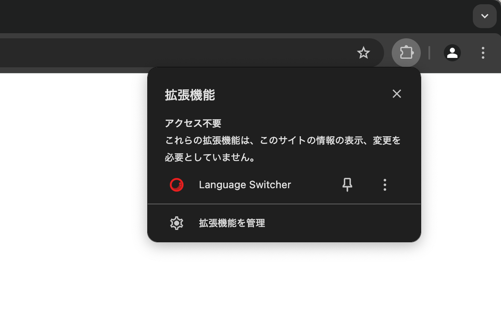

import { FileTree, Steps, LinkCard } from '@astrojs/starlight/components';

ブラウザの機能拡張となる、WXT - Web Extension Framework を利用して、Sitecore の管理画面の多言語化をするサンプルプログラムを作成します。

WXT の公式サイトは以下の通りです。

<LinkCard
  title="WXT Next-gen Web Extension Framework"
  href="https://wxt.dev"
  target="_blank"
  description="An open source tool that makes web extension development faster than ever before."
/>

## プロジェクトの作成

WXT は manifest.json を書いて、という手順ではなくプロジェクトのテンプレートを利用して開発をするというスタイルになっています。そこで、新しいプロジェクトを作成、動作確認をしていきます。

<Steps>

1. プロジェクトを作成します

   ```bash
   npx wxt@latest init
   ```

2. プロジェクトのディレクトリの確認がきます。任意の名前を指定してください。

3. テンプレート一覧が表示されます。

   - vanilla
   - vue
   - react
   - solid
   - svelte

   今回は react を選択します。

4. Package Manager を選択します。

   - npm
   - pnpm
   - yarn
   - bun

   このサイトでは npm に統一しているので npm で進めます。

5. テンプレートのダウンロードを開始して、次のステップが表示されます。

   

6. パッケージをインストールします。

   ```bash
   npm install
   ```

</Steps>

これでテンプレートを利用したプロジェクトの準備ができました。以下のコマンドで実行します。

```bash
npm run dev
```

実行すると以下のリソースを読み込み、ブラウザが起動します。


テンプレートのコードは `entrypoints/content.ts` に記載されているように、Google のサイトにアクセスをすると、コンソールに Hello content. とメッセージを表示する形です。実際に起動したブラウザでアクセスをして、開発者ツールを開くとコンソールにメッセージが出ているのがわかります。


テンプレートの作成、動作確認ができました。機能拡張のアイコンをクリックすると、 popup のフォルダで作成された画面が表示されています。


### manifest.json について

ブラウザの機能拡張に関する定義は、manifest.json で定義することになっています。そこで、この機能拡張に関する名前やアイコンなどを変更していきます。

<Steps>

1. アイコンに関して、`public/icon/` のディレクトリの下に、それぞれのサイズの png ファイルを用意して変更します。

   

2. `wxt.config.ts` に対して、以下のように manifest の項目を追加します。

   ```ts {8-13}
   // wxt.config.ts
   import { defineConfig } from 'wxt';

   // See https://wxt.dev/api/config.html
   export default defineConfig({
     extensionApi: 'chrome',
     modules: ['@wxt-dev/module-react'],
     manifest: {
       name: 'Language Switcher',
       description: 'Sitecore Language Switcher',
       version: '0.1.0',
       permissions: ['storage'],
     },
   });
   ```

</Steps>

上記の設定を変更したあと、改めて実行するとアイコンと名前が変わっていることを確認することができました。



## Popup の作成

プロジェクトの `entrypoints/popup` のディレクトリにおいては、機能拡張のアイコンをクリックしたときに表示する部分を制御しています。動作確認として、以下のような変更をしていきます。

### ブラウザの言語を取得

テンプレートではロゴが表示され、かつカウンターをクリックすると動作するようになっています。画像に関しては削除、ブラウザの言語を取得してその結果を表示するように書き換えます。

```ts
// entrypoints/popup/App.tsx
import { useState, useEffect } from "react";
import "./App.css";

function App() {
  const [count, setCount] = useState(0);
  const locale = navigator.language;

  return (
    <>
      <h1>Sitecore Language Switcher</h1>
      <div className="card">
        <button onClick={() => setCount((count) => count + 1)}>
          count is {count}
        </button>
      </div>
      <p className="read-the-docs">Click count</p>
      <p>Browser Locale: {locale}</p>
    </>
  );
}

export default App;
```


## コンテンツの操作

ブラウザの機能拡張では、ブラウザで表示をしているコンテンツの制御をすることができます。これは `entrypoints/content.ts` で実行しています。

### HTML を書き換える

ページに埋め込まれている HTML を変更する際のコードを確認していきます。今回は対象として、Sitecore Cloud Portal にログインをしたあと、複数の組織に所属している時に表示される組織の変更の画面を対象とします。


このページに関してコードを実行する際には、以下の点を気を付ける必要があります。

- ドメイン: login.sitecorecloud.io となっている
- Select organization を Extension が入っていれば日本語で表示をする

以下の手順で確認、実装を進めていきます。

<Steps>

1. 開発者ツールを利用して、Select orgainzation を選択するための Selector を取得する

   

   今回は、`body > form > header` となります

2. `entrypoints/content.ts` のファイルを以下のように書き換えます。

   ```ts
   // entrypoints/content.ts
   export default defineContentScript({
     matches: ['*://*.sitecorecloud.io/*'],
     main() {
       console.log('Hello content.');

       // Replace text in HTML
       replaceTextInSelector();
     },
   });

   function replaceTextInSelector() {
     // Replace text in header
     const selector = 'body > form > header';
     const element = document.querySelector(selector);
     if (element?.textContent?.trim() === 'Select organization') {
       element.textContent = '組織の選択';
     }
   }
   ```

</Steps>

上記の変更が終わったあと、 npm run dev で起動したブラウザでログインをすると、文字が日本語に変わっています。


この画面はシンプルで、残るはフッターの Cancel のみです。そこで、以下のようにコードを書き換えます。

```ts {10-15}
// entrypoints/content.ts
function replaceTextInSelector() {
  // Replace text in header
  const selector = 'body > form > header';
  const element = document.querySelector(selector);
  if (element?.textContent?.trim() === 'Select organization') {
    element.textContent = '組織の選択';
  }

  // Replace text in footer link
  const footerLinkSelector = 'body > form > footer > a';
  const footerLinkElement = document.querySelector(footerLinkSelector);
  if (footerLinkElement?.textContent?.trim() === 'Cancel') {
    footerLinkElement.textContent = '取り消し';
  }
}
```

両方とも、日本語で表示することができました。


### DOM の更新を利用する

続いて Cloud Portal で表示される Quick Links の表示を日本語にしていきたいと思います。上記の HTML と同じようにコードを追加します。

```ts {13-18}
// entrypoints/content.ts

function replaceTextInSelector() {
  // Replace text in header
  const selector = 'body > form > header';
  const element = document.querySelector(selector);
  if (element?.textContent?.trim() === "Select organization") {
    element.textContent = "組織の選択";
  }

  ...

  // Replace text in Quick Link
  const QuickLinkSelector = '[data-testid='quick-links-panel'] h2';
  const QuickLinkElement = document.querySelector(QuickLinkSelector);
  if (QuickLinkElement?.textContent?.trim() === "Quick Links") {
    QuickLinkElement.textContent = "クイックリンク";
  }
}
```

コードを更新した後アクセスをしても、Quick Links は英語のままとなっています。


このページは動的に表示されているため、HTML としてデータを持っていないため書き換えることができません。このような場合は、DOM の更新を監視して、動的に更新されるページの要素を翻訳します。

```ts {10-14}
// entrypoints/content.ts
export default defineContentScript({
  matches: ['*://*.sitecorecloud.io/*'],
  main() {
    console.log('Hello content.');

    // Replace text in HTML
    replaceTextInSelector();

    // Observe changes in the DOM
    const observer = new MutationObserver(() => {
      replaceTextInSelector();
    });
    observer.observe(document.body, { childList: true, subtree: true });
  },
});
```

上記の変更後は、日本語で`クイックリンク`と表示されるようになりました。


## リソースファイルの作成

動作確認のために 3 つの文字列変更のために Selector と英語、日本語に関して実行していましたが、これに関してリソースを分けて処理をしていきます。

### 言語ファイルに変更する

今回は言語ごとのリソースファイルを作成して、それぞれのリソースを利用して日本語を表示する動作に切り替えていきます。以下のように変更をしていきます。

<Steps>

1. リソースファイルを作成します。今回は、 entrypoints の下に resources ディレクトリを作成して、 en.json および ja.json を追加します。

   ```json
   // entrypoints/resources/en.json
   {
     "body > form > header": "Select organization",
     "body > form > footer > a": "Cancel",
     "[data-testid='quick-links-panel'] h2": "Quick Links",
     "[data-testid='help-item-XM Cloud Deploy'] p": "Manage XM Cloud setup and deployments",
     "[data-testid='media-title-Invite team members']": "Invite team members",
     "[data-testid='media-title-Help']": "Help",
     "[data-testid='media-title-Create support ticket']": "Create support ticket",
     "[data-testid='help-item-Help'] p": "Useful links and support"
   }
   ```

   ```json
   // entrypoints/resources/ja.json
   {
     "body > form > header": "組織の選択",
     "body > form > footer > a": "取り消し",
     "[data-testid='quick-links-panel'] h2": "クイックリンク",
     "[data-testid='help-item-XM Cloud Deploy'] p": "XM Cloud のセットアップと展開を管理",
     "[data-testid='media-title-Invite team members']": "チームメンバーの招待",
     "[data-testid='media-title-Help']": "ヘルプ",
     "[data-testid='help-item-Help'] p": "便利なリンクとサポート",
     "[data-testid='media-title-Create support ticket']": "サポートチケットの作成"
   }
   ```

2. `entrypoints/content.ts` では上記２つのリソースファイルを読み込みます。

   ```ts
   // entrypoints/content.ts
   import en from './resources/en.json';
   import ja from './resources/ja.json';

   type TranslationKeys = keyof typeof en;
   ```

3. 同じファイルにある `function replaceTextInSelector` を以下のように書き換えます。

   ```ts
   // entrypoints/content.ts
   function replaceTextInSelector() {
     const selectors = Object.keys(en) as TranslationKeys[];

     selectors.forEach((selector) => {
       const element = document.querySelector(selector);
       if (element?.textContent?.trim() === en[selector as TranslationKeys]) {
         element.textContent = ja[selector as TranslationKeys];
       }
     });
   }
   ```

</Steps>

上記の変更により、Selector に対するリソースという処理ができました。

リソースファイルでの管理に切り替えた場合、注意点としては英語の Selector に対して日本語の Selector が無い場合、文字が消えるという処理になってしまうことがあります。そこで、日本語に関して同じキーがあるかどうか、以下のように書き換えます。

```ts {7-11}
// entrypoints/content.ts
function replaceTextInSelector() {
  const selectors = Object.keys(en) as TranslationKeys[];

  selectors.forEach((selector) => {
    const element = document.querySelector(selector);
    if (element?.textContent?.trim() === en[selector]) {
      if (ja[selector as keyof typeof ja]) {
        element.textContent = ja[selector as keyof typeof ja];
      }
    }
  });
}
```

意図的に Help の日本語リソースを用意していない場合は、英語が表示されるようになりました。


### 対応言語の追加

上記のコードでは、インストールをしている環境では必ず日本語の表示に変わります。実際にはこういうツールは複数の言語への対応が必要となるため、以下のように言語に関しての設定を追加していきます。

<Steps>

1. 言語定義のための json ファイルとして entrypoints/resources/languages.json を以下のように作成します。

   ```json
   // entrypoints/resources/languages.json
   {
     "en": "English",
     "ja": "日本語",
     "fr": "Français"
   }
   ```

2. en.json のファイルをベースに `entrypoints/resources/fr.json` のファイルを作成します。

3. ここからは `entrypoints/content.ts` のファイルを変更していきます。作成をした言語に関するデータをインポートします。

   ```diff lang="ts"
   // entrypoints/content.ts
   import en from './resources/en.json';
   import ja from './resources/ja.json';
   +import fr from './resources/fr.json';
   +import languages from './resources/languages.json';
   ```

4. 言語に関して、ブラウザの言語を取得するように以下のコードを追加します。ロケールを指定している場合でも、最初の２文字の言語だけでここでは処理をします。

   ```ts
   // entrypoints/content.ts
     main() {
       const lang = navigator.language.slice(0, 2);

       console.log('lang: ' + lang);
   ```

5. 上記の変更後、アクセスをしてブラウザの優先言語が開発者ツールの Console に表示されているか確認をします。

   

6. 英語、そして language.json に定義されていない言語の場合はオリジナルを表示するようにコードを追加します。

   ```ts {7-12}
   // entrypoints/content.ts
     main() {
       const lang = navigator.language.slice(0, 2);

       console.log('lang: ' + lang);

       // If the language is 'en', do not execute
       if (lang.startsWith('en') || !Object.keys(languages).some(language => lang.startsWith(language))) {
         console.log('Original');

         return;
       }
   ```

7. ドイツ語で実行した場合、オリジナルのコンテンツが表示されていることを確認します。

   

8. `function replaceTextInSelector` に関して、言語情報を渡して必要な情報を利用するように設定します。ここで必要なリソースを読み込むようにコードも書き換えます。

   ```ts
   // entrypoints/content.ts
   async function replaceTextInSelector(lang: string) {
     const selectors = Object.keys(en) as TranslationKeys[];
     let translations: Record<string, string> | null = null;

     try {
       const module = await import(`./resources/${lang}.json`);
       translations = module.default;
     } catch (error) {
       console.error(`Translation file for ${lang} not found.`);
       return;
     }

     selectors.forEach((selector) => {
       const element = document.querySelector(selector);
       if (translations && element?.textContent?.trim() === en[selector]) {
         if (translations[selector as keyof typeof translations]) {
           element.textContent = translations[selector as keyof typeof translations];
         }
       }
     });
   }
   ```

9. 表示の切り替えの呼び出しに対して言語を指定するようにします。

   ```ts {3,7}
   // entrypoints/content.ts
   // Replace text in HTML
   replaceTextInSelector(lang);

   // Observe changes in the DOM
   const observer = new MutationObserver(() => {
     replaceTextInSelector(lang);
   });
   observer.observe(document.body, { childList: true, subtree: true });
   ```

10. 最後に、不要となった `ja.json` および `fr.json` のインポートを削除します。

    ```diff lang="ts"
    // entrypoints/content.ts
    import en from './resources/en.json';
    -import ja from './resources/ja.json';
    -import fr from './resources/fr.json';
    import languages from './resources/languages.json';
    ```

</Steps>

これでブラウザの優先言語を利用して、各言語のリソースを表示するようになりました。

### ドメインごとのファイルに変更する

Sitecore Cloud のサービスは複数のドメインにわたって動作しています。リソースファイルをもう少し管理しやすくするために、サブディレクトリを切って、リソースを分けていきます。階層は以下の通りです。

<FileTree>

- entrypoints/resources/login.sitecorecloud.io/en.json
  - resources
    - login.sitecorecloud.io
      - en.json
      - ja.json
    - portal.sitecorecloud.io
      - en.json
      - ja.json

</FileTree>

ファイルの中身は以下のように変更しました。en.json のみサンプルで記載しています。

```json
// entrypoints/resources/login.sitecorecloud.io/en.json
{
  "body > form > header": "Select organization",
  "body > form > footer > a": "Cancel"
}
```

```json
// entrypoints/resources/portal.sitecorecloud.io/en.json
{
  "[data-testid='quick-links-panel'] h2": "Quick Links",
  "[data-testid='help-item-XM Cloud Deploy'] p": "Manage XM Cloud setup and deployments",
  "[data-testid='media-title-Invite team members']": "Invite team members",
  "[data-testid='media-title-Help']": "Help",
  "[data-testid='media-title-Create support ticket']": "Create support ticket",
  "[data-testid='help-item-Help'] p": "Useful links and support"
}
```

