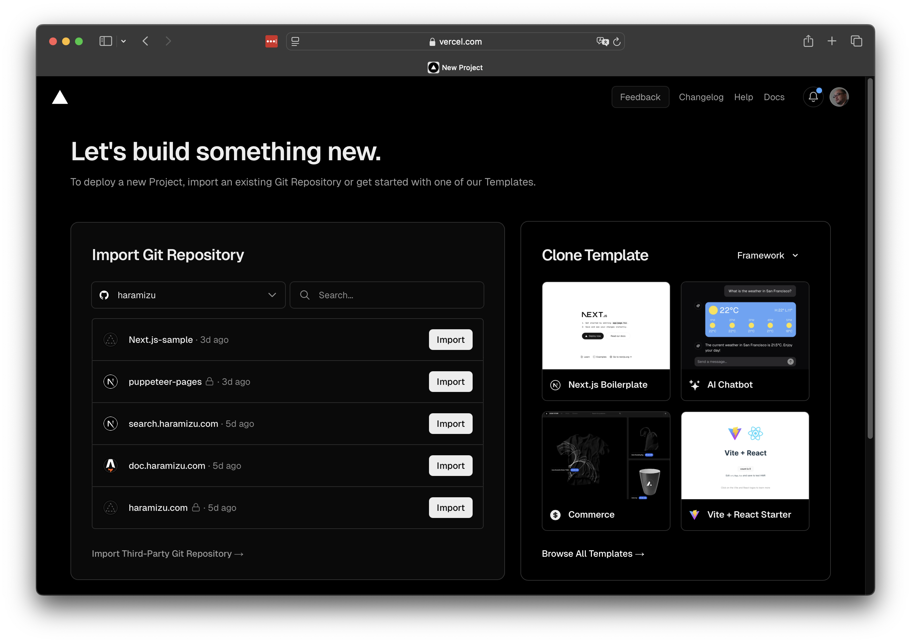
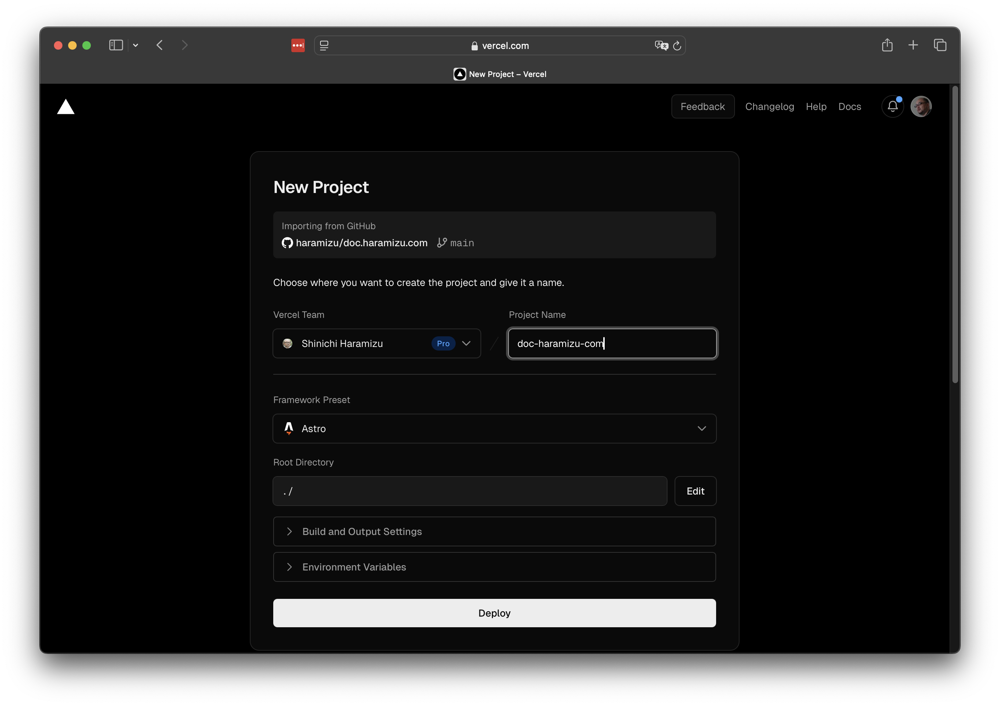
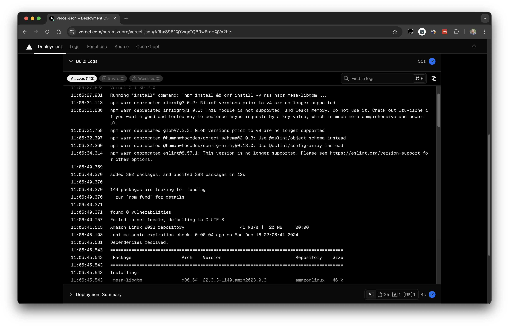
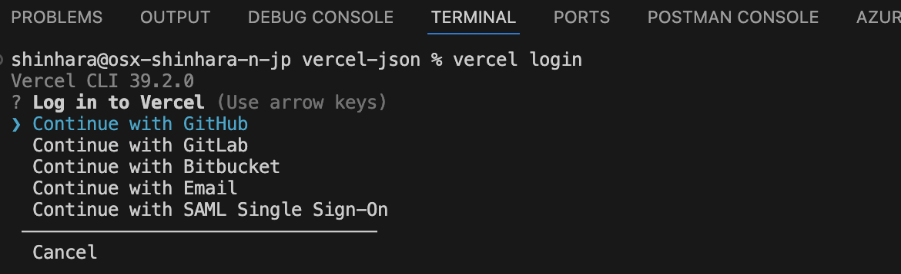
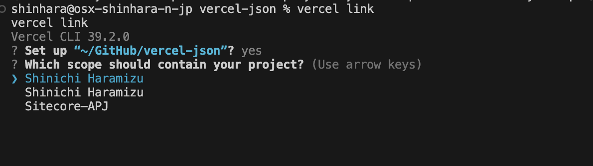

import { Steps, LinkCard } from '@astrojs/starlight/components';

Vercel は会社名でもあり、サービスの名前でもあります。Web サイトにアクセスをするとわかりますが、いくつかの製品、ソリューションを提供しています。このサイトで取り上げている内容は、以下の通りです。

- **Vercel**: CI/CD に対応したサーバーレス ホスティング サービス
- **Next.js**: React を利用した Web フレームワーク
- **v0.dev**: プロトタイプの作成の際に Web コンポーネントを生成 AI で作成するサービス
- **AI SDK**: AI アプリケーションを React, Next.js などを利用して効率よく開発をするための SDK

上記のうち、ここでは Vercel のホスティング、および展開をする際の Tips をまとめていきます。Next.js に関しては以下の形で別途まとめています。

- [Next.js](/nextjs/overview/)

## Vercel とは

Vercel は、フロントエンド開発者向けのクラウドプラットフォームで、静的サイトやサーバーレス機能を簡単にデプロイできます。Vercel は、Next.js の開発元としても知られており、シームレスな開発体験を提供します。主な特徴としては、以下の点が挙げられます。

- **簡単なデプロイ**: GitHub、GitLab、Bitbucket などのリポジトリと連携し、プッシュするだけで自動的にデプロイが行われます。
- **高速なパフォーマンス**: グローバル CDN による高速なコンテンツ配信を実現し、ユーザーに優れたパフォーマンスを提供します。
- **サーバーレス機能**: API やバックエンドロジックをサーバーレス関数として簡単に実装できます。
- **カスタムドメイン**: 独自ドメインの設定が簡単に行え、SSL 証明書も自動的に管理されます。

Vercel を使用することで、開発からデプロイまでのプロセスが大幅に簡素化され、効率的な開発が可能になります。

例えば、このサイトは Astro をベースにした静的サイトとして構築していますが、Markdown で記述したこの記事が Web のページとして展開する際には Build を実行することになります。GitHub にコードを展開することで自動的に Build が実行されて、問題なければ本番環境に適用して公開されるようにしています。

### 利用プランに関して

Vercel を利用する際には、個人で利用できる Hobby 、チームで利用するもしくはより本格的に利用する際の Pro、そして企業向けで利用するための Enterprise が提供されています。違いに関しては公式サイトを確認してください。

<LinkCard title="Pricing" href="https://vercel.com/pricing" target="_blank" />

注意点としては、Hobby プランは商用で利用することは許可されていないため、広告付きの広告の展開などは認められない形となります。この場合は Pro プランにすることで、この条件は回避することが可能です。

以下のような感じで覚えておくといいかと思います。

- Hobby
  - GitHub などと利用して Web サイトのホスティングを簡単にできる
  - 独自ドメイン、DNS などの機能も利用可能
  - 一人で利用するためのプラン（チームの場合は Pro に）
  - サンプルとかの公開には適している
- Pro
  - チームとして利用したい場合に利用できる
  - Hobby で割り当てられているよりも多くのリソースを利用できる
  - 商用として利用することも許可される
  - メールのサポートを利用することが可能
- Enterprise
  - SSO が利用できる
  - Audit Log が取得できる
  - SLA 99.99%

ほとんどの機能を Hobby で利用できるためハードルが低くなっており、また Pro も１アカウント $20 からとなっており比較的安価なホスティングとして利用できます。また企業で求められるような SSO や SLA に関しては Enterprise でカバーされている形です。

## サイトを展開する

ここでは、Vercel で展開する際に必要となるステップを参考までに紹介をします。前提条件として、すでに GitHub と連携しているアカウントを利用して、Vercel に展開していきます。

<Steps>

1. 新しいプロジェクトを作成します。右上にある Add New のボタンをクリックします。いくつか作成するメニューが表示されますが、ここでは Project を選択します。

   

2. 連携している GitHub のリポジトリ一覧が表示されます。

   

3. 新しいプロジェクトの設定画面が表示されます。

   

   この画面を見ると、すでに Astro のプロジェクトとして認識していることがわかります。これに併せて標準の展開コマンドが設定されています。

   

4. 環境変数などの値を設定したあと、Deploy のボタンをクリックすると Build が実行されます。

   

5. しばらくすると展開が完了となります。

   

</Steps>

### 展開手順のカスタマイズ

上記の手順では、デフォルトの Build プロセスで問題なく動作するパターンのため `Build and Output Settings` の部分はデフォルトのままで展開しました。とはいえプロジェクトによっては、この部分をカスタマイズしたいパターンがあります。この部分をコードで管理するための仕組みとして、vercel.json というファイルをプロジェクトに含めて、この設定を制御することができます。

この設定手順に関する公式のページは以下の通りです。

<LinkCard
  title="Configuring projects with vercel.json"
  href="https://vercel.com/docs/projects/project-configuration"
  target="_blank"
  description="Learn how to use vercel.json to configure and override the default behavior of Vercel from within your project.
"
/>

例えばプロジェクトとして、環境に対してなんらかのライブラリを追加する必要がある場合を想定します。Vercel が利用している Build Image に関して、Node 20 以降を対象としている場合、 Amazon Linux 2023 を利用しています。

<LinkCard
  title="Build image overview"
  href="https://vercel.com/docs/deployments/build-image"
  target="_blank"
  description="Learn about the container image used for Vercel builds."
/>

<LinkCard
  title="Introducing the Amazon Linux 2023 runtime for AWS Lambda"
  href="https://aws.amazon.com/blogs/compute/introducing-the-amazon-linux-2023-runtime-for-aws-lambda/"
  target="_blank"
  description="AWS Lambda now supports Amazon Linux 2023 (AL2023) as a managed runtime and container base image. Named provided.al2023, this runtime provides an OS-only environment to run your Lambda functions."
/>

例えば Next.js で Playwright を利用したい場合、Vercel に展開する場合は上記の Amazon Linux 2023 ではいくつかのライブラリが不足しています。このような場合、以下のような vercel.json ファイルを配置します。

```json
// vercel.json
{
  "$schema": "https://openapi.vercel.sh/vercel.json",
  "installCommand": "npm install && dnf install -y nss nspr mesa-libgbm"
}
```

このファイルを読み込んだプロジェクトは、以下のように Install Command の部分が反映されていることがわかります。


実際に展開をしたあと、Build のログを参照しにいくと以下のようにインストールが実行されていることがわかります。



今回はライブラリをインストールする部分を紹介しましたが、この部分を理解していると色々なツールを Vercel で利用できる可能性が増えます。

## Vercel CLI

環境変数に関しては、固定で展開するためのものであれば Vercel.json で利用するので利用可能です。ただ、Client Key などで本番環境と非本番環境で異なる値を利用したい、などの場合は、ここで Vercel CLI を利用することをお勧めします。

Vercel CLI の公式ページは以下の通りです。

<LinkCard
  title="Vercel CLI Overview"
  href="https://vercel.com/docs/cli"
  target="_blank"
  description="Learn how to use the Vercel command-line interface (CLI) to manage and configure your Vercel Projects from the command line.
"
/>

Vercel CLI は文字通り Vercel に関する手続きをコマンドラインで実行するためのもので、ローカルにインストールをして手元のプロジェクトと Vercel のプロジェクトを紐づけて利用することが可能です。

インストールは非常に簡単で以下のコマンドを実行するだけです。

```bash
npm i -g vercel
```

### 利用例

ここでは手元のプロジェクトと Vercel のプロジェクトで環境変数を連携させる手順を紹介します。

<Steps>

1. 連携をしたいローカルプロジェクトのルートで、コマンドラインのコマンドとして以下のものを実行します。

   ```bash
   vercel login
   ```

   アカウントの選択画面が表示されます

   

2. GitHub をクリックするとブラウザが起動します。GitHub にログインをしてください。

3. ブラウザでログインをすると、Vercel CLI のログインは完了です。

   

4. 改めて次のコマンドを実行します

   ```bash
   vercel link
   ```

5. 手元のどのプロジェクトと連携をするのかを確認してきます。すでにそのパスで作業をしている前提のため、Yes で進めます。

6. 複数のチームに所属している場合は、どのチームにあるプロジェクト火を知るために、チームの選択が出ます。

   

7. 既存のプロジェクトと連携をするかの確認が表示されます。今回はすでに展開しているプロジェクト連携するため Y を選択します。

8. `.env.local` のファイルが作成されます

</Steps>

なお、一般的に環境変数ファイルに関して、.env および .env.local という形で複数設定することができます。住み分けとしては以下のように設定すると便利です。

- .env - 環境のデフォルトの値を設定
- .env.local - プロジェクトに関わるシークレットコードなど

実際に、Next.js などのプロジェクトではデフォルトで .env.local などのファイルは共有しない形で作成さることもあり、.env.local でシークレットコードを管理すること他重要です。

```
// .gitignore
.env.local
.env.\*.local
```

実際には .env.development.local というファイルを利用して、開発環境として読み込むということもできます。

## まとめ

Vercel のサービスの概要、展開のカスタマイズと Vercel CLI に関して紹介をしました。実際にはもっと多くのことが可能ですが、最初にこのあたりを理解していればというところまでの紹介をここではしました。

## 参照情報

<LinkCard
  title="AI SDK by Vercel"
  href="https://sdk.vercel.ai/docs/introduction"
  target="_blank"
  description="The AI SDK is the TypeScript toolkit designed to help developers build AI-powered applications with React, Next.js, Vue, Svelte, Node.js, and more."
/>

<LinkCard
  title="Configuring projects with vercel.json"
  href="https://vercel.com/docs/projects/project-configuration"
  target="_blank"
  description="Learn how to use vercel.json to configure and override the default behavior of Vercel from within your project.
"
/>

<LinkCard
  title="Build image overview"
  href="https://vercel.com/docs/deployments/build-image"
  target="_blank"
  description="Learn about the container image used for Vercel builds."
/>

<LinkCard
  title="Introducing the Amazon Linux 2023 runtime for AWS Lambda"
  href="https://aws.amazon.com/blogs/compute/introducing-the-amazon-linux-2023-runtime-for-aws-lambda/"
  target="_blank"
  description="AWS Lambda now supports Amazon Linux 2023 (AL2023) as a managed runtime and container base image. Named provided.al2023, this runtime provides an OS-only environment to run your Lambda functions."
/>

<LinkCard
  title="Vercel CLI Overview"
  href="https://vercel.com/docs/cli"
  target="_blank"
  description="Learn how to use the Vercel command-line interface (CLI) to manage and configure your Vercel Projects from the command line.
"
/>

