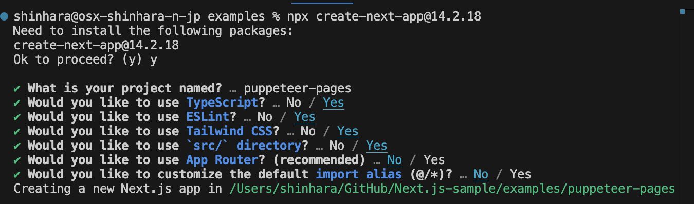
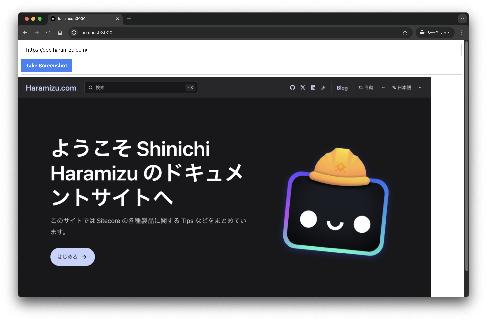
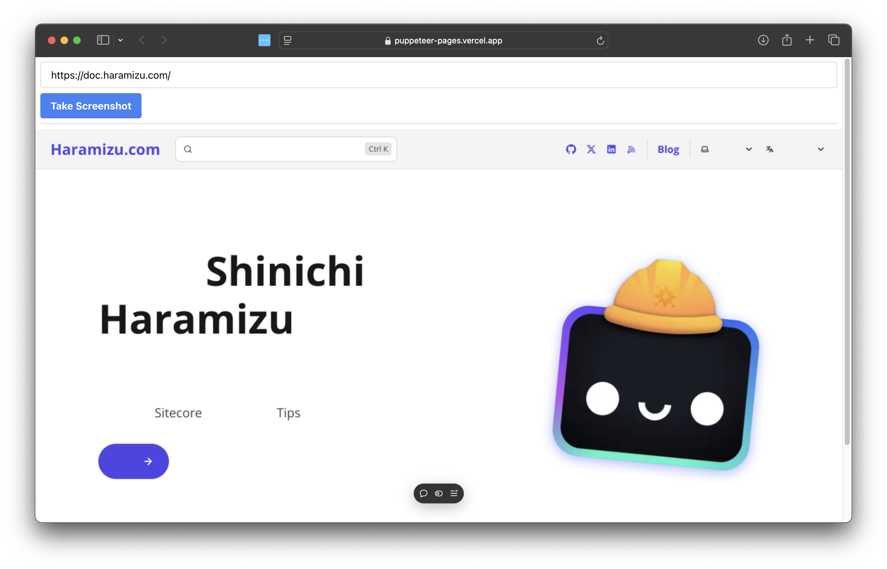
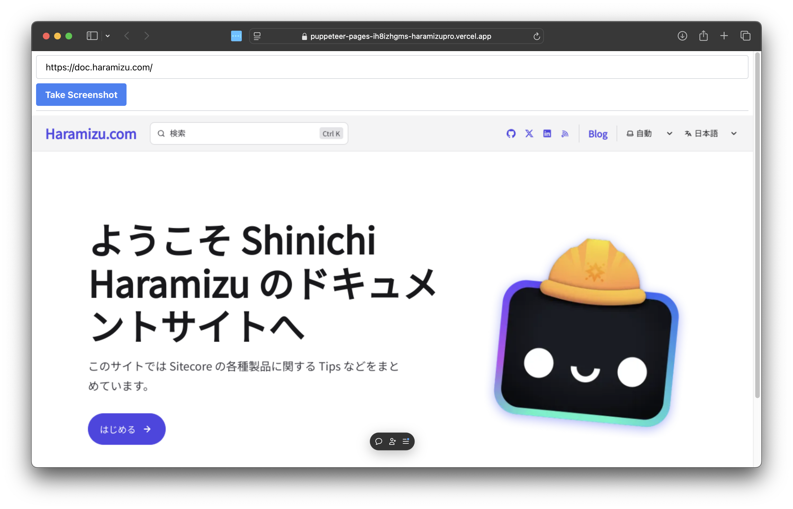

import { Steps, LinkCard } from '@astrojs/starlight/components';

Puppeteer は、Node.js で開発されたライブラリで、Chrome または Chromium を制御するための API を提供します。Headless Chrome を操作するのに特化しており、テストの自動化などでよく利用されます。公式サイトは以下のサイトになります。

<LinkCard
  title="Puppeteer"
  href="https://pptr.dev"
  description="Puppeteer is a JavaScript library which provides a high-level API to control Chrome or Firefox over the DevTools Protocol or WebDriver BiDi. Puppeteer runs in the headless (no visible UI) by default"
  target="_blank"
/>

ここでは、Puppeteer を利用している Next.js のサンプルを Vercel に展開する手順を紹介します。

## プロジェクトを作成する

まずは Next.js で利用できる Puppeteer のサンプルを作成していきます。このドキュメントでの前提条件は以下の通りです。

- Next.js 14.2.18
- Pages Router
- Node.js v20
- macOS
- Google Chrome

ローカルで動作させる際には、Google Chrome がインストールされていることを前提として、Google Chrome を Headless モードで動作させてスクリーンショットを撮る形となります。

<Steps>

1. 新しい Next.js のプロジェクトを作成します。

   ```bash
   npx create-next-app@14.2.18
   ```

   今回は、以下のように選択しました。

   

2. puppeteer のパッケージを追加します。

   ```bash
   npm install puppeteer-core
   ```

3. 今回は URL を指定して画像を取得するような API として puppeteer を利用します。このため API のファイルとして `src/pages/api/screenshot.ts` のファイルを作成し、以下のコードを追加します。

   ```tsx
   // /src/pages/api/screenshot.ts
   // Next.js API route support: https://nextjs.org/docs/api-routes/introduction
   import type { NextApiRequest, NextApiResponse } from 'next';
   import puppeteer from 'puppeteer-core';

   export default async function handler(req: NextApiRequest, res: NextApiResponse) {
     const url = req.query.url as string;
     const width = parseInt(req.query.width as string) || 1280;
     const height = parseInt(req.query.height as string) || 768;

     if (!url) {
       res.status(400).json({ error: 'URL is required' });
       return;
     }

     try {
       const browser = await puppeteer.launch({
         channel: 'chrome',
         headless: true,
       });

       const page = await browser.newPage();

       await page.setViewport({ width, height });
       await page.goto(url, { waitUntil: 'networkidle0' });

       const screenshot = await page.screenshot({ encoding: 'base64' });
       await page.close();
       await browser.close();

       res.status(200).json({ screenshot });
     } catch (error) {
       console.error(error);
       res.status(500).json({ error: 'Failed to take screenshot' });
     }
   }
   ```

4. Next.js のトップページのコードを以下のように変更をします。

   ```tsx
   // /src/pages/index.tsx
   import Image from 'next/image';
   import { useState } from 'react';

   export default function Home() {
     const [screenshot, setScreenshot] = useState<string | null>(null);

     const handleTakeScreenshot = async () => {
       const urlInput = (document.getElementById('urlInput') as HTMLInputElement).value;
       const response = await fetch(
         `/api/screenshot?url=${encodeURIComponent(urlInput)}&width=1280&height=768`
       );
       const data = await response.json();
       setScreenshot(data.screenshot);
     };

     return (
       <div>
         <div className="m-2 border-b border-gray-300 pb-2">
           <input
             type="text"
             id="urlInput"
             placeholder="Enter URL"
             defaultValue="https://doc.haramizu.com/"
             className="mb-2 w-full rounded border border-gray-300 px-4 py-2"
           />
           <button
             onClick={handleTakeScreenshot}
             className="rounded bg-blue-500 px-4 py-2 font-bold text-white hover:bg-blue-700"
           >
             Take Screenshot
           </button>
         </div>
         <div>
           {screenshot && (
             <Image
               src={`data:image/png;base64,${screenshot}`}
               alt="Screenshot"
               width={1280}
               height={768}
             />
           )}
         </div>
       </div>
     );
   }
   ```

5. スタイルシート `/src/styles/globals.css` に記載されているサンプルのスタイルを全て削除します。

   ```css
   @tailwind base;
   @tailwind components;
   @tailwind utilities;
   ```

</Steps>

上記の状態で、実行をします。

```bash
npm run dev
```

URL を入力して、ボタンを押してスクリーンショットを取得します。以下のように、画像として表示されました。



## Vercel に展開する

上記ではローカルにインストールされている Google Chrome を利用していましたが、Vercel の環境には Chrome はインストールされていないため、そのままでは動作しません。

そこで今回は、`@sparticuz/chromium` というパッケージを利用します。これは、Serverless 環境で利用できる Chromium のパッケージとなります。

<LinkCard
  title="@sparticuz/chromium"
  href="https://github.com/Sparticuz/chromium"
  target="_blank"
  description="Chromium (x86-64) for Serverless Platforms"
/>

手順は以下の通りです。

<Steps>

1. `@sparticuz/chromium` をインストールする

   ```bash
   npm install @sparticuz/chromium
   ```

2. `/src/pages/api/screenshot.ts` の API において、Vercel の環境では上記の chromium を利用するように、以下のように変更をします。

   ```ts {4,20-32}
   // /src/pages/api/screenshot.ts
   import type { NextApiRequest, NextApiResponse } from "next";
   import puppeteer from "puppeteer-core";
   import chromium from "@sparticuz/chromium";

   export default async function handler(
     req: NextApiRequest,
     res: NextApiResponse,
   ) {
     const url = req.query.url as string;
     const width = parseInt(req.query.width as string) || 1280;
     const height = parseInt(req.query.height as string) || 768;

     if (!url) {
       res.status(400).json({ error: "URL is required" });
       return;
     }

     try {
       let browser;
       if (process.env.VERCEL_ENV) {
         browser = await puppeteer.launch({
           args: chromium.args,
           executablePath: await chromium.executablePath(),
           headless: true,
         });
       } else {
         browser = await puppeteer.launch({
           channel: 'chrome',
           headless: true,
         });
       }

       const page = await browser.newPage();
   ```

</Steps>

上記の変更後、Vercel に展開して、動作確認をします。URL を入力して実行すると以下のようになります。



実は `@sparticuz/chromium` はデフォルトで日本語のフォントが入っていないため、日本語のページを参照するとページにコンテンツが正しく表示されることがありません。

今回は日本語も表示する形にしたいため、 `/src/pages/api/screenshot.ts` に日本語を表示するための処理を追加します。具体的には、スタイルに関しての定義を追加して、それが適用されるためにスクリーンショットを取得する手前で 1 秒待ちます。

```ts {7-16}
// /src/pages/api/screenshot.ts
const page = await browser.newPage();

await page.setViewport({ width, height });
await page.goto(url, { waitUntil: 'networkidle0' });

await page.addStyleTag({
  content: `
        @import url('https://fonts.googleapis.com/css2?family=Noto+Sans+JP&display=swap');
        * {
          font-family: 'Noto Sans JP', sans-serif !important;
        }
      `,
});

await new Promise((resolve) => setTimeout(resolve, 1000));

const screenshot = await page.screenshot({ encoding: 'base64' });
```

上記のコードの変更後、Vercel に改めて展開をしてテストを実行します。無事、スクリーンショットを取得できました。



## まとめ

今回は Puppeteer を利用した簡単な Next.js のアプリを Vercel に展開しました。日本語が表示できない部分に関しても、パッケージの機能を利用することでスクリーンショットに日本語のフォントを適用することができました。おそらく他の言語でも同様に動作すると思います。

このサンプルコードは以下の URL で公開しています。併せて App Router でのコードも共有しています。

<LinkCard
  title="GitHub - haramizu / Next.js-sample: puppeteer-pages"
  href="https://github.com/haramizu/Next.js-sample/tree/main/examples/puppeteer-pages"
  description="Puppeteer - Next.js Pages Router version"
  target="_blank"
/>

<LinkCard
  title="GitHub - haramizu / Next.js-sample: puppeteer-app"
  href="https://github.com/haramizu/Next.js-sample/tree/main/examples/puppeteer-app"
  description="Puppeteer - Next.js App Router version"
  target="_blank"
/>

