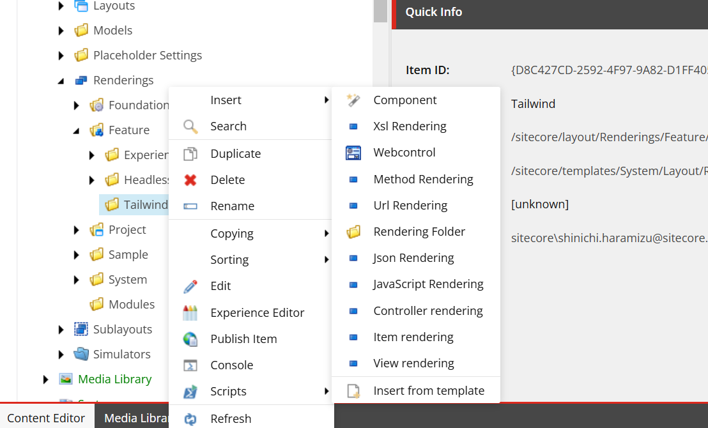

{/* https://blog.haramizu.com/ja-JP/blog/2023/10/18/create-custom-sxa-component */}
{/* https://blog.haramizu.com/ja-JP/blog/2022/03/25/create-component */}
{/* https://blog.haramizu.com/ja-JP/blog/2024/10/10/xmc-component-folder-settings */}
{/* https://blog.haramizu.com/ja-JP/blog/2024/10/03/xmc-component-wizard-part-1 */}

{/* https://blog.haramizu.com/ja-JP/blog/2024/10/04/xmc-component-wizard-part-2 */}
{/* https://blog.haramizu.com/ja-JP/blog/2024/10/09/xmc-component-wizard-part-5 */}
{/* https://blog.haramizu.com/ja-JP/blog/2024/10/07/xmc-component-wizard-part-3 */}
{/* https://blog.haramizu.com/ja-JP/blog/2024/10/08/xmc-component-wizard-part-4 */}

import { Steps, LinkCard, Aside, FileTree } from '@astrojs/starlight/components';

ここでは Sitecore が提供する Next.js Starter Kit に対して、提供されているコンポーネント以外のカスタムコンポーネントを追加するための手順を紹介します。

## Image コンポーネントの要素

まず既存のコンポーネントが利用しているアイテムを確認していきながら進めていきます。今回は、Image コンポーネントを対象とします。この Image コンポーネントは以下のアイテムで成り立っています。

<FileTree>

- sitecore
  - layout
    - Renderings
      - Feature
        - _JSS Experience Accelerator_
          - Media
            - **Image** レンダリングアイテム
  - templates
    - Feature
      - JSS Experience Accelerator
        - Media
          - **Image** 画像テンプレート
          - **Image Folder** 画像フォルダのテンプレート
          - Rendering Parameters
            - **Image** パラメーターテンプレート

</FileTree>

上記で指定している内容を参考にしながら進めていきます。

### レンダリングアイテム

レンダリングアイテムは、実際のコンポーネントの動作に関して定義しているアイテムと考えてください。重要なポイントは上記のツリーのアイテムと連動して設定しています。参考までに、以下の設定が必要となります。

| グループ               | 項目                    | 設定する値                 |
| ---------------------- | ----------------------- | -------------------------- |
| Experience Accelerator | Other properties        | 動作に関する設定           |
| Editor Options         | Parameters Template     | パラメーターテンプレート   |
|                        | Datasource Location     | 保存に関する定義           |
|                        | Datasource Template     | テンプレートのアイテム     |
| GraphQL                | Component GraphQL Query | GraphQL を利用する際に利用 |

### 画像テンプレート

実際に Image アイテムを作成した場合に利用するフィールドの定義を作成しているのが、このテンプレートになります。


コンポーネントでは以下のフィールドを用意している形となります。

- Image: メディアライブラリの画像を指定、 query:$siteMedia を指定して、サイトのメディアのみを選択できるようにしてます
- TargetUrl: リンク先を設定することができます
- ImageCaption: 画像のキャプションに関して文字列で定義します

アイテムを作成した際には、上記の項目のアイテムが作成されることになります。

### パラメーターテンプレート

この要素は、Image コンポーネントが継承をするテンプレートを指定することが可能となっています。この仕組みを利用することで、Image のテンプレートで他のテンプレートを継承する形ではなく、継承に関して別のアイテムで管理することが可能です。


残りは Image のアイテムを作成した場合、フォルダを利用してフォルダには Image アイテムのみと制限しているテンプレートを用意して、フォルダの中にアイテムを追加する際には画像のみが配置できる制限をかけることが可能となります。

## コンポーネント ウィザード

コンポーネントを作成するにあたって、必要なアイテムをまとめて作ることができるウィザードをコンテンツエディターから実行することができるようになっています。今回はシンプルなコンポーネントをウィザードを利用して作成したいと思います。

### ウィザード実行前の準備

コンポーネントウィザードが作成するアイテムを保存する場所に関して、あらかじめ準備をしておく必要があります。今回は Tailwind というフォルダを作成していきます。

<FileTree>

- sitecore
  - layout
    - Renderings
      - Feature
        - **Tailwind**
  - system
    - Settings
      - Feature
        - **Tailwind**
  - templates
    - Branches
      - Feature
        - **Tailwind**
    - Feature
      - **Tailwind**

</FileTree>

これでウィザードを実行する準備が完了しました。

### ウィザードを実行する

上記のフォルダの作成が完了したあと、レンダリングに作成したフォルダを右クリックをすると、実行可能な項目が表示されて、Insert の一番上に Component と記載されたアイコンがあります。これがコンポーネントウィザードになります。



まず最初の General のタブではコンポーネントの名前を指定します。今回は、ContentBlock を設定します。


続いて Datasource のタブに切り替えます。この画面では、 **Rendering template** の項目を **Templates/Foundation/JavaScript Services/Json Rendering** に変更してください。


上記の２か所変更をして実行すると、ウィザードがアイテムを作成していきます。作成されたアイテムに対して、以下の作業をしていきます。

### コンポーネントの変更

コンポーネントで利用するフィールドを定義する必要があります。実は今回の ContentBlock のコンポーネントに関しては、Next.js Starter Kit に含まれており、有効になっていないサンプルのコンポーネントです。ファイルは、 **src\components\ContentBlock.tsx** に既に作成されており、内容は以下の通りです。

```ts
// src\components\ContentBlock.tsx
import { Text, RichText, Field, withDatasourceCheck } from '@sitecore-jss/sitecore-jss-nextjs';
import { ComponentProps } from 'lib/component-props';

type ContentBlockProps = ComponentProps & {
  fields: {
    heading: Field<string>;
    content: Field<string>;
  };
};

/**
 * A simple Content Block component, with a heading and rich text block.
 * This is the most basic building block of a content site, and the most basic
 * JSS component that's useful.
 */
const ContentBlock = ({ fields }: ContentBlockProps): JSX.Element => (
  <div className="contentBlock">
    <Text tag="h2" className="contentTitle" field={fields.heading} />

    <RichText className="contentDescription" field={fields.content} />
  </div>
);

export default withDatasourceCheck()<ContentBlockProps>(ContentBlock);
```

このコンポーネントのデータソースは **/sitecore/templates/Feature/Tailwind/Data Source/ContentBlock** のアイテムとなっています。今回はコードに合わせて以下の２つの項目を追加します。


これでコンポーネントの準備ができました。

### コンポーネントの登録

サイトでコンポーネントを利用できるようにするためには、利用したいサイトの **Presentation** - **Available Renderings** に登録する必要があります。今回は Page Content のグループに登録します。


登録後、Page Builder を開くと以下のようにコンポーネントが表示されていることが分かります。


上記では Page Content に対して登録をしましたが、Tailwind というグループにアイコンが表示されていることが分かります。グループの中に表示したい場合は、同じフォルダの名前を作成して、レンダリングのアイテムを移動させることで、表示位置を変更できます。


変更後、以下のように同じグループに表示されました。


### 保存フォルダの作成

アイテムを作成した際に、ページアイテムの下の Data フォルダ、もしくはサイトで共有する Data フォルダに対してアイテムが作成されるようにしていきたいと思います。まず、参考としている Image コンポーネントが持っている保存先に関する情報は、Editor Options - Datasource Location の下の項目になります。参考までに、以下のようになっています。

```txt title="Editor Options - Datasouce Location"
query:$site/*[@@name='Data']/*[@@templatename='Image Folder']|query:$sharedSites/*[@@name='Data']/*[@@templatename='Image Folder']
```

ここで **Image Folder** というテンプレートを利用して、指定した先にアイテムもしくはフォルダを作成できるように指定していることが分かります。今回は、`ContentBlock Folder` を作成したいと思います。

<Steps>

1. ContentBlock のアイテムテンプレートが用意されている階層 **/sitecore/templates/Feature/Tailwind/Data Source** に移動をして、画面に表示される New Template のボタンをクリックしてください。

   

2. テンプレートの名前としては **ContentBlock Folder** を指定をしてテンプレートを作成します。

   

3. 作成されたアイテムを選択、メニューの Builder Options から Standard values をクリックします。

   

4. 作成された **\_\_Standard Values** のアイテムを選択して、 **Configure** - **Assign** をクリックしてアイテムのアサインの設定の画面を開きます。

   

5. Insert Options の画面では、今回作成をした ContentBlock のアイテム、そして自分自身を追加してください。

   

6. 上記の設定が完了したところで、最後にサイトの Data フォルダの下に今回作成をした ContentBlock のフォルダを追加してください。

   

</Steps>

上記の手順が完了したところで、ContentBlock のレンダリングアイテムの Editor Options - Datasouce Location に以下の内容を設定します。

```txt title="Editor Options - Datasouce Location"
query:$site/*[@@name='Data']/*[@@templatename='ContentBlock Folder']|query:$sharedSites/*[@@name='Data']/*[@@templatename='ContentBlock Folder']
```

これでコンポーネントを配置する際に、アイテムが最適な場所に作成されるようになります。以下が設定後で保存先が上記で設定した形で動作していることが分かります。


## ウィザードの各項目について

今回は標準的なコンポーネントを作るため、コンポーネントウィザードでは最低限の設定のみで進めていきました。いくつかの項目が用意されているため、それぞれ確認をしていきます。

### Datasouce の設定

Datasource のタブでは Rendering template を指定する以外に、一番上に Datasource の項目が用意されています。標準では `Ask user for data source` となっています。

- Ask user for data source ( Default )
- User current page
- Automatically create data source under page


#### User current page

この項目を選択すると、まず **Datasource** 表示される項目が減少します。


合わせて **Behaviors** のタブの項目も減っています。


実際に作成をすると、Editor Options - Datasource Template が空っぽの形でレンダリングアイテムが作成されており、かつ連携するテンプレートは作成されていません。


実際にこの項目が空欄となっている標準のコンポーネントは以下の通りです。

- Navigation
- Page Content
- Title
- Columun Splitter
- Container
- Row Splitter

上記のコンポーネントはデータソースとなるアイテムを持たず、コンポーネントを配置したアイテムに対してのデータを利用するという動作になっています（例： Title はそのページの Title を表示する）。このように、アイテムのデータソースを持たなくてもよいコンポーネントを作るときは、User current page を指定することで余計なテンプレートなどが作成されない形となります。

#### Automatically Automatically create data source under page

この設定をオンにした際には、Experience Accelerator - Other properties の項目に対して、デフォルトで IsAutoDatasourceRendering の項目が true という形で設定されます。


この場合、コンポーネントをドラッグ & ドロップで配置した際に、自動的にそのページの配下にある Data フォルダにアイテムが自動的に作成されます。これは、Image コンポーネントが有効になっており、コンポーネントを配置するとまずアイテムが作成されて、その後そのアイテムを指定するという流れになります。

コンポーネントとして必ずそのページの中で完結する形で作成をしたい場合は、ウィザードであらかじめ指定をする、もしくは後で **IsAutoDatasourceRendering** を指定するなどで動作を制御することができます。

### Behaviors の設定

ウィザードで表示される項目は以下のように５つ用意されています。

- Select Page as a data source
- Background image
- Select data source behavior
- Component variants
- Dynamic placeholders


#### Select Page as a data source

この項目をチェックしてコンポーネントを作成した際には、レンダリングアイテムの **Experience Accelerator** - **Can select page as a data source** がチェックされる形になります。この項目がチェックされている標準のコンポーネントは Title のみとなります。


ページのデータソースを利用している Page Content との動作の違いはどのようなものでしょうか？実はこれは、コーディングに関しての部分が異なる形となります。Title コンポーネントの Rendering アイテムの GraphQL の項目を参照すると、以下のようなクエリが実装されています。

```graphql
query TitleQuery($datasource: String!, $contextItem: String!, $language: String!) {
  datasource: item(path: $datasource, language: $language) {
    url {
      path
      siteName
    }
    field(name: "Title") {
      jsonValue
    }
  }
  contextItem: item(path: $contextItem, language: $language) {
    url {
      path
      siteName
    }
    field(name: "Title") {
      jsonValue
    }
  }
}
```

画面で確認をすると以下の通りです。


このようにレンダリングのコンポーネント側で処理をして、その結果をコンポーネントでは Json のデータとして受け取り、ページに表示する実装となっています。

コンポーネント側だけで処理をするのではなく、レンダリングアイテム側で処理をしたい場合は、このような実装が可能となります。

#### Background image

この項目をチェックして実行した際には、テンプレートの継承対象として **\_Background Image** が追加されます。


このテンプレートは、 **/sitecore/templates/Foundation/Experience Accelerator/Presentation/\_Background Image** で提供されているテンプレートになります。実際にフィールドを追加せずにアイテムを作成すると、以下のように画像に関する設定項目が表示されます。


背景画像のフィールドをコンポーネントとして用意したい場合、この項目をチェックすることで自動的に追加される形となります。

一方、標準のコンポーネントで背景画像を持つ **Container** はこれを利用しているのでしょうか？実はこの形とは異なる仕組みで実装をしています。実装を再現するために、ContentBlock のコンポーネントの **/sitecore/templates/Feature/Tailwind/Rendering Parameters/ContentBlock** を選択して、フィールドを追加します。


このフィールドを追加した後、Page Builder を開いて、Advanced styling の項目を開くと、画像を設定することが可能になっているのが分かります。


実装方法がこちらのほうが Page Builder で変更しやすくなっていることもあり、BackGround Image に関しては後者の実装が今後のためにも良い、という形になります。

#### Select data source behavior

この項目をチェックすると、テンプレートとして **Global Datasource Behavior** の項目が追加されます。


このテンプレートは、 **/sitecore/templates/Foundation/Experience Accelerator/Local Datasources/Global Datasource Behavior** で用意されているものとなります。

これに関しては後日利用方法が分かったところで紹介をします。

#### Component variants

この項目をチェックすると、Rendering Parameters のテンプレートに対して **IDynamicPlaceholder** と **IComponentVariant** が追加されます。


それぞれのアイテムのパスは以下の通りです。

- /sitecore/templates/Foundation/Experience Accelerator/Dynamic Placeholders/Rendering Parameters/IDynamicPlaceholder
- /sitecore/templates/Foundation/Experience Accelerator/Variants/Rendering Parameters/IComponentVariant

これにより、Page Builder の画面に Variant を指定する項目が表示されます。


コンポーネントの表示形式として複数のパターンを持ちたい場合、この項目をチェックすることで Variants の項目で選択が可能となります。

#### Dynamic placeholders

この項目をチェックすることで、コンポーネントにおいて Dynamic placeholders を利用することが可能となります。実際に作成をした時のレンダリングの違いは、IsRenderingsWithDynamicPlaceholders が true になっている形です。


これは、コンポーネントが複数のプレースホルダーを含む場合や、プレースホルダー名が動的に生成される場合に使用されます。通常はプレースホルダーは固定の名前を利用することになるのですが、ダイナミックプレースホルダーを利用することで、動的に重複しないプレースホルダーの番号を振って割り当てます。

つまりページの中に同じコンポーネントを配置する際に、ユニークな ID を振って別の動作をさせるということになります。実際に複数配置した場合にユニークな ID が割り振られているのが分かります。


実際に、標準のコンポーネントでは以下のコンポーネントで設定されています。

- Media
- Link List
- Promo
- Title
- Rich Text
- Column Splitter
- Container
- Row Splitter

Navigation コンポーネント、Page Content コンポーネント以外は利用している形です。

## まとめ

今回は新しいコンポーネントを作成する際の設定項目、ウィザードの利用に関して紹介をしました。カスタムコンポーネントを作るのは Next.js Starter Kit に含まれてるコンポーネントを参考にしながら作っていくのが次のステップになります。

