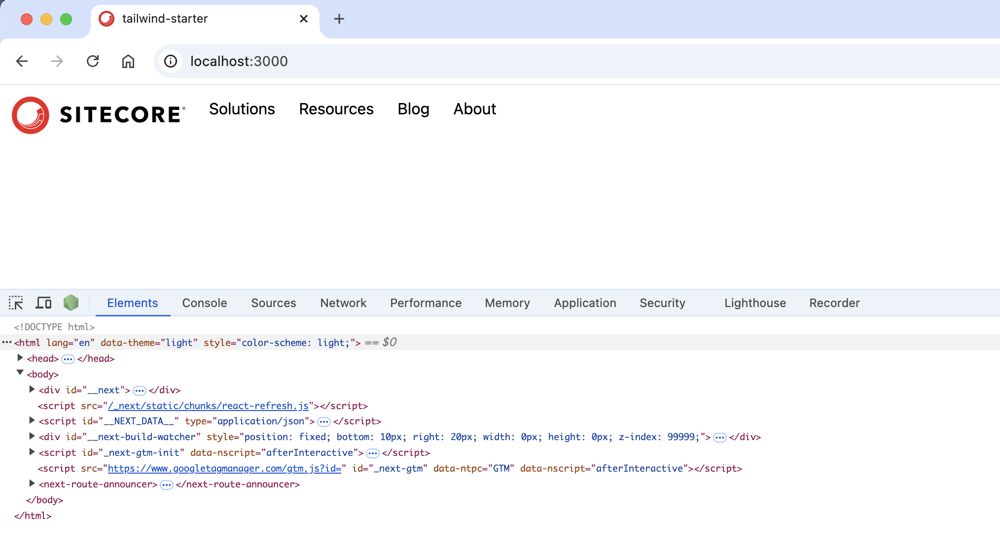
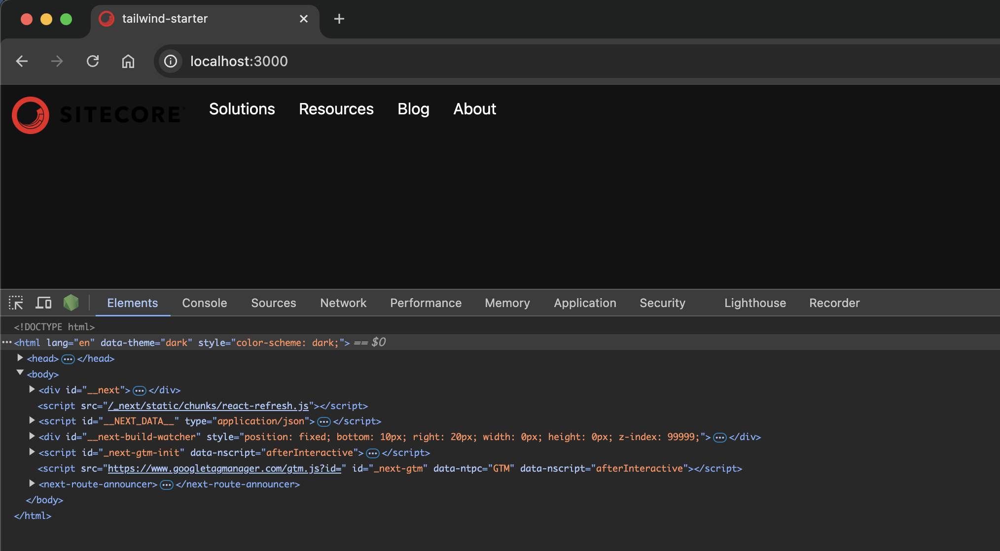
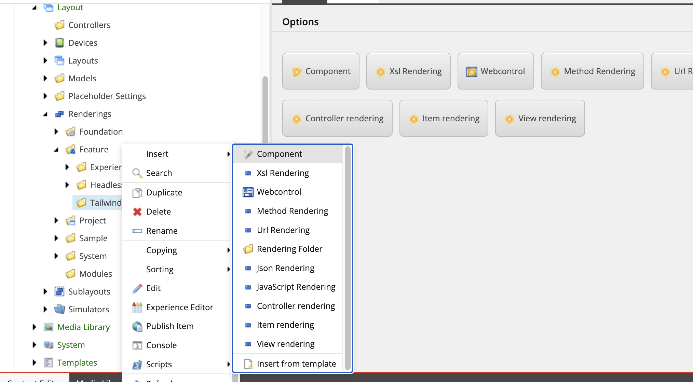
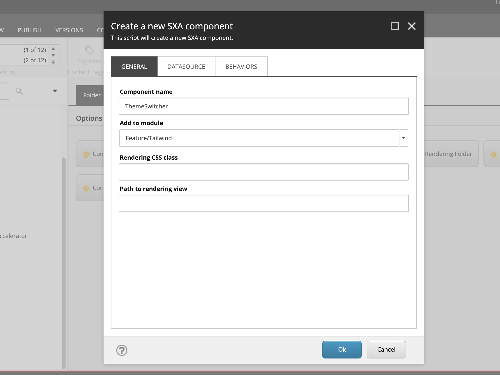
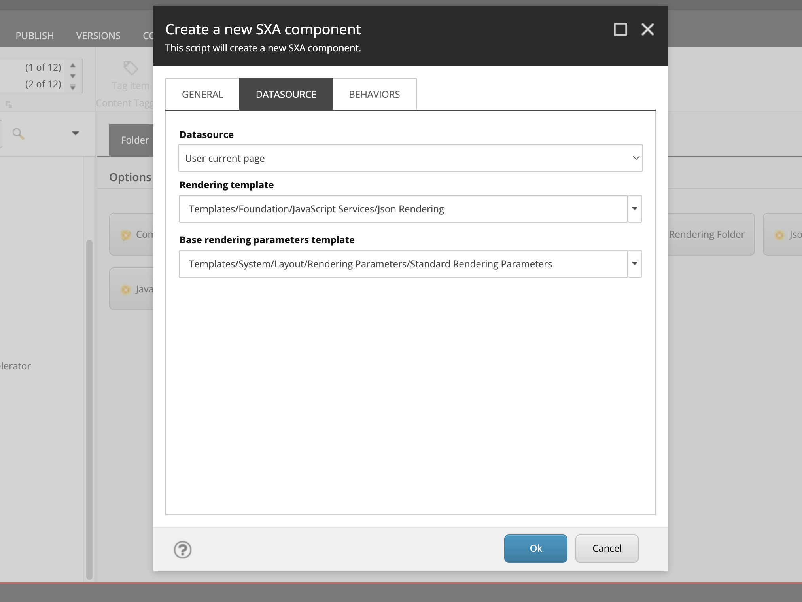
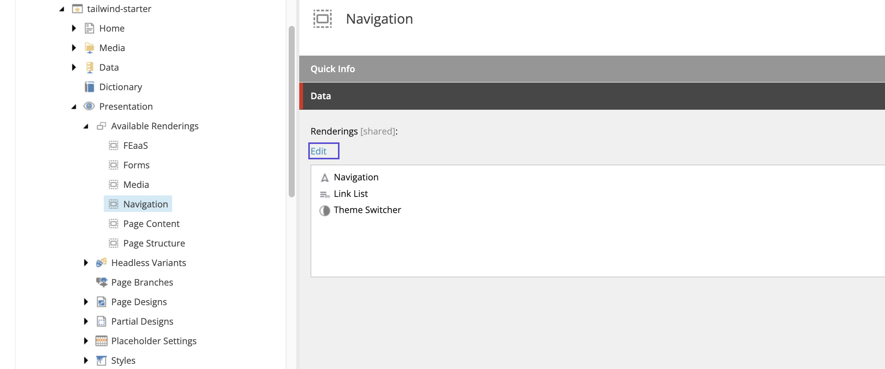
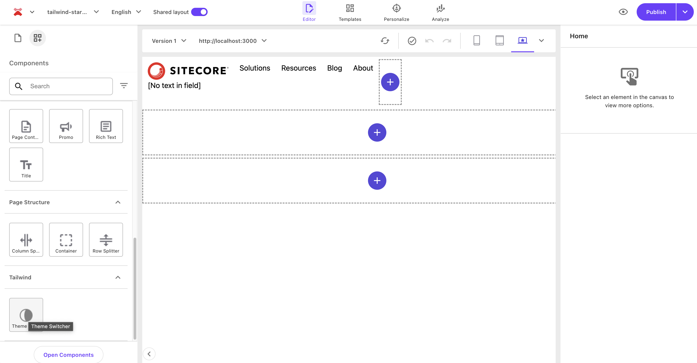
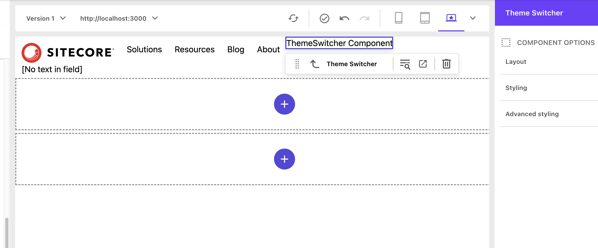

import { Steps, LinkCard, FileTree } from '@astrojs/starlight/components';

このドキュメントでは Next.js Starter Kit に対してダークモードの機能を実装する手順を紹介します。

## 前提条件

今回の実装に関して、以下の環境を前提として紹介をしていきます。

- Next.js - Page Router 14.2.18
- Sitecore JSS 22.3.1
- Tailwind CSS 4.0.0

## ダークモードを有効にする

<Steps>

1. `next-themes` のパッケージをインストールする

   ```bash
   npm install next-themes
   ```

2. `ThemeProvider` を `src/pages/_app.tsx` に追加します。以下ではコードは一部抜粋しています。

   ```ts {4,14,16}
   // src/pages/_app.tsx
   import { GoogleTagManager } from '@next/third-parties/google';
   import Bootstrap from 'src/Bootstrap';
   import { ThemeProvider } from 'next-themes';

   function App({ Component, pageProps }: AppProps<SitecorePageProps>): JSX.Element {
   const { dictionary, ...rest } = pageProps;

    return (
        <>
        <Bootstrap {...pageProps} />
        <GoogleTagManager gtmId={process.env.NEXT_PUBLIC_GOOGLE_TAG_MANAGER || ''} />
        <I18nProvider lngDict={dictionary} locale={pageProps.locale}>
          <ThemeProvider>
            <Component {...rest} />
          </ThemeProvider>
        </I18nProvider>
        </>
    );
   }
   ```

3. `tailwind.config.js` に Darkmode に関する設定を追加します。

   ```js {4}
   // tailwind.config.js
   /** @type {import('tailwindcss').Config} */
   module.exports = {
     darkMode: ['class'],
     content: [],
   ```

</Steps>

上記の設定が完了したタイミングで、ページを参照すると以下のように PC のモードによって表示が変わる状況を確認することができます。例えば、ライトモードで利用している PC の画面では以下のようにライトモードで表示されており、HTML に `data-theme` に対してモードが記載されています。

```html
<html lang="en" data-theme="light" style="color-scheme: light;">
  ...
</html>
```



ダークモードの際は以下のコードに切り替わっています。

```html
<html lang="en" data-theme="dark" style="color-scheme: dark;">
  ...
</html>
```



## 切り替えボタンの実装

PC のモードに合わせてダークモードが有効になる形となりましたが、モードの切り替えボタンを追加して、ユーザーの好みで切り替えることができるようにするためには、モード切り替えのコンポーネントを追加してページに実装する形となります。

### ThemeSwitcher レンダリングアイテムの追加

今回作成をするコンポーネントは、画面の表示を切り替えるだけとなるため、データソースを必要としないコンポーネントとして作成をしていきます。コンポーネントの作成に関しては別の記事で紹介していますので、まだ参照していない場合は一度ご覧ください。

<LinkCard
  title="カスタムコンポーネントの作成"
  href="/xmcdeveloper/cretea-component/"
  target="_blank"
  description="Sitecore が提供する Next.js Starter Kit に対して、提供されているコンポーネント以外のカスタムコンポーネントを追加するための手順を紹介します。"
/>

以下の手順で、コンポーネントを追加する準備を進めていきます。

<Steps>

1. 今回は、以下のパスを作成してコンポーネントを作成していきます。

   <FileTree>

   - sitecore
     - layout
       - Renderings
         - Feature
           - **Tailwind/**

    </FileTree>

2. 右クリックをして、コンポーネントウィザードを立ち上げます

   

3. Component の名前として ThemeSwitcher を設定します。

   

4. Datasource タブを開いて、以下の２項目を設定します。

   - **Datasource**: User current page
   - **Rendering template**: Templates/Foundation/JavaScript Services/Json Rendering

   

5. 作成されたレンダリングアイテムのアイコンを変更します。Configure - Icon を選択して、`office/32x32/moon_half.png` をアイコンとして指定します。

6. Home - Display name を選択して、表示名を `Theme Switcher` に変更します。

</Steps>

これでコンポーネントの準備ができました。

### コンポーネントのファイルを作成

作成をしたコンポーネントが利用するコードをプロジェクトに追加する必要があります。ここでは JSS のコマンドを実行してファイルを作成します。

```bash
jss scaffold ThemeSwitcher
```

上記のコマンドを実行すると、 `src/components/ThemeSwitcher.tsx` のファイルが作成され、コードは以下のようになります。

```ts
import React from 'react';
import { ComponentParams, ComponentRendering } from '@sitecore-jss/sitecore-jss-nextjs';

interface ThemeSwitcherProps {
  rendering: ComponentRendering & { params: ComponentParams };
  params: ComponentParams;
}

export const Default = (props: ThemeSwitcherProps): JSX.Element => {
  const id = props.params.RenderingIdentifier;

  return (
    <div className={`component ${props.params.styles}`} id={id ? id : undefined}>
      <div className="component-content">
        <p>ThemeSwitcher Component</p>
      </div>
    </div>
  );
};
```

### コンポーネントを配置する

コンポーネントのレンダリングアイテム、およびコードの準備ができました。まず Pages で利用できるようにするために、対象となるサイトで利用できる Rendering に追加します。今回は、Navigation に対して追加しました。



Page Builder を立ち上げて、コンポーネント一覧に表示されているのを確認します。



実際に配置すると、サンプルのコードで用意されているコンポーネント名が表示されているのを確認できます。



### コンポーネントのコードを書き換える

現在のコンポーネントのコードに対して、モードを切り替えるためのコードに変更をします。このコンポーネントは Sitecore からのデータを利用せずに動作させる形とするため、以下のように標準的なダークモードに関するコードに変更をします。

```ts
// src/components/ThemeSwitcher.tsx
import { useTheme } from 'next-themes';
import React, { useEffect } from 'react';

export const Default = (): JSX.Element => {
  const { theme, setTheme } = useTheme();

  useEffect(() => {}, [theme]);

  const toggleTheme = () => {
    setTheme(theme === 'light' ? 'dark' : 'light');
  };

  return (
    <div>
      <button onClick={toggleTheme}>
        {theme ? (theme === 'light' ? 'Dark Mode' : 'Light Mode') : 'Loading...'}
      </button>
    </div>
  );
};
```

コードを書き換えた後、新たにページで表示を確認すると、以下のようにモードが切り替わるようになりました。


ダークモードとライトモードの切り替えができるようになりました。

## まとめ

今回は標準的なダークモードの実装に関して紹介をしています。このコンポーネントの作り方としては、Sitecore のデータソースを利用しない、シンプルなコンポーネントとなるため、一般的な Next.js の実装と同様に設定できることを確認することができました。

