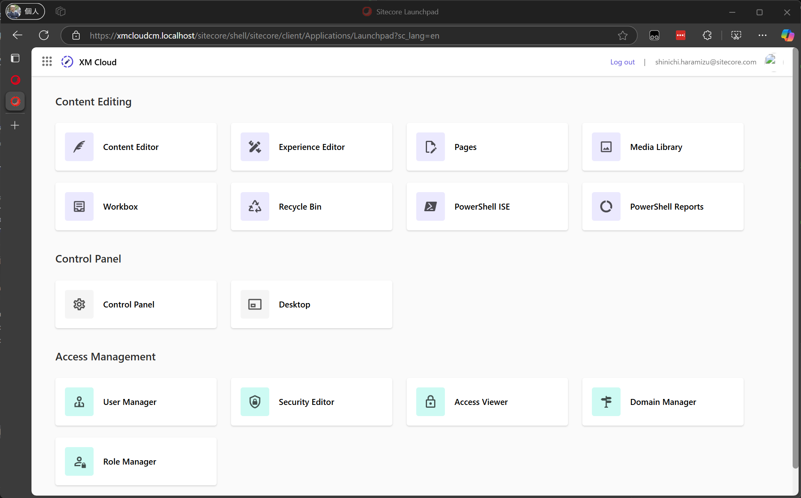
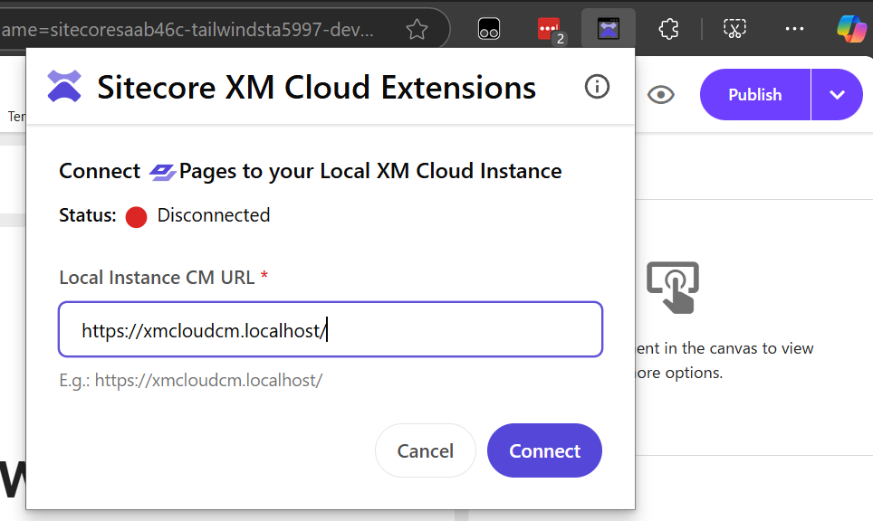
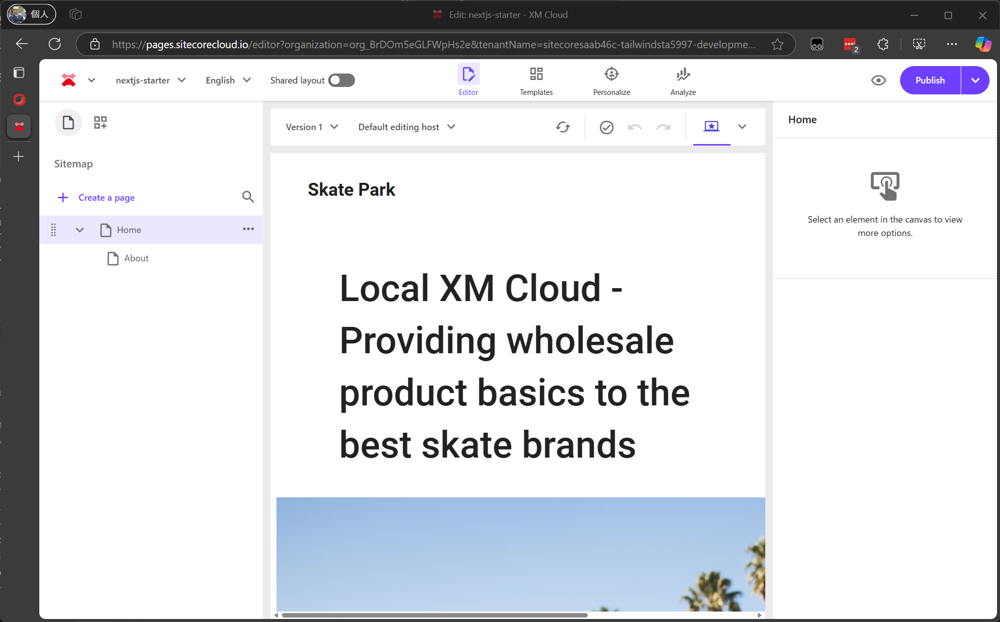

{/* https://blog.haramizu.com/ja-JP/blog/2024/10/01/xmcloud-foundation-head-dev-2024 */}
{/* https://blog.haramizu.com/ja-JP/blog/2024/09/06/xmcloud-localhost-how-to-show-image */}
{/* https://blog.haramizu.com/ja-JP/blog/2023/12/02/advent-calendar-2023-day-2 */}
{/* https://blog.haramizu.com/ja-JP/blog/2023/07/20/nextjs-connect-to-xmcloud */}

import { FileTree, Steps, LinkCard } from '@astrojs/starlight/components';

このドキュメントでは、XM Cloud を対象とした Web サイトの開発を行う場合の環境について紹介をします。ローカルでの Docker での環境について、XM Cloud のインスタンスに接続して開発をする方法のそれぞれの環境の整え方を紹介します。

## Starter Kit の構成

Sitecore XM Cloud のプロジェクトに関する Starter Kit を GitHub のリポジトリで公開をしています。

<LinkCard
  title="XM Cloud Front End Application Starter Kits"
  href="https://github.com/sitecorelabs/xmcloud-foundation-head"
  target="_blank"
  description="This repository contains the Next.js Starter Kit, and the SPA Starters monorepo (which includes a Node Proxy Application and and SPA starter apps) for Sitecore XM Cloud Development. It is intended to get developers up and running quickly with a new front end project that is integrated with Sitecore XM Cloud."
/>

上記のリポジトリは XM Cloud のプロジェクト作成の際に選択することが可能となっています。また先にプロジェクトを作成して展開することができるように、 `Use this template` から新しいリポジトリを作成して、利用することも可能です。

このプロジェクトには、以下の役割のファイルが配置されています。

<FileTree>

- headapps
  - nextjs-starter/ Nest.js starter kit
  - spa-starters/ angular starter kit
- local-containers
  - docker
    - build/ docker build image
    - data/ docker data folder
    - deploy
      - platform/
    - traefik/ traefik data and certification
    - clean.ps1 docker image clean up script
  - scripts
    - down.ps1 docker script
    - init.ps1 init script for local instance
    - up.ps1 start xm cloud instance
  - docker-compose.override.yml
  - docker-compose.yml
- sitecore.json Sitecore CLI configuration file
- xmcloud.build.json XM Cloud Deploy configuration file

</FileTree>

このドキュメントサイトで紹介をするテンプレートは以下のサイトになります。

<LinkCard
  title="Tailwind CSS Starter Kit"
  href="https://github.com/haramizu/tailwind-starter"
  target="_blank"
/>

このプロジェクトには、 `headapps/tailwind-starter` のプロジェクトが追加されており、Next.js + Tailwind CSS が利用できるようにカスタマイズをしています。

どちらのプロジェクトも Docker および XM Cloud を利用した開発環境を作ることができます。今回はそれぞれの環境の準備について紹介をしていきます。

## Docker の利用

Sitecore XM Cloud の開発環境をローカルの PC で利用するための仕組みとして Docker を利用して環境を用意することが出来ます。今回はこの手順を紹介します。

### 前提条件

今回の記事は以下の環境で実行しています。

- Windows 11 Pro 23H2
- Docker 4.37.0
- Visual Studio Code
- Google Chrome, Microsoft Edge などモダンブラウザ

### Docker 環境で起動する

今回はすでにプロジェクトが出来上がっていることを想定します。プロジェクトの作成に関しては、[テンプレートの作成]
(/xmcdeveloper/create-template/) で紹介をしています。Docker に関する環境は、すべて local-containers のディレクトリ配下で用意されています。

以下の手順で起動してください。

<Steps>

1. Docker Desktop が起動しているのを確認します。

2. 管理者権限を利用できるターミナルを起動します。

3. 対象となるフォルダに移動をして、初期化のスクリプトを実行します。この際、ライセンスファイルを指定する必要があります。

   ```bash
   cd local-containers
   ./scripts/init.ps1 -InitEnv -LicenseXmlPath "C:\license\license.xml" -AdminPassword "DesiredAdminPassword"
   ```

   

4. Sitecore の CMS を初期化してローカルで起動するために、以下のコマンドを実行します。

   ```bash
   .\scripts\up.ps1
   ```

   

   初回の起動の際には、コンテナのイメージのダウンロードなども実行します。

5. 途中、XM Cloud へのログイン画面が表示されます。Confirm をクリックして、ログインを完了する必要があります。

   

6. しばらくすると、XM Cloud の Docker 版の管理画面が表示されます。

   

</Steps>

これで、例えば `headapps\nextjs-starter` にある Next.js のプロジェクトを利用して開発をすれば、Experience Editor のレンダリングとして利用することになるため、開発環境が手元に用意できる形となります。

### Docker 環境と Pages

Pages は Sitecore XM Cloud が提供する非常に便利なみたまま編集ツールであり、またパーシャルデザインの作成などの際にも利用することが可能です。同様の作業は Experience Editor でも可能ですが、XM Cloud が提供する Components との連携は Experience Editor ではできないため、基本的には Pages での作業が理想的です。

実際に、Docker 版にも Pages のアイコンが表示されています。


Pages をローカルで起動している Docker の環境と連携させることが可能となっています。手順としては、以下のページで公式の情報として掲載しています。

<LinkCard
  title="Connect XM Cloud Pages to your local XM instance"
  href="https://doc.sitecore.com/xmc/en/developers/xm-cloud/connect-xm-cloud-pages-to-your-local-xm-instance.html"
  target="_blank"
  description="When you use Docker for full-stack development in XM Cloud, and after you set up your local XM Cloud development environment, XM Cloud Pages is not connected to your locally running XM instance."
/>

上記の手順通りに作業をすれば接続できますが、もっと簡単に接続することができるブラウザの機能拡張が提供されています。

<LinkCard
  title="Sitecore XM Cloud Extensions"
  href="https://chromewebstore.google.com/detail/sitecore-xm-cloud-extensi/pkonhbljhhbhbdjkacgmafheaebijmjh?pli=1"
  target="_blank"
  description="Browser extension that improves Sitecore XM Cloud user experience."
/>

この機能拡張をインストールすれば、Pages をローカルのインスタンスに簡単に接続することができます。下記の手順は機能拡張をインストール後の手順となります。

<Steps>

1. ローカルの管理画面にある Pages のアイコンを利用して起動します

2. 機能拡張を起動して、ローカルのインスタンスの URL を入れます

   

3. URL を設定すると以下のようにローカルのインスタンスに接続されます

   

4. ローカルの環境が反映されているか確認をするために、以下のようにアイテムを変更します。

   

5. Pages を更新すると、ローカルのコンテンツを読み込んで表示していることを確認できました。

   

</Steps>

Docker を利用して開発をする環境がこれで準備ができた形です。Docker の環境は誰にも影響を与えることなく、手元の開発環境を利用できるという点では非常に強力です。

## XM Cloud インスタンス

Docker とは異なり、SaaS の環境として提供されている XM Cloud を開発用サーバーとして利用することも可能です。ここでは、すでに XM Cloud に展開をしている環境を利用して、手元の開発環境と連携する方法を紹介します。

### 前提条件

- Sitecore XM CLoud の開発用インスタンス
- Node 22.x 以上
- Visual Studio Code
- Google Chrome, Microsoft Edge などモダンブラウザ

### 環境の構築

