{/* https://blog.haramizu.com/ja-JP/blog/2024/06/28/xmcloud-tailwindcss-sample-part-6 */}
{/* https://blog.haramizu.com/ja-JP/blog/2024/09/11/xmcloud-tailwindcss-sample-part-7 */}
{/* https://blog.haramizu.com/ja-JP/blog/2024/02/28/xm-cloud-tailwind-style */}
{/* https://blog.haramizu.com/ja-JP/blog/2022/03/14/tailwindcss */}
{/* https://blog.haramizu.com/ja-JP/blog/2024/09/11/xmcloud-tailwindcss-sample-part-7 */}
{/* https://blog.haramizu.com/ja-JP/blog/2023/12/23/advent-calendar-2023-day-23 */}
{/* https://blog.haramizu.com/ja-JP/blog/2024/03/01/xm-cloud-column-splitter */}
{/* https://blog.haramizu.com/ja-JP/blog/2024/06/17/xmcloud-tailwindcss-sample-part-1 */}

import { Steps, LinkCard, Aside, FileTree } from '@astrojs/starlight/components';

このドキュメントサイトで作成をしていくサンプルのベースとなる、Tailwind Starter は、Next.js Starter をベースにスタイルシートのフレームワークとして Tailwind CSS を適用しています。このドキュメントでは、ベースとなる Next.js Starter に対してどのような作業をしているのかについて、ここでは紹介をします。

<linkCard
  title="GitHub Haramizu / tailwind-starter"
  href="https://github.com/haramizu/tailwind-starter"
  target="_blank"
/>

テンプレートのベースに関しては以下のように作成をしました。

- [テンプレートの作成](/xmcdeveloper/create-template/)

## サイトの作成

まず上記のテンプレートをベースとして、XM Cloud を SaaS の環境で立ち上げます。

<Steps>

1. 作成をするサイトのテンプレートとしては、Empty を選択してください。

   

2. 以下のようにサイトを作成して、作業対象となるサイトを XM Cloud の開発環境に用意します。

   

3. Next.js Starter キットの Basic site と上記で作成をしたサイトの２つが並んでいる状況で作業を進めていきます。

   

4. Pages では、ローカルの Next.js のインスタンスと連携するようにして、開発中のコードを利用してページ表示を確認していきます。

   

   今回は Empty を選択しているため以下のように何も表示されない形です。

5. Content Editor を開いて、JSS の設定として `/sitecore/content/sites/tailwind-starter/Settings` のアイテムを選択して、Grid の設定を Tailwind に変更します。

   

6. 続いてサイトの設定 `/sitecore/content/sites/tailwind-starter/Settings/Site Grouping/tailwind-starter` を開き、Predefined application editing host の項目を tailwindstarter に変更します。

   

</Steps>

開発をするための環境の準備ができました。

## Tailwind CSS の適用

Next.js Starter Kit は Bootstrap を CSS フレームワークとして利用しているため、Tailwind CSS を適用しつつ不要な bootstrap のパッケージを削除していきます。

### Tailwind CSS のインストール

まず最初に Tailwind CSS を利用できるように書き換えていきます。

<Steps>

1. まず、Tailwind CSS をインストールします

   ```bash
   npm install -D tailwindcss postcss autoprefixer
   npx tailwindcss init -p
   ```

2. `headapps/nextjs-starter/src/assets/app.css` のファイルをコピーして `headapps/tailwind-starter/src/styles/app.css` を作成します。

3. `headapps/tailwind-starter/src/styles/globals.css` のファイルを作成して、以下のスタイルを設定します。

   ```css
   @import './app.css';

   @tailwind base;
   @tailwind components;
   @tailwind utilities;
   ```

4. スタイルシートを読み込んでいる `headapps/tailwind-starter/src/pages/_app.tsx` のコードを以下のように変更します。

   ```diff lang="tsx"
   // headapps/tailwind-starter/src/pages/_app.tsx
   import type { AppProps } from 'next/app';
   import { I18nProvider } from 'next-localization';
   import { SitecorePageProps } from 'lib/page-props';
   import Bootstrap from 'src/Bootstrap';

   -import 'assets/main.scss';
   +import '@/styles/globals.css';
   ```

5. 上記のスタイルシート読み込みの際に `@/` を利用してファイルを指定しています。これを有効にするためには、Typescript の設定 tsconfig.json に対して以下の行を追加してください。

   ```json {12}
   // headapps/tailwind-starter/tsconfig.json
   {
     "compilerOptions": {
       "baseUrl": ".",
       "paths": {
         "components/*": ["src/components/*"],
         "lib/*": ["src/lib/*"],
         "temp/*": ["src/temp/*"],
         "assets/*": ["src/assets/*"],
         "graphql-types": ["node_modules/@types/graphql-let/__generated__/__types__"],
         "react": ["node_modules/react"],
         "@/*": ["./src/*"]
       },
   ```

</Steps>

これで Tailwind CSS を適用できている状況です。実際に npm run start:connected でアクセスをして、コンテンツはまだ無いため開発者ツールで確認をすると、スタイルシートが適用されていることを確認することができます。


### Bootstrap を削除する

続いて利用しなくなる Bootstrap 関連のファイルを削除していきます。

<Steps>

1. スタイルシート関連のファイルがある `headapps/tailwind-starter/src/assets` のフォルダを削除します。

2. bootstrap および font-awesome のパッケージを削除します。

   ```bash
   npm uninstall bootstrap font-awesome
   ```

</Steps>

これで bootstrap 関連のファイルを削除することができました。

## スタイルシートの調整

上記の作業をしただけでは、スタイルシートのフレームワークを切り替えただけであり、かつ各コンポーネントに関するスタイルが何も定義されていない状況となります。そこで、いくつかのコンポーネントに対するスタイルを追加していきます。

### グリッド

利用頻度の多いコンポーネントとして **Culumn Splitter** および **Row Splitter** の２つのコンポーネントがあります。このコンポーネントの動作を確認すると、まず `Column Splitter` を配置すると以下のようになります。

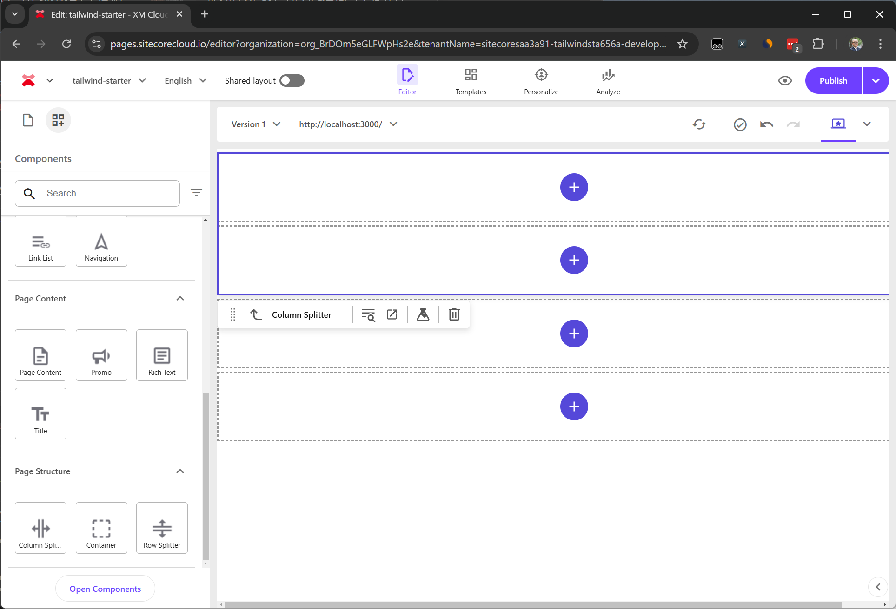

期待すべき結果は横に２つ並ぶ形ですが、縦に並んでいる状況です。HTML の出力は以下のようになっています。

```html
<div class="row component column-splitter basis-full">
  <div class="basis-1/2"><div class="row"></div></div>
  <div class="basis-1/2"><div class="row"></div></div>
</div>
```

まず横に並べるためには、flex クラスを追加する必要があります。そこで、`headapps/tailwind-starter/src/styles/components/ColumnSplitter.css` というファイルを作成して、以下のコードを適用します。

```css
// headapps/tailwind-starter/src/styles/components/ColumnSplitter.css
.column-splitter {
  @apply flex;
}
```

上記の結果、以下のような表示に変わります。

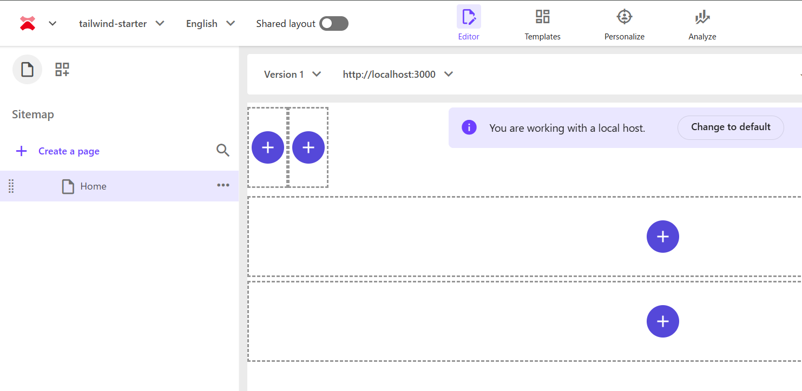

横に並びましたが、それぞれに指定されている `basis-1/2` の横幅が適用されていない形となります。Tailwind CSS の特徴として、なるべくサイト向けのスタイルシートをシンプルにするために、コードに記述されていないスタイルシートは無効になるため、コンポーネントで出力しているスタイルが適用できていません。

そこで、設定ファイルとなる tailwind.config.js に対して、salelist で指定をして利用できるように、以下のコードを追加をします。

```js {5-10}
// headapps/tailwind-starter/tailwind.config.js
/** @type {import('tailwindcss').Config} */
module.exports = {
  content: [],
  safelist: [
    {
      pattern: /basis-/,
      variants: ['sm', 'md', 'lg', 'xl', '2xl'],
    },
  ],
  theme: {
    extend: {},
  },
  plugins: [],
};
```

無事、横に２つ並んで 1/2 を指定している値が有効になりました。

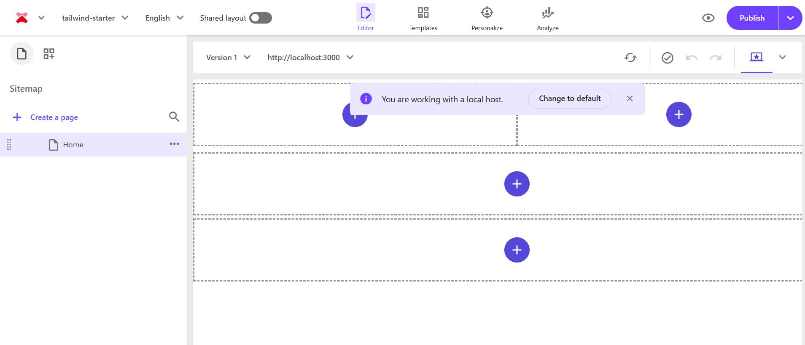

### 表示オプション

今回は RichText エディターを利用して、コンポーネントの表示位置、およびテキストの位置に関してのスタイルを追加していきます。まず RichText コンポーネントを Pages を利用して配置します。

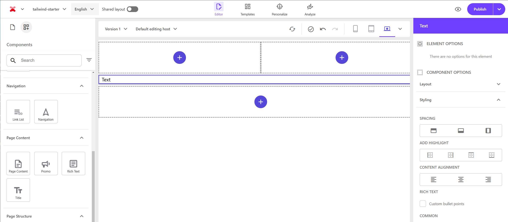

配置をした時、コンポーネントのオプションとして Spacing / Add Highlight / Content Alignment / Rich Text の設定項目が表示されます。Rich Text に関しては別途取り上げるとして、例えば項目に関して以下のように設定します。

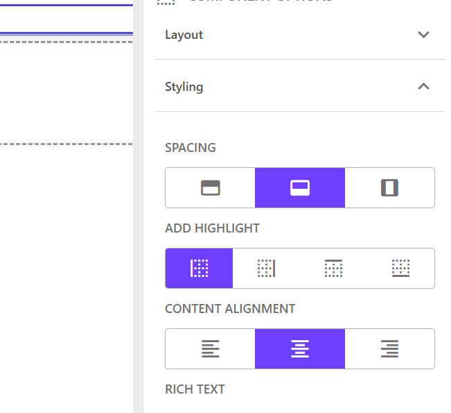

これを設定した場合、HTML のコードは以下のように変わります。

```html
<div id="content">
  <!--$-->
  <div class="component rich-text indent-bottom highlighted-left position-center basis-full">
    <div class="component-content">
      <div>
        <div class="ck-content"><p>Text</p></div>
      </div>
    </div>
  </div>
  <!--/$-->
</div>
```

これらの定義は、構築中のサイトの中にアイテムとして定義されています。サイトのツリーを参照すると以下のようになっています。なおアイテムの右側に記載されているのが、CSS に出力される値となります。

<FileTree>

- Presentation
  - Styles
    - _Spacing_
      - _Indent top_ indent-top
      - _Indent bottom_ indent-bottom
      - _Indent side_ indent
    - _Add highlight_
      - _Highlighted left_ highlighted-left
      - _Highlighted right_ highlighted-right
      - _Highlighted top_ highlighted-top
      - _Highlighted bottom_ highlighted-bottom
    - _Content alignment_
      - _Align content left_ position-left
      - _Align content center_ position-center
      - _Align content right_ position-right

</FileTree>

Spacing および Content alignment に関しては、画像などでも利用することがある汎用的な表示オプションということになります。共通のスタイルということで、スタイルのファイルを2つ作成します。

```css
// headapps\tailwind-starter\src\styles\common\alignment.css
.position-left {
  @apply flex;
  @apply justify-start;
}

.position-right {
  @apply flex;
  @apply justify-end;
}

.position-center {
  @apply flex;
  @apply justify-center;
}
```

```css
// headapps\tailwind-starter\src\styles\common\highlight.css
.highlighted-left {
  @apply border-l-4;
  @apply border-blue-500;
}

.highlighted-right {
  @apply border-r-4;
  @apply border-blue-500;
}

.highlighted-top {
  @apply border-t-4;
  @apply border-blue-500;
}

.highlighted-bottom {
  @apply border-b-4;
  @apply border-blue-500;
}
```

```css
// headapps\tailwind-starter\src\styles\common\spacing.css
.indent {
  @apply mx-3;
}

.indent-top {
  @apply mt-3;
}

.indent-bottom {
  @apply mb-3;
}
```

上記3つのファイルを、globals.css ファイルに対して追加します。

```css {8-11}
// headapps\tailwind-starter\src\styles\globals.css
@import './app.css';

@tailwind base;
@tailwind components;
@tailwind utilities;

/* Pages Style - Common */
@import './common/alignment.css';
@import './common/highlight.css';
@import './common/spacing.css';

/* Components */
@import './components/ColumnSplitter.css';
```

これで、以下のように表示位置を反映させることができました。

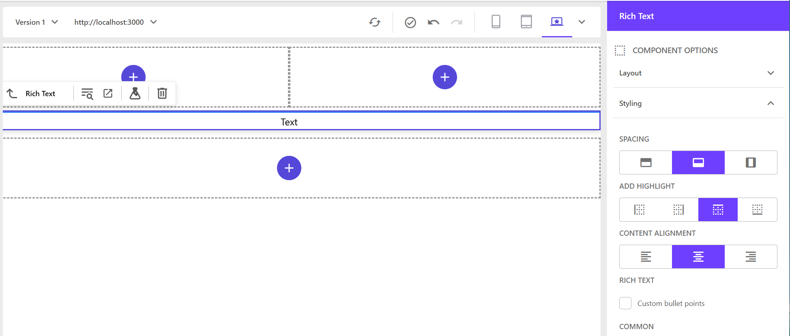

### リッチテキスト

RichText コンポーネントの中に入っている HTML に関して、まず以下のように段落を設定している形とします。

```html
<p>Paragraph</p>
<ul>
  <li>Bullets 1</li>
  <li>Bullets 2</li>
  <li>Bullets 3</li>
</ul>
<p>Paragraph</p>
<ol>
  <li>Number 1</li>
  <li>Number 2</li>
  <li>Number 3</li>
</ol>
```

Tailwind CSS を利用している場合は、何も定義していない場合は以下のようにフラットに表示されます。

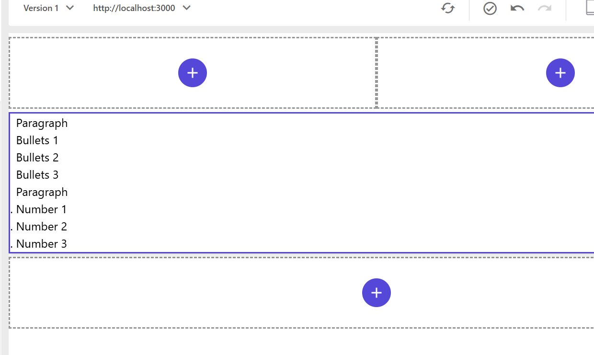

RichText 出の表示に関する定義を追加していく必要があります。これは h1 タグなどにも同様に適用する必要があるため、リッチテキストのスタイルを定義するファイルを以下のように作成をします。

```css
// headapps\tailwind-starter\src\styles\components\RichText.css
.component.rich-text {
  h1 {
    @apply text-4xl;
  }

  h2 {
    @apply text-3xl;
  }

  h3 {
    @apply text-2xl;
  }

  ul {
    @apply list-disc pb-2 pl-3 pt-2;
  }

  ol {
    @apply list-decimal pb-2 pl-3 pt-2;
  }

  li {
    @apply ml-4;
  }
}
```

`headapps\tailwind-starter\src\styles\globals.css` のファイルで上記のスタイルをインポートしたあと、改めてプレビューを参照すると表示が切り替わっていることが分かります。

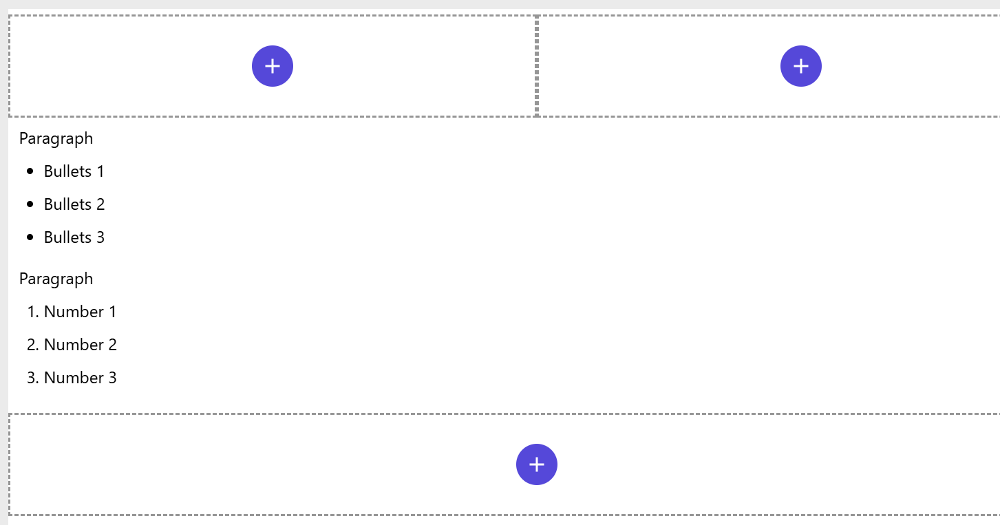

また Rich Text に関してもスタイルを表示するためのサンプルの値が用意されています。

<FileTree>

- Presentation
  - Styles
    - Rich-text
      - Custom-bullet-points rich-text-lists

</FileTree>

これを有効にした時に、一覧の表示が書き換わるように以下のコードを `headapps\tailwind-starter\src\styles\components\RichText.cs` に追加します。

```css
.component.rich-text.rich-text-lists {
  ul {
    @apply list-disc px-2 pl-9 text-2xl;
  }
}
```

設定後、リッチテキストのコンポーネントの表示オプションでチェックをすると、リストの文字が大きくなります。

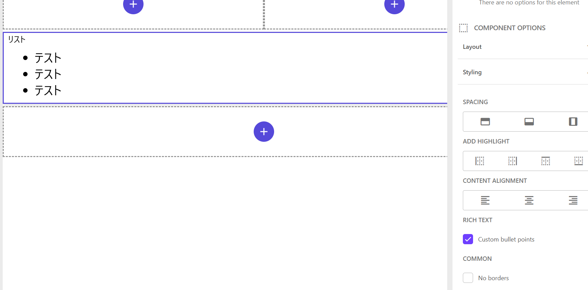

### コンテナの背景色

コンテナの上には様々なコンポーネントを配置することができ、またレスポンシブなどの処理で表示・非表示というのをコンテナ単位で制御できることもあり、非常に便利なコンポーネントです。コンテナ専用で用意されているスタイルは以下の通りです。

<FileTree>

- Presentation
  - Styles
    - _Background color_
      - _Clean background_ container-clean-background
      - _Color background_ container-color-background
      - _Dark background_ container-dark-background
      - _Gray background_ container-gray-background
    - _Background layout_
      - _Cover background_ cover-background
      - _Fix background_ fix-background
      - _Parallax background_ parallax-background
    - _Container_
      - _Centered_ container
      - _Bordered_ sxa-bordered

</FileTree>

今回は背景色の部分のみを定義するため、以下のようにスタイルシートを追加します。

```css
// headapps\tailwind-starter\src\styles\components\Container.css
.container-dark-background {
  @apply bg-gray-800 text-white;
}

.container-color-background {
  @apply bg-blue-400 text-gray-800;
}

.container-gray-background {
  @apply bg-gray-300 text-gray-800;
}

.container-clean-background {
  @apply bg-white text-gray-800;
}
```

上記のファイルを `headapps\tailwind-starter\src\styles\globals.css` に対して追加して、コンテナの背景色を有効にします。以下が、実際にコンテナを配置して、背景色を指定した結果となります。

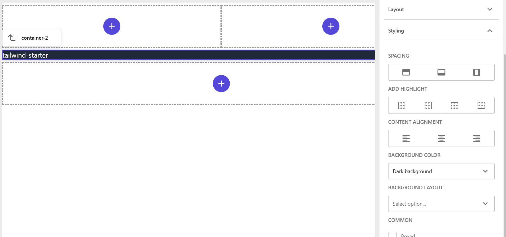

### LinkList

標準で提供されているリストコンポーネントの表示に関して、動作確認をしていきます。まず、サンプルとなるアイテムを作成して、Pages に配置すると以下のように表示されます。

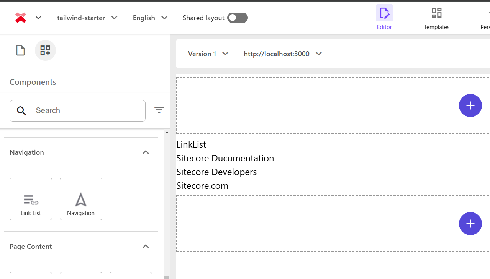

実際に出力される HTML 配下のようになります。

```html
<div class="component link-list basis-full">
  <div class="component-content">
    <h3>LinkList</h3>
    <ul>
      <li class="item0 odd first">
        <div class="field-link">
          <a href="https://doc.sitecore.com/" target="">Sitecore Ducumentation</a>
        </div>
      </li>
      <li class="item1 even">
        <div class="field-link">
          <a href="https://developers.sitecore.com/" target="">Sitecore Developers</a>
        </div>
      </li>
      <li class="item2 odd last">
        <div class="field-link"><a href="https://www.sitecore.com/" target="">Sitecore.com</a></div>
      </li>
    </ul>
  </div>
</div>
```

上記の HTML であれば、リッチテキストで利用していたリストのスタイルをそのまま利用することができます。そこで、以下のファイルを追加します。

```css
// headapps\tailwind-starter\src\styles\components\LinkList.css
.component.link-list {
  ul {
    @apply list-disc pb-2 pl-3 pt-2;
  }

  ol {
    @apply list-decimal pb-2 pl-3 pt-2;
  }

  li {
    @apply ml-4;
  }
}
```

上記のファイルを `headapps\tailwind-starter\src\styles\globals.css` に対して追加して、リンクリストを表示した画面となります。

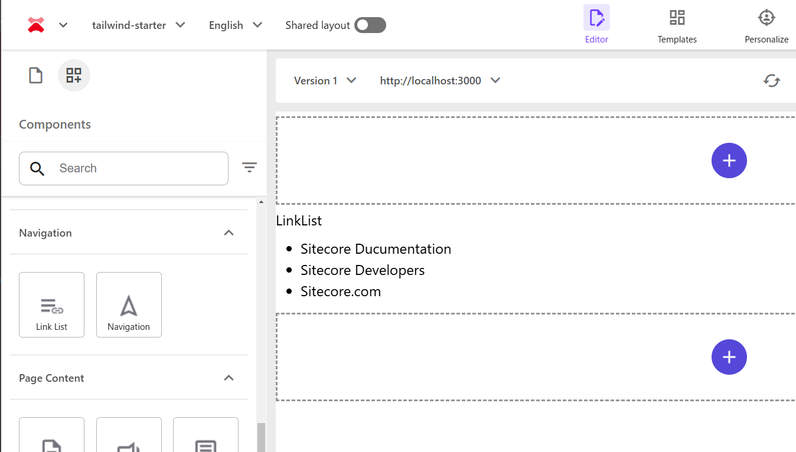

### Navigation

Navigation コンポーネントにはいくつかのスタイルが用意されており、すべて説明をすると長くなるので今回は１つのナビゲーションを利用できるように調整をしていきます。まず、サンプルのサイトのページで利用するアイテムを以下のように階層化させて配置します。

<FileTree>

- home
  - products
    - sitecore-language-switcher/
    - tailwindcss/
  - resources
    - components/
    - nextjs/
  - blog/

</FileTree>

上記のコンテンツツリーを利用して、Navigation コンポーネントを配置すると以下のようになります。Tailwind CSS を利用するときは、基本まずはフラットに表示される形です。

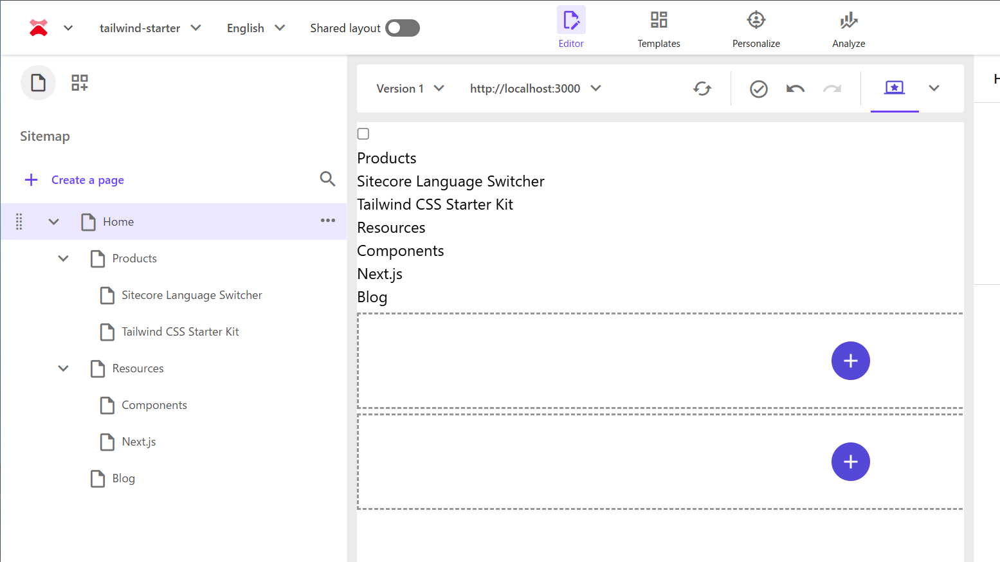

実際に出力される HTML は以下のような形となります。

```html
<div class="component navigation basis-full">
  <label class="menu-mobile-navigate-wrapper"
    ><input type="checkbox" class="menu-mobile-navigate" />
    <div class="menu-humburger"></div>
    <div class="component-content">
      <nav>
        <ul class="clearfix">
          <li class="level1 submenu item0 odd first rel-level1" tabindex="0">
            <div class="navigation-title child">
              <a title="Products" href="/products?sc_site=tailwind-starter"
                ><span>Products</span></a
              >
            </div>
            <ul class="clearfix">
              <li class="level2 item0 odd first rel-level2" tabindex="0">
                <div class="navigation-title">
                  <a
                    title="Sitecore Language Switcher"
                    href="/products/sitecore-language-switcher?sc_site=tailwind-starter"
                    ><span>Sitecore Language Switcher</span></a
                  >
                </div>
              </li>
              <li class="level2 item1 even last rel-level2" tabindex="0">
                <div class="navigation-title">
                  <a
                    title="Tailwind CSS Starter Kit"
                    href="/products/tailwindcss?sc_site=tailwind-starter"
                    ><span>Tailwind CSS Starter Kit</span></a
                  >
                </div>
              </li>
            </ul>
          </li>
          <li class="level1 submenu item1 even rel-level1" tabindex="0">
            <div class="navigation-title child">
              <a title="Resources" href="/resources?sc_site=tailwind-starter"
                ><span>Resources</span></a
              >
            </div>
            <ul class="clearfix">
              <li class="level2 item0 odd first rel-level2" tabindex="0">
                <div class="navigation-title">
                  <a title="Components" href="/resources/components?sc_site=tailwind-starter"
                    ><span>Components</span></a
                  >
                </div>
              </li>
              <li class="level2 item1 even last rel-level2" tabindex="0">
                <div class="navigation-title">
                  <a title="Next.js" href="/resources/nextjs?sc_site=tailwind-starter"
                    ><span>Next.js</span></a
                  >
                </div>
              </li>
            </ul>
          </li>
          <li class="level1 item2 odd last rel-level1" tabindex="0">
            <div class="navigation-title">
              <a title="Blog" href="/blog?sc_site=tailwind-starter"><span>Blog</span></a>
            </div>
          </li>
        </ul>
      </nav>
    </div></label
  >
</div>
```

メニューに関する表示オプションに追加されるスタイルは、サイトのスタイルにて以下のように定義されています。今回は、**Main navigation - Drop down vertical** と **Main navigation - Drop down horizontal** を利用できるようにして、モバイルでの実装は後回しにしていきましょう。

<FileTree>

- Presentation
  - Styles
    - Navigation
      - **Main navigation - Drop down vertical** navigation-main navigation-main-vertical
      - **Main navigation - Drop down horizontal** navigation-main navigation-main-horizontal
      - _Mobile navigation_ navigation-mobile
      - _Sidebar navigation_ navigation-sidebar
      - _Sitemap navigation_ sitemap-navigation
      - _Big/Fat navigation_ navigation-fat

</FileTree>

実際のスタイルシートとしては、 **navigation-main** でトップレベルの表示部分を調整し、**navigation-main-vertical** で縦にメニューを表示をして、**navigation-main-horizontal** で横にサブメニューを表示するようなスタイルシートを実装する形です。以下が完成したコードになります。

```css
// headapps\tailwind-starter\src\styles\components\Navigation.css
.component.navigation.navigation-main {
  .rel-level1 {
    @apply relative float-left mx-3;
  }

  .rel-level2 {
    @apply mx-5 mb-3;
  }

  &.navigation-main-vertical {
    .rel-level1 {
      &:hover {
        > ul {
          @apply absolute left-0 top-full z-10 block w-max min-w-[200px] border border-gray-300 bg-white pt-3 shadow-md;
        }
      }

      > ul {
        overflow: hidden;
        display: none;
      }
    }
  }

  &.navigation-main-horizontal {
    .rel-level1 {
      &:hover {
        > ul {
          @apply absolute left-0 top-full z-10 flex w-screen border border-gray-300 bg-white pt-3 shadow-md;
        }
      }

      > ul {
        overflow: hidden;
        display: none;
      }
    }
  }
}

.menu-mobile-navigate {
  display: none;
}
```

実際にメニューを２つ配置、それぞれの動作を確認している動画が以下の画面のようになります。


## まとめ

今回は Sitecore が提供している Next.js Starter Kit をベースに Tailwind CSS のスタイルシートを利用する際の最初のステップを紹介しました。このウォークスルーを実施することで、スタイルシートをどのように管理をするのが良いか、また Sitecore 側にスタイルを持つときに、どのようにサイトのスタイルを呼び出して適用するのか、を学ぶことができます。

## 参考情報

<LinkCard
  title="Install Tailwind CSS with Next.js"
  href="https://tailwindcss.com/docs/guides/nextjs"
  target="_blank"
/>

