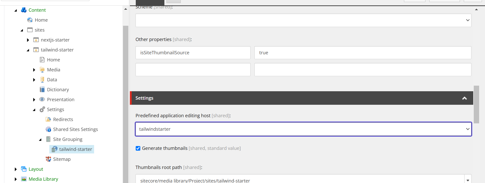

{/* https://blog.haramizu.com/ja-JP/blog/2022/03/14/tailwindcss */}
{/* https://blog.haramizu.com/ja-JP/blog/2024/02/28/xm-cloud-tailwind-style */}
{/* https://blog.haramizu.com/ja-JP/blog/2024/06/28/xmcloud-tailwindcss-sample-part-6 */}

import { Steps, LinkCard, Aside, FileTree } from '@astrojs/starlight/components';

このドキュメントサイトで作成をしていくサンプルのベースとなる、Tailwind Starter は、Next.js Starter をベースにスタイルシートのフレームワークとして Tailwind CSS を適用しています。このドキュメントでは、ベースとなる Next.js Starter に対してどのような作業をしているのかについて、ここでは紹介をします。

<linkCard
  title="GitHub Haramizu / tailwind-starter"
  href="https://github.com/haramizu/tailwind-starter"
  target="_blank"
/>

テンプレートのベースに関しては以下のように作成をしました。

- [テンプレートの作成](/xmcdeveloper/create-template/)

## サイトの作成

まず上記のテンプレートをベースとして、XM Cloud を SaaS の環境で立ち上げます。

<Steps>

1. 作成をするサイトのテンプレートとしては、Empty を選択してください。

   

2. 以下のようにサイトを作成して、作業対象となるサイトを XM Cloud の開発環境に用意します。

   

3. Next.js Starter キットの Basic site と上記で作成をしたサイトの２つが並んでいる状況で作業を進めていきます。

   

4. Pages では、ローカルの Next.js のインスタンスと連携するようにして、開発中のコードを利用してページ表示を確認していきます。

   

   今回は Empty を選択しているため以下のように何も表示されない形です。

5. Content Editor を開いて、JSS の設定として `/sitecore/content/sites/tailwind-starter/Settings` のアイテムを選択して、Grid の設定を Tailwind に変更します。

   

6. 続いてサイトの設定 `/sitecore/content/sites/tailwind-starter/Settings/Site Grouping/tailwind-starter` を開き、Predefined application editing host の項目を tailwindstarter に変更します。

   

</Steps>

開発をするための環境の準備ができました。

## Tailwind CSS の適用

Next.js Starter Kit は Bootstrap を CSS フレームワークとして利用しているため、Tailwind CSS を適用しつつ不要な bootstrap のパッケージを削除していきます。

### Tailwind CSS のインストール

まず最初に Tailwind CSS を利用できるように書き換えていきます。

<Steps>

1. まず、Tailwind CSS をインストールします

   ```bash
   npm install -D tailwindcss postcss autoprefixer
   npx tailwindcss init -p
   ```

2. `headapps/nextjs-starter/src/assets/app.css` のファイルをコピーして `headapps/tailwind-starter/src/styles/app.css` を作成します。

3. `headapps/tailwind-starter/src/styles/globals.css` のファイルを作成して、以下のスタイルを設定します。

   ```css
   @import './app.css';

   @tailwind base;
   @tailwind components;
   @tailwind utilities;
   ```

4. スタイルシートを読み込んでいる `headapps/tailwind-starter/src/pages/_app.tsx` のコードを以下のように変更します。

   ```diff lang="tsx"
   // headapps/tailwind-starter/src/pages/_app.tsx
   import type { AppProps } from 'next/app';
   import { I18nProvider } from 'next-localization';
   import { SitecorePageProps } from 'lib/page-props';
   import Bootstrap from 'src/Bootstrap';

   -import 'assets/main.scss';
   +import '@/styles/globals.css';
   ```

5. 上記のスタイルシート読み込みの際に `@/` を利用してファイルを指定しています。これを有効にするためには、Typescript の設定 tsconfig.json に対して以下の行を追加してください。

   ```json {12}
   // headapps/tailwind-starter/tsconfig.json
   {
     "compilerOptions": {
       "baseUrl": ".",
       "paths": {
         "components/*": ["src/components/*"],
         "lib/*": ["src/lib/*"],
         "temp/*": ["src/temp/*"],
         "assets/*": ["src/assets/*"],
         "graphql-types": ["node_modules/@types/graphql-let/__generated__/__types__"],
         "react": ["node_modules/react"],
         "@/*": ["./src/*"]
       },
   ```

</Steps>

これで Tailwind CSS を適用できている状況です。実際に npm run start:connected でアクセスをして、コンテンツはまだ無いため開発者ツールで確認をすると、スタイルシートが適用されていることを確認することができます。


### Bootstrap を削除する

続いて利用しなくなる Bootstrap 関連のファイルを削除していきます。

<Steps>

1. スタイルシート関連のファイルがある `headapps/tailwind-starter/src/assets` のフォルダを削除します。

2. bootstrap および font-awesome のパッケージを削除します。

   ```bash
   npm uninstall bootstrap font-awesome
   ```

</Steps>

これで bootstrap 関連のファイルを削除することができました。

## スタイルシートの調整

上記の作業をしただけでは、スタイルシートのフレームワークを切り替えただけであり、かつ各コンポーネントに関するスタイルが何も定義されていない状況となります。そこで、いくつかのコンポーネントに対するスタイルを追加していきます。

### グリッドの調整

{/* https://blog.haramizu.com/ja-JP/blog/2023/12/23/advent-calendar-2023-day-23 */}
{/* https://blog.haramizu.com/ja-JP/blog/2024/03/01/xm-cloud-column-splitter */}

### コンテナの背景色の制御

{/* https://blog.haramizu.com/ja-JP/blog/2024/09/11/xmcloud-tailwindcss-sample-part-7 */}

### LinkList

{/* https://blog.haramizu.com/ja-JP/blog/2024/03/05/headless-sxa-linklist-component */}

### Navigation

{/* https://blog.haramizu.com/ja-JP/blog/2024/09/12/xmcloud-multi-language-component-part-1-1 */}
{/* https://blog.haramizu.com/ja-JP/blog/2024/09/13/xmcloud-multi-language-component-part-1-2 */}

## 参考情報

<LinkCard
  title="Install Tailwind CSS with Next.js"
  href="https://tailwindcss.com/docs/guides/nextjs"
  target="_blank"
/>

